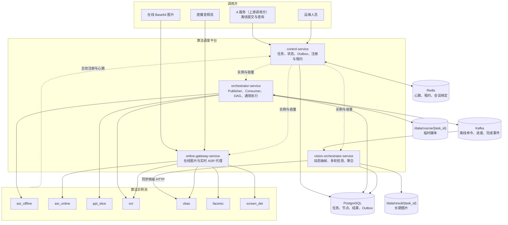

# A 服务对接指南

## 1. 接口边界

A 服务（上游调用方）只通过 `control-service` 提交/查询离线课程任务，通过
`online-gateway-service` 调用在线图片与实时语音能力。A 服务不连接 PostgreSQL、Redis、Kafka、
MongoDB 或算法算子实例。

| 场景 | 对接服务 | 是否异步 | 是否进入 Kafka |
| --- | --- | --- | --- |
| PPT、ASR、教师行为、学生行为 | `control-service` | 是 | 是 |
| 在线 VBas、FaceRec、ScreenDet、OCR | `online-gateway-service` | 否 | 否 |
| 实时 ASR | `online-gateway-service` | WebSocket 会话 | 否 |

在线图片由 A 服务直接传 Base64。平台不从 RTSP 或其他流中截图。

当前离线 DAG 为：

- `PPT`：`PPT_SLICE -> PPT_OCR`。
- `ASR`：`ASR_TRANSCRIPTION`。
- 教师/学生行为：各自一个视觉分析节点，由视觉编排服务完成。

新任务不会创建 `PPT_KEYWORDS` 或 `COURSE_OVERVIEW` 占位节点。历史任务中已经存在的退役节点
和结果仍可通过课程查询接口读取。A 服务无需直连数据库，也不应把历史节点是否出现作为新任务
完成条件。

### 1.1 ARCH-001：历史总体组件图（七算子裁剪视图）

下图沿用总体设计 ARCH-001 的一体化布局，用于展示调用方、四个平台服务、基础设施、共享目录和
算法实例池之间的总体关系。为符合当前平台边界，本图只保留七类现役算子；具体接口、数据流和部署
约束以本文后续章节为准。



## 2. 在线单图 OCR

```http
POST /api/online/ocr/recognize
Content-Type: application/json
```

请求：

```json
{
  "image_id": "frame-001",
  "image": "data:image/png;base64,...",
  "enable_formula": false
}
```

| 字段 | 必填 | 说明 |
| --- | --- | --- |
| `image` | 是 | 普通 Base64 或 Data URL；解码后单图不超过 50 MiB |
| `image_id` | 否 | A 服务提供的图片标识；省略时由网关生成 |
| `enable_formula` | 否 | 严格布尔值，默认 `false` |

网关将请求适配为 OCR 算子已有 `/ocr/prediction` 单元素 `key/value` 协议。成功时 OCR 原始响应
对象放在现有 `BusinessResponse.data` 中，保留 `key`、`value`、`formula_results`、`err_no`
和 `err_msg` 语义。

示例响应：

```json
{
  "code": 0,
  "message": "OCR 在线识别完成",
  "data": {
    "key": ["frame-001"],
    "value": ["[]"],
    "formula_results": [],
    "err_no": 0,
    "err_msg": ""
  }
}
```

## 3. 在线业务错误

已进入网关路由并被映射的在线业务错误通常保持 HTTP `200`，由业务码表达结果：

| 业务码 | 含义 | A 服务处理建议 |
| ---: | --- | --- |
| `40001` | 请求字段、Base64、72 MiB 正文或 50 MiB 解码边界不合法 | 修正请求，不自动重试同一正文 |
| `50301` | 在线算子租约申请或续租失败；最常见是当前无可用容量 | 有界退避后重试；持续出现时保留追踪标识并告警 |
| `50000` | 算子 HTTP、超时或响应格式失败 | 记录请求标识并按 A 服务策略有限重试 |

`50301` 是当前租约异常的统一映射，A 不能只凭该码区分真实容量不足、Control 调用/响应解析失败或
续租失败。它不表示 Control Service 已创建离线任务、排队或发布 Kafka；在线网关不会替 A 保留
一个等待稍后执行的在线请求。
在线与离线 OCR 使用同一个 `ocr` 实例容量池，不为任一来源预留槽位。

## 4. 图片大小约束

- Online Gateway HTTP 请求正文最大 `75497472` 字节（72 MiB）。
- Base64 解码后的单张图片最大 `52428800` 字节（50 MiB）。
- 超限请求会在申请算子租约前拒绝，不会占用 OCR、VBas、FaceRec 或 ScreenDet 容量。
- 反向代理如存在，请求体上限不得低于 72 MiB。

## 5. 追踪与重试

A 服务应为一次业务调用保留自身请求标识。网关会为每个请求生成或传播 `trace_id`，但不会在
容量租约中保存 Base64、图片内容或识别文本。在线调用不保证实例轮询均衡；只保证按注册、健康
和共享容量选择可用实例。A 服务重试会形成新的在线请求和新租约，不应假设仍命中原实例。

## 6. 离线课程任务详细合同

本节补充 Control Service 的离线北向接口。离线任务只接受视频 URL，平台在后台下载视频并执行
DAG；A 服务不上传视频字节，也不需要访问 PostgreSQL、Kafka、Redis 或算法算子。

### 6.1 入口、请求头和统一响应

宿主机部署时，A 服务使用平台服务器的内网地址：

```text
POST http://<platform-host>:18100/api/course-jobs
GET  http://<platform-host>:18100/api/course-jobs/{task_id}
```

若 A 服务和平台运行在同一个受控 Docker network，可以使用：

```text
http://control-service:18100
```

请求使用 Content-Type: application/json。可以发送 X-Trace-ID，平台会在响应头返回同一个
追踪标识；未发送时平台生成新的标识。追踪标识只用于日志和审计，不会改变任务幂等键。

正常解析到的 A 面 JSON 请求通常返回 HTTP 200，响应结构为：

```json
{
  "code": 0,
  "message": "操作成功",
  "data": {}
}
```

A 必须同时检查 HTTP 状态和 JSON code。Control Service 已识别到的 JSON/Pydantic 请求校验错误
会映射为 HTTP 200、code=40001；反向代理、路由错误、网络故障或未捕获的应用异常仍可能返回
非 200。不能把 HTTP 200 当成业务成功，也不能把非 200 当成任务一定没有创建。

离线接口业务码：

| code | 含义 | A 服务处理建议 |
|---:|---|---|
| 0 | 已成功接收、已存在或查询成功 | 读取 data |
| 40001 | 请求字段、任务类型或业务参数不合法 | 修正请求；不要原样无限重试 |
| 40401 | 查询的 task_id 不存在 | 确认业务 ID；不要继续轮询 |
| 50000 | 已映射的任务仓储或平台内部错误 | 记录 X-Trace-ID，按业务策略有限重试或告警 |

提交接口不会因为暂时没有算子容量而返回 50301。任务会先接收，随后在查询结果中进入状态 30
（等待算子）。

### 6.2 提交接口

```http
POST /api/course-jobs
Content-Type: application/json
```

公共字段：

| 字段 | 类型 | 必填 | 说明 |
|---|---|---:|---|
| task_id | string | 是 | 课程业务 ID，长度 1-200；必须满足下方安全正则 |
| task_types | string[] | 是 | 非空数组，可选 PPT、ASR、TEACHER_BEHAVIOR、STUDENT_BEHAVIOR |
| priority | string | 否 | NORMAL 或 URGENT，默认 NORMAL；URGENT 不抢占已运行节点 |
| teacher_video_path | string | 按任务类型 | 教师视频 HTTP/HTTPS URL |
| student_video_path | string | 按任务类型 | 学生视频 HTTP/HTTPS URL |
| slides_video_path | string | 按任务类型 | PPT 录屏 HTTP/HTTPS URL |
| student_count | integer | 学生行为必填 | 非负整数，不能传布尔值 |
| front_points | object[] | 否 | 学生画面前排区域多边形点；每个点使用整型 X、Y，坐标系与原视频画面一致 |
| back_point | object[] | 否 | 学生画面后排区域多边形点；字段名固定为单数 back_point |
| asr_options | object | ASR 可选 | 见下方 ASR 参数；未知字段会被拒绝 |

只有 task_types 中选中的任务类型会校验对应字段。未选择 PPT 时不需要传 slides_video_path；
未选择学生行为时不需要传 student_video_path 和 student_count。Control Service 当前只同步检查
front_points/back_point 是否存在，不检查其内部结构；对象列表结构和每个点的整型 X/Y 会在异步
视觉链路中继续校验。区域格式错误可能先返回 code=0，随后任务状态变为 70，因此 A 必须按本表
自行前置校验。

任务类型与字段：

| task_types 值 | 必填字段 | 生成节点 |
|---|---|---|
| PPT | slides_video_path | PPT_SLICE -> PPT_OCR |
| ASR | teacher_video_path | ASR_TRANSCRIPTION |
| TEACHER_BEHAVIOR | teacher_video_path | TEACHER_BEHAVIOR_ANALYSIS |
| STUDENT_BEHAVIOR | student_video_path、student_count | STUDENT_BEHAVIOR_ANALYSIS |

视频 URL 约束：

- 只接受带主机名的 HTTP/HTTPS URL；不接受相对路径、file:// 或 RTSP。
- URL 在任务真正开始下载前必须持续有效。提交成功不代表视频已经下载。
- 下载器默认不跟随 HTTP 重定向；需要鉴权时使用带有效期的签名 URL 或双方约定的可直接访问地址，
  平台不会替 A 服务附加自定义下载请求头。
- 默认单个视频大小上限为 10 GiB。媒体下载的实际 HTTP 超时当前跟随 Orchestrator 的统一算子
  HTTP 客户端，由部署参数决定；A 不应依赖配置文件中尚未接入下载链路的 10/3600 秒字段。
- 视频必须能被 ffprobe 解析出正的时长，否则对应任务会异步失败。

task_id 必须满足以下形式：

```text
^[A-Za-z0-9][A-Za-z0-9._-]*$
```

当前同步入口只校验长度，工作目录创建时才执行上述硬校验。中文、空格、斜杠或首字符不是字母/
数字的 ID 可能先被接收，再异步失败；A 不得使用这类 ID。

#### PPT 提交示例

```json
{
  "task_id": "course-001",
  "task_types": ["PPT"],
  "priority": "NORMAL",
  "slides_video_path": "https://media.example/course-001/slides.mp4?token=..."
}
```

#### ASR 提交示例

```json
{
  "task_id": "course-001",
  "task_types": ["ASR"],
  "teacher_video_path": "https://media.example/course-001/teacher.mp4?token=...",
  "asr_options": {
    "language": "auto",
    "showSpk": true,
    "showEmotion": true,
    "showRoleIdentify": false,
    "wordTimestamps": false,
    "hotWords": ["导数", "函数"]
  }
}
```

ASR 参数默认值：

```json
{
  "language": "auto",
  "showSpk": false,
  "showEmotion": false,
  "showRoleIdentify": false,
  "wordTimestamps": false,
  "hotWords": []
}
```

language 当前支持 auto、zh、en，以及在算子开启小语种模型时的 fr。fr 是否可用由部署模型状态
决定；不支持的语言或未就绪的小语种模型会在异步节点中失败。`showSpk`、`showEmotion`、
`showRoleIdentify` 和 `wordTimestamps` 的默认值均为 false。平台会把补齐后的完整对象保存为
`effective_params`，并生成 `params_fingerprint`。

同一 `task_id` 的 ASR 参数按指纹形成独立执行版本。相同参数已成功时复用原 `run_id` 和结果；
相同参数正在处理时返回原活动 `run_id`，不重复下发；参数变化时创建新的 `run_id`，旧版本及其
结果保留。失败或取消版本不会被当作成功复用，后续相同参数提交可以重新执行。

#### 学生行为提交示例

```json
{
  "task_id": "course-001",
  "task_types": ["STUDENT_BEHAVIOR"],
  "student_video_path": "https://media.example/course-001/student.mp4?token=...",
  "student_count": 38,
  "front_points": [
    {"X": 0, "Y": 0},
    {"X": 1920, "Y": 0},
    {"X": 1920, "Y": 540},
    {"X": 0, "Y": 540}
  ],
  "back_point": [
    {"X": 0, "Y": 540},
    {"X": 1920, "Y": 540},
    {"X": 1920, "Y": 1080},
    {"X": 0, "Y": 1080}
  ]
}
```

student_count 是应到学生数（来自上游课表数据），不是平台从视频中检测出的实际人数。未提供某个区域时，平台会使用
配置中的稳定兜底值，并在结果中返回对应的 front_region_provided 或 back_region_provided。

### 6.3 接收响应、幂等和追加任务

成功接收示例：

```json
{
  "code": 0,
  "message": "课程任务已接收",
  "data": {
    "task_id": "course-001",
    "tasks": [
      {
        "task_type": "PPT",
        "status": 10,
        "status_text": "待处理",
        "reason": "任务已接收，等待处理",
        "priority": "NORMAL",
        "created": true,
        "updated_at": "2026-08-05T12:00:00Z"
      }
    ]
  }
}
```

幂等键为 (task_id, task_type)：

- 首次提交某类型返回 created=true，并创建一次离线管道。
- 相同类型再次提交返回 created=false，不会重复下载、发布或执行。
- 重复提交不会覆盖该类型已经保存的 URL、优先级或 effective_params。
- 同一 task_id 可以后续追加此前未请求的任务类型；已完成类型的结果保留。
- 如果提交请求超时且无法确定服务端是否收到，使用相同 task_id 和 task_types 重试是安全的。
- 当前 A 面没有“强制重算”接口；已失败任务需要由双方约定补跑方式，不要通过无限重复提交期待自动重跑。

提交的 task_types 会去重并保持首次出现顺序。一个请求可以同时提交四种任务：

```json
{
  "task_id": "course-001",
  "task_types": ["PPT", "ASR", "TEACHER_BEHAVIOR", "STUDENT_BEHAVIOR"],
  "priority": "URGENT",
  "slides_video_path": "https://media.example/course-001/slides.mp4",
  "teacher_video_path": "https://media.example/course-001/teacher.mp4",
  "student_video_path": "https://media.example/course-001/student.mp4",
  "student_count": 38
}
```

同一提交中 ASR 和教师行为会复用一次教师视频下载；之后分开的追加提交会生成新的 submission_id
和下载目录，并重新从 URL 下载媒体。追加任务时必须重新确认签名 URL 有效期和可达性。

### 6.4 查询接口和状态机

```http
GET /api/course-jobs/{task_id}
```

成功响应的 data.tasks 固定包含四种任务类型。没有请求的类型也会返回，但状态为 0、nodes 为空。
以下示例节选 PPT 和 ASR 两项，真实响应还会包含 TEACHER_BEHAVIOR 和 STUDENT_BEHAVIOR：

```json
{
  "code": 0,
  "message": "课程任务查询成功",
  "data": {
    "task_id": "course-001",
    "tasks": [
      {
        "task_type": "PPT",
        "status": 30,
        "status_text": "等待算子",
        "reason": "等待算子能力可用: ocr",
        "priority": "NORMAL",
        "created": false,
        "effective_params": null,
        "nodes": [
          {
            "node_code": "PPT_SLICE",
            "status": 60,
            "status_text": "已完成",
            "reason": "PPT 切片处理完成",
            "priority": "NORMAL",
            "required_capability": "ppt_slice",
            "progress": {
              "task_id": "course-001",
              "operator_task_id": "ppt-node-101",
              "lease_status": "TERMINAL_PERSISTED",
              "completed_count": 1,
              "total_count": 1
            },
            "effective_params": null,
            "claimed_at": "2026-08-05T12:00:02Z",
            "started_at": "2026-08-05T12:00:03Z",
            "updated_at": "2026-08-05T12:02:03Z",
            "path": "/data/result/course-001/ppt/slices",
            "count": 1,
            "result": {
              "manifest_path": "/data/result/course-001/ppt/manifest.json",
              "images": [
                {
                  "ppt_image_id": "ppt-0123456789abcdef0123456789abcdef",
                  "frame_seq": 1,
                  "snap_time": 12,
                  "path": "/data/result/course-001/ppt/slices/ppt-0001-f1-t12s.jpg"
                }
              ],
              "dynamic_segments": []
            }
          },
          {
            "node_code": "PPT_OCR",
            "status": 30,
            "status_text": "等待算子",
            "reason": "等待算子能力可用: ocr",
            "priority": "NORMAL",
            "required_capability": "ocr",
            "progress": {},
            "effective_params": null,
            "claimed_at": null,
            "started_at": null,
            "updated_at": "2026-08-05T12:02:04Z"
          }
        ]
      },
      {
        "task_type": "ASR",
        "status": 0,
        "status_text": "未请求",
        "reason": "未请求该任务",
        "priority": null,
        "effective_params": null,
        "nodes": [],
        "updated_at": null
      }
    ]
  }
}
```

完整状态值：

| 状态 | 文本 | 含义 |
|---:|---|---|
| 0 | 未请求 | 该类型没有被选择 |
| 10 | 待处理 | 已写入任务事实，等待发布或领取 |
| 20 | 等待前置节点 | DAG 前置节点尚未完成 |
| 30 | 等待算子 | 当前没有满足条件的算子容量 |
| 40 | 已排队 | 节点已领取，等待实际执行 |
| 50 | 处理中 | 算子或视觉聚合正在执行 |
| 60 | 已完成 | 成功结果已持久化；没有检测到行为也属于完成 |
| 70 | 处理失败 | 节点或任务失败，查看 reason |
| 80 | 已取消 | 节点被取消 |

A 建议每 2-5 秒轮询一次；不要无间隔高频查询。查询已请求的任务类型时，created 固定为 false，
表示本次查询没有创建新任务，不能用它判断该任务最初是否成功创建。每个 task type 独立推进，例如 PPT_SLICE=60
但 PPT_OCR=30 时，只能读取切片文件，不能认为 OCR 已完成。

任务类型状态是其节点状态的聚合，并不保证逐值复制某个子节点。例如节点 40（已排队）通常聚合为
任务类型 50（处理中）；节点 20、30、40 的精确阶段应从 nodes 读取。

nodes 中常用字段：

- node_code：当前实际节点名称；新任务不会创建已退役的 PPT_KEYWORDS 或 COURSE_OVERVIEW。
- progress：执行中的进度或租约信息，字段随节点类型不同。
- effective_params：该节点真正采用的参数，ASR 重点查看此字段。
- run_id：ASR 参数执行版本标识；同一课程可存在多个历史版本。
- params_fingerprint：完整 `effective_params` 的稳定 SHA-256 指纹。
- claimed_at、started_at：数据库时间；尚未领取或启动时为 null。
- path、count：仅文件型结果可能出现，不能把 path 当成 HTTP URL。
- result：结构化结果；不存在时不要按空对象强行推断成功。ASR 查询响应的 `runs` 列出该课程
  全部参数执行版本摘要，当前选中的版本由任务级 `run_id` 标识。

查询不存在的课程返回 HTTP 200、code=40401。任务进入 70 时，A 应保存 reason、节点码和
X-Trace-ID，不能只记录“任务失败”。当前 A 面没有取消课程任务的公共接口；状态 80 只表示平台
内部已产生取消事实。

### 6.5 离线结果格式与文件生命周期

| 节点 | 结果重点 |
|---|---|
| PPT_SLICE | path、count、result 中的 manifest 元数据；切片位于 `{result_root}/{task_id}/ppt/slices` |
| PPT_OCR | 按 ppt_image_id 索引的结构化 OCR 结果，包含文本和算子原始响应 |
| ASR_TRANSCRIPTION | language、segments、text、speed_info、load_audio_time_ms、gpu_time_ms |
| TEACHER_BEHAVIOR_ANALYSIS | 板书、坐、站、讲授区间以及精选证据 |
| STUDENT_BEHAVIOR_ANALYSIS | 人数、到课率、区域入座率、区域 provided 标识和行为统计 |

PPT OCR 每项 result 中的 ocr_response.value[0] 是 JSON 字符串，解析后才是普通 OCR 结果数组；
同项的 text 是平台提取并用换行拼接后的便捷文本。不要把 value[0] 当成已经展开的数组。
ASR 的 segments 结构保持离线 ASR v1.1.8 原始合同，平台不把完整 ASR 文本放进日志。但课程
查询会一次性返回完整 segments 和 text，当前没有分页；长课程响应可能很大，A 需要配置合理的
客户端响应大小、读取超时和存储方式。

#### 6.5.1 PPT Slice 与 PPT OCR

以下 JSON 只展示节点的 result 字段。节点未完成时 result 可能缺失；A 应先判断节点状态，再解析
结果，并忽略未来新增的未知字段。

PPT_SLICE.result 的完整字段结构为：

```json
{
  "manifest_path": "/data/result/course-001/ppt/manifest.json",
  "images": [
    {
      "ppt_image_id": "ppt-0123456789abcdef0123456789abcdef",
      "frame_seq": 1,
      "snap_time": 12,
      "path": "/data/result/course-001/ppt/slices/ppt-0001-f1-t12s.jpg"
    }
  ],
  "dynamic_segments": [
    {
      "type": "SUSPECTED_VIDEO_PLAYBACK",
      "start_ms": 32000,
      "end_ms": 45000,
      "confidence": 0.91,
      "reason": "sustained_visual_change"
    }
  ]
}
```

- 节点外层 path 指向切片目录，count 等于 images 长度。
- manifest_path、images[i].path 都是共享文件系统绝对路径。
- snap_time 是整数秒；dynamic_segments 使用毫秒半开区间，必须满足 start_ms < end_ms。
- images 和 dynamic_segments 都可能为空数组；是否成功仍以节点 status 判断。

PPT_OCR.result 是以 ppt_image_id 为键的对象：

```json
{
  "ppt-0123456789abcdef0123456789abcdef": {
    "ppt_image_id": "ppt-0123456789abcdef0123456789abcdef",
    "text": "第一章 函数",
    "ocr_response": {
      "err_no": 0,
      "err_msg": "",
      "key": ["ppt-0123456789abcdef0123456789abcdef"],
      "value": [
        "[{\"text\":\"第一章 函数\",\"confidence\":0.99,\"text_region\":[[10,20],[300,20],[300,60],[10,60]]}]"
      ],
      "formula_results": []
    }
  }
}
```

只有 ocr_response.value[0] 需要二次 JSON 解析；外层 text 已是平台提取的便捷文本。每完成一张图片，
平台会在同一事务中把该 ppt_image_id 的结果合并到节点 result，并更新
progress.completed_count/total_count。因此 PPT_OCR 运行中或后续失败后，公共查询可能已返回
部分图片映射；A 可按业务需要保留这些部分结果，但只有 PPT_OCR.status=60 才表示整批成功。

#### 6.5.2 ASR

ASR_TRANSCRIPTION.result 是算子成功对象本身，不再额外包一层业务 code：

```json
{
  "language": "auto",
  "segments": [
    {
      "segment_text": "一二三四五六七八九十",
      "bg": "0.00",
      "ed": "60.00",
      "speed": 4,
      "segment_words": [],
      "role": "teacher",
      "emotion": "平淡"
    }
  ],
  "text": "一二三四五六七八九十",
  "speed_info": [
    {
      "unit": 1,
      "segment_info": {"segment_count": 1, "speed": [10]}
    },
    {
      "unit": 5,
      "segment_info": {"segment_count": 1, "speed": [10]}
    },
    {
      "unit": 10,
      "segment_info": {"segment_count": 1, "speed": [10]}
    }
  ],
  "load_audio_time_ms": "163.24",
  "gpu_time_ms": "1349.49"
}
```

segments 成功时为非空数组，segment_words 总是存在；wordTimestamps=false 时它为 []。role 和
emotion 是否出现取决于 ASR 开关和语言模型，允许为 null。bg/ed 和两个耗时字段当前是字符串，
A 应按需安全转换，不要假设它们是 JSON number。段级 speed 使用该段时长并乘部署的
speech_rate_factor；speed_info 则按 1/5/10 分钟时间窗统计，不乘该修正因子，两者数值不应被
期待相等。上例按 60 秒内 10 个字、speech_rate_factor=0.4 展示这一差异。实际请求参数读取
节点 effective_params，语速修正因子由 ASR 部署配置决定。

#### 6.5.3 教师行为

TEACHER_BEHAVIOR_ANALYSIS.result：

```json
{
  "analysis_quality": "SUFFICIENT",
  "valid_frame_count": 17,
  "total_frame_count": 17,
  "valid_frame_ratio": 1.0,
  "writing_intervals": [
    {"start_seconds": 10.0, "end_seconds": 18.0}
  ],
  "sitting_intervals": [],
  "standing_intervals": [
    {"start_seconds": 0.0, "end_seconds": 10.0}
  ],
  "teaching_intervals": [],
  "duration_seconds": 60.0,
  "scan": {
    "stages": ["coarse_10s", "topology_5s", "topology_2s"],
    "candidate_windows": [[0.0, 20.0]],
    "evaluated_point_count": 17
  },
  "evidence": [
    {
      "category": "teacher_writing",
      "capture_second": 12.0,
      "confidence": 0.92,
      "path": "/data/result/course-001/vision/teacher_writing/teacher_writing-000000012000.jpg"
    }
  ]
}
```

顶层字段：

| 字段 | 类型/取值 | 含义 |
|---|---|---|
| `analysis_quality` | string | 分析覆盖质量；当前只有 `SUFFICIENT` 和 `INSUFFICIENT_VALID_FRAMES` |
| `valid_frame_count` | integer，`>= 0` | 成功解析并进入聚合的采样时间点数，不是检测到教师行为的帧数，也不是原视频总帧数 |
| `total_frame_count` | integer，`> 0` | 聚合器用于质量判定的采样点总数，不是按视频 FPS 计算的物理帧总量 |
| `valid_frame_ratio` | number，`0-1` | `valid_frame_count / total_frame_count`，当前不额外四舍五入 |
| `writing_intervals` | object[] | 教师板书区间，来源于 VBas 教师 `ObjectType=203` |
| `sitting_intervals` | object[] | 教师坐姿区间，来源于 VBas 教师 `ObjectType=201` |
| `standing_intervals` | object[] | 教师站姿区间，来源于 VBas 教师 `ObjectType=202` |
| `teaching_intervals` | object[] | 教师讲授区间，来源于 VBas 教师 `ObjectType=204` |
| `duration_seconds` | number，`> 0` | ffprobe 读取的原视频真实时长，单位秒；不是四类行为时长之和 |
| `scan` | object | 本次教师自适应抽帧和检测计划的执行摘要，不是行为统计结果 |
| `evidence` | object[] | 已筛选并持久化的教师代表帧；没有入选图片时为 `[]` |

四类 `*_intervals` 的元素结构一致：

| 子字段 | 类型 | 含义 |
|---|---|---|
| `start_seconds` | number | 行为区间起点，相对视频起点的秒数，包含该时刻 |
| `end_seconds` | number | 行为区间终点，相对视频起点的秒数，不包含该时刻 |

区间采用 `[start_seconds, end_seconds)` 半开语义，满足
`0 <= start_seconds < end_seconds <= duration_seconds`。这些边界由离散采样点推算，不是逐视频帧
检测得到的精确边界。当前板书区间间隔不超过 3 秒时合并，坐姿区间间隔不超过 5 秒时合并；站姿和
讲授只合并重叠或首尾相接的区间。四类行为独立聚合，区间可能重叠，A 不应把四类时长直接相加作为
教师有效出镜时长。

`scan` 子字段：

| 子字段 | 类型 | 含义 |
|---|---|---|
| `stages` | string[] | 实际执行的扫描阶段；至少有 `coarse_{间隔}s`，粗扫命中板书或坐姿后才出现 `topology_{间隔}s` 加密阶段 |
| `candidate_windows` | number[2][] | 粗扫命中板书/坐姿后形成的加密检测窗口，两个值分别是窗口起止秒数；无粗扫命中时为 `[]`，它不是最终行为区间 |
| `evaluated_point_count` | integer，`> 0` | 去重后实际交给 VBas 评估的时间点数，不是行为命中数，也不是 HTTP 请求次数 |

当前默认扫描阶段是 `coarse_10s`，存在候选窗口时继续执行 `topology_5s`、`topology_2s`；部署或内部
策略可以调整间隔。只有板书或坐姿粗扫命中会触发加密扫描，站姿或讲授单独命中不会触发，因此四类
区间都应按采样估计值读取。`evaluated_point_count` 还受检测点上限保护，当前部署默认上限为 10000；
超过上限时节点失败，不会截断后冒充完整结果。

`evidence` 元素字段：

| 子字段 | 类型/取值 | 含义 |
|---|---|---|
| `category` | string | 当前教师结果只可能是 `teacher_writing`、`teacher_sitting`、`teacher_teaching`；当前不生成 `teacher_standing` 证据 |
| `capture_second` | number，`>= 0` | 代表帧在视频中的采样时刻，单位秒 |
| `confidence` | number，`0-1` | 对应行为对象列表中的最大模型置信度；行为计数为正但没有可解析置信度时，当前回退为 `1.0` |
| `path` | string | 已复制到配置结果根目录下的持久图片绝对路径；标准部署为 `/data/result/{task_id}/vision/...`，不是 HTTP URL |

`analysis_quality=SUFFICIENT` 只表示当前满足至少 5 个有效采样点且有效比例不低于 0.5，不保证一定
检测到教师或某种行为。当前成功执行路径中 `valid_frame_count` 和 `total_frame_count` 都取实际已
评估点数，因此两者恒相等且 `valid_frame_ratio=1.0`；当前质量不足实际由采样点少于 5 触发。任一
VBas 单帧响应失败会使节点失败，而不是记为无效帧后继续返回部分教师结果。

质量足够但没有检测到目标行为时，四类 intervals 为 `[]`；质量不足时四类 intervals 也会统一清空，
两者都可能得到节点 `status=60`，必须结合 `analysis_quality` 区分。证据图片独立筛选，所以质量不足、
区间被清空时仍可能保留少量命中的 `evidence`。默认同类证据 30 秒内只保留更高置信度者，每类最多
3 张、单任务最多 20 张；这些是部署参数，`evidence` 不是所有命中帧的完整清单。

上述字段都位于节点 `result` 内。节点成功完成时这些字段均存在且不为 null，集合没有数据时使用
空数组。节点外层 `count` 是持久证据图片数量，包括 `0`；只有证据非空时才返回外层 `path`，其值
是该任务的视觉结果目录。

#### 6.5.4 学生行为

STUDENT_BEHAVIOR_ANALYSIS.result：

```json
{
  "student_count": 38,
  "recognized_total_person_count": 30.0,
  "stable_person_count": 24.0,
  "attendance_rate": 0.631579,
  "front_occupancy_ratio": 0.266667,
  "back_occupancy_ratio": 0.31,
  "front_region_provided": true,
  "back_region_provided": false,
  "duration_seconds": 60.0,
  "sample_interval_seconds": 10.0,
  "frames": [
    {
      "timestamp_seconds": 0.0,
      "detected_total": 30,
      "stable_person_count": 24,
      "phone_count": 1,
      "sleep_count": 2,
      "read_count": 4
    }
  ],
  "evidence": [
    {
      "category": "student_phone_use",
      "capture_second": 0.0,
      "confidence": 0.033333,
      "path": "/data/result/course-001/vision/student_phone_use/student_phone_use-000000000000.jpg"
    }
  ]
}
```

顶层字段：

| 字段 | 类型/取值 | 含义 |
|---|---|---|
| `student_count` | integer，`>= 0` | A 提交的应到学生人数原样回显，不是模型检测人数 |
| `recognized_total_person_count` | number，`>= 0` | 在全图检测人数大于 0 的采样帧中，对 `detected_total` 取中位数；无有效人数帧时为 `0.0` |
| `stable_person_count` | number，`>= 0` | 在同一批有效采样帧中，对 VBas `ObjectType=101` 的人脸/抬头人数取中位数；不是跨帧身份去重人数 |
| `attendance_rate` | number，`0-1` | `stable_person_count / student_count`，限制到 `0-1` 并保留最多 6 位小数；`student_count=0` 时为 `0.0` |
| `front_occupancy_ratio` | number，`0-1` | 前排区域入座比例；实测或兜底的具体口径见下文 |
| `back_occupancy_ratio` | number，`0-1` | 后排区域入座比例；实测或兜底的具体口径见下文 |
| `front_region_provided` | boolean | A 是否提交了非空 `front_points`；`false` 表示前排比例不是区域实测值 |
| `back_region_provided` | boolean | A 是否提交了非空 `back_point`；`false` 表示后排比例不是区域实测值 |
| `duration_seconds` | number，`> 0` | ffprobe 读取的原视频真实时长，单位秒 |
| `sample_interval_seconds` | number，`> 0` | 本次学生抽帧的目标间隔，单位秒，不是接口处理耗时；当前默认 `10.0` |
| `frames` | object[] | 按时间升序返回的全图逐采样点计数；当前正常成功结果至少包含 0 秒采样点，长视频时数组可能较大 |
| `evidence` | object[] | 已筛选并持久化的学生代表帧；没有入选图片时为 `[]` |

`frames` 元素字段：

| 子字段 | 类型/取值 | 含义 |
|---|---|---|
| `timestamp_seconds` | number，`>= 0` | 采样点相对视频起点的秒数，不是服务器墙钟时间 |
| `detected_total` | integer，`>= 0` | 当前学生画面中检测到的人员目标数，来源于 VBas `ObjectType=100`；模型不负责确认人员身份 |
| `stable_person_count` | integer，`>= 0` | 当前帧检测到的人脸数，可作为抬头人数，来源于 `ObjectType=101`；不是稳定跟踪 ID 数 |
| `phone_count` | integer，`>= 0` | 当前帧检测到的玩手机人数，来源于 `ObjectType=201` |
| `sleep_count` | integer，`>= 0` | 当前帧检测到的睡觉人数，来源于 `ObjectType=202` |
| `read_count` | integer，`>= 0` | 当前帧检测到的阅读人数，来源于 `ObjectType=205` |

成功结果中的每个 `frames` 元素固定包含上述五类计数；VBas 未返回某类时平台补 `0`。VBas 虽还
支持学生举手和站立检测，但当前离线学生结果不输出 `hand_count` 或 `standing_count`。各行为计数
不是互斥集合，A 不应把 `phone_count`、`sleep_count`、`read_count` 相加后解释为行为学生总数。
`frames` 保留人数为 0 的采样点，但顶层两个人数中位数只使用 `detected_total > 0` 的帧；偶数个
有效帧的中位数可能以 `.5` 结尾，因此顶层人数是 number，不保证为整数。

有非空区域时，`front_occupancy_ratio` 或 `back_occupancy_ratio` 的计算过程是：先在每个
`detected_total > 0` 的全图采样点计算“对应区域人脸/抬头人数 / 同时刻全图检测总人数”，再对逐帧
比例取中位数并保留最多 6 位小数。它不是“区域人数中位数 / 全图人数中位数”，也不是区域座位容量
使用率；提供区域但没有有效人数帧时返回 `0.0`。

未提供某区域时，对应 `*_region_provided=false`，比例仍不会为 null。当前实现首次在前排
`0.10-0.15`、后排 `0.25-0.40` 范围内生成并最多保留 6 位小数的兜底值，再按当前课程的学生行为
任务记录和前/后排指标分别持久化复用；它只是展示兜底，不能解释为模型实测结果。

`evidence` 元素字段：

| 子字段 | 类型/取值 | 含义 |
|---|---|---|
| `category` | string | 当前可能为 `student_head_up`、`student_reading`、`student_sleeping`、`student_phone_use` |
| `capture_second` | number，`>= 0` | 代表帧在视频中的采样时刻，单位秒 |
| `confidence` | number，`0-1` | 该类别人数除以同帧 `detected_total` 后限制到 `0-1`；它不是 VBas 检测框置信度 |
| `path` | string | 已复制到配置结果根目录下的持久图片绝对路径；标准部署为 `/data/result/{task_id}/vision/...`，不是 HTTP URL |

默认同类证据 30 秒内只保留更高 `confidence` 的帧，每类最多 3 张、单任务最多 20 张；这些是部署
参数，`evidence=[]` 只表示没有入选或持久化的学生证据图，不表示分析失败。所有采样帧人数均为 0 时，
两个顶层人数和到课率为 `0.0`，已提供区域的比例为 `0.0`，未提供区域仍返回持久兜底值，逐帧零计数
中的这些 `detected_total=0` 采样点仍保留在 `frames` 中。`frames=[]` 不是当前正常成功形态；抽帧或
任一 VBas 单帧响应失败会使节点失败，不会用 null 字段冒充成功结果。

上述字段都位于节点 `result` 内。节点外层 `count` 是持久证据图片数量，包括 `0`；只有证据非空时
才返回外层 `path`，其值是该任务的视觉结果目录。

平台默认使用：

```text
/data/course/{task_id}   临时下载视频、WAV、普通抽帧；满足受控清理条件后可清理
/data/result/{task_id}   PPT 切片和精选视觉证据；正常流程长期保留
```

path 是平台服务器或共享文件系统中的绝对路径。A 如果需要直接读取 PPT 图片，必须和平台共享
同一挂载，并保持路径一致；没有共享挂载时不能把该值拼成 URL。平台不会把 path 自动转换为下载
链接，也不会把视频或图片 Base64 放进课程查询响应。

A 不得在看到任务终态后自行删除 /data/course。平台的安全清理条件至少包括所有已请求任务类型和
节点均处于终态、结构化结果已落库、声明的持久文件真实存在且位于对应 /data/result/{task_id}
边界内，并且没有执行仍在读取临时文件。当前自动触发清理的运行时入口尚未形成对 A 的稳定合同，
因此 /data/course 既不能被 A 当作长期存储，也不能假设任务结束后一定立即消失。

### 6.6 离线提交与查询重试矩阵

| 情况 | 建议 |
|---|---|
| HTTP 超时，无法确认是否接收 | 使用相同 task_id 和任务类型重试；随后查询确认 |
| HTTP 200、code=40001 | 修正字段，不重试原正文 |
| HTTP 200、code=40401 | 检查课程 ID，不继续轮询 |
| HTTP 200、code=50000 | 有界退避；不要并发制造大量相同提交 |
| 已接收后状态 30 | 继续轮询；这是等待算子容量，不是提交失败；真正的已排队是状态 40 |
| 已接收后状态 70 | 记录节点 reason；当前无公共强制重算接口 |
| 查询网络错误 | 按 2-5 秒退避重试，避免把未知状态当成未提交 |

## 7. 在线 JSON 接口详细合同

在线图片接口不创建课程任务、不写课程 DAG，也不进入 Kafka。每个推理请求通常申请一个算子容量
租约，人物库管理是例外：它固定调用配置中的一个 FaceRec 管理实例，不申请推理租约。

### 7.1 在线图片公共规则

以下四条推理路由受网关图片限制：VBas、FaceRec 识别、ScreenDet、OCR。

- HTTP 请求体上限默认 75,497,472 字节（约 72 MiB）。
- 单张 Base64 解码后上限默认 52,428,800 字节（50 MiB）。VBas 多图请求是“总正文 72 MiB + 每张 50 MiB”。
- 支持严格标准 Base64，或 data:image/...;base64,... Data URL；必须能被 Pillow 作为完整图片加载。
- 图片在申请算子租约前校验，校验失败不占用推理容量。
- 人物库管理路由当前不经过上述图片大小中间件，A 不应把推理路由的 72/50 MiB 限制误套到人物管理。

所有在线 JSON 响应外层形如：

```json
{
  "code": 0,
  "message": "操作完成",
  "data": {}
}
```

外层 code=0 只表示网关完成 HTTP 调用并得到 JSON 对象，不自动表示算子业务成功。A 必须按照每个
接口的内层字段判断；尤其要处理部分成功和未匹配等正常业务状态。

已进入路由且被网关处理的参数、容量和算子调用错误，当前通常仍以 HTTP 200 返回，错误由
外层 code 表示。但非法 JSON、FastAPI 在路由外产生的协议/校验错误，以及反向代理、负载均衡器
和网络层错误仍可能返回非 200。A 必须先检查 HTTP 状态和响应是否为可解析 JSON，再检查外层
code 与算子内层状态，不得把“HTTP 200”单独当成业务成功。

### 7.2 VBas 师生行为分析

```http
POST /api/online/vbas/analyze
Content-Type: application/json
```

请求：

```json
{
  "task_id": "online-001",
  "batch_id": "batch-001",
  "stream_type": "student",
  "ImageList": [
    {
      "ImageId": "student-001",
      "StoragePath": "data:image/jpeg;base64,/9j/4AAQ...",
      "frame_id": "frame-001",
      "frame_index": 0,
      "timestamp_seconds": 0.0
    }
  ]
}
```

规则：

- stream_type 支持 student、s、teacher、t，大小写和首尾空白会规范化。
- ImageList 至少一项；每项必须有非空 ImageId 和 StoragePath。
- A 服务的 StoragePath 必须是 Base64 或 Data URL，不要传平台本机文件路径。
- Points、frame_id、frame_index、timestamp_seconds 可随请求透传；Points 是由整型 X/Y 点组成的
  多边形，VBas 只对区域内画面推理。
- 学生阈值覆盖字段名固定为 Student_Thresd，可包含 phone、hand、sleep、stand、read，
  每项范围是 0-1。
- 教师阈值覆盖字段名固定为 Teacher_Behavior_Thresd，可包含 sit、stand、bbwriting、teach。
  当前教师请求模型未强制限定数值范围，A 仍应只传 0-1，避免无意义阈值。
- 只有教师请求支持 ReturnHeadPose JSON 布尔值。它为 true 且 VBas 部署同时启用头部姿态模型时，
  每图可返回 HeadPoseResult；服务端未启用时该字段会省略。
- 多图片请求整体选择一个 VBas 实例，不会拆到多个实例；返回顺序保留。

ResultList 中的 ObjectType 是稳定数值类型，ObjectCount 是该类数量，ObjectPostList 是可选的目标框数组：

| stream_type | ObjectType | 含义 |
|---|---:|---|
| student | 100 | 检测人数 |
| student | 101 | 脸/抬头人数；离线视觉聚合将它作为稳定人数 |
| student | 201 | 使用手机 |
| student | 202 | 睡觉 |
| student | 203 | 举手 |
| student | 204 | 站立 |
| student | 205 | 阅读 |
| teacher | 100 | 讲台主体/讲台有人 |
| teacher | 201 | 坐 |
| teacher | 202 | 站立 |
| teacher | 203 | 板书 |
| teacher | 204 | 讲授 |

ObjectPostList 中的坐标字段是 LeftTopX、LeftTopY、RightBtmX、RightBtmY，Confidence 可选；
教师坐/站结果还可带 SuspectedSitting 或 PostureFallback。ObjectCount=0 时 ObjectPostList 通常为 null。

典型响应：

```json
{
  "code": 0,
  "message": "VBas 在线分析完成",
  "data": {
    "StatusObject": {"StatusString": "success", "StatusCode": 0},
    "DataList": [
      {
        "StatusObject": {
          "ImageId": "student-001",
          "StatusString": "success",
          "StatusCode": 0
        },
        "ResultList": []
      }
    ]
  }
}
```

外层 data.StatusObject.StatusCode 和每个 DataList[i].StatusObject.StatusCode 都要检查。外层
成功但某张图片 StatusCode != 0 时属于部分失败，A 应按图片 ID 重试或记录，不要重发整个成功项集合。
当前 VBas 实现在单图处理抛异常时也可能直接返回非 2xx，网关会将它折叠为外层 code=50000；
这种情况没有可用 DataList，A 只能把整次结果视为未知/失败并做有界重试。

### 7.3 FaceRec 人脸识别

```http
POST /api/online/face/recognize
Content-Type: application/json
```

请求：

```json
{
  "photo": "data:image/jpeg;base64,/9j/4AAQ...",
  "targets": ["T001", "T002"],
  "threshold": 0.4
}
```

| 字段 | 必填 | 说明 |
|---|---:|---|
| photo | 是 | 单张图片的严格 Base64 或图片 Data URL |
| targets | 否 | 人物编号字符串数组；不是人物 ID 数组 |
| threshold | 否 | 相似度阈值，建议在 0-1 范围；省略时使用 FaceRec 部署配置 |

当前 FaceRec 会始终执行全库匹配：返回全库中达到 threshold 的前三名；传 targets 时还会对这些
编号按 threshold/2 做附加匹配并合并结果。因此 targets 不是“只在指定人员中查找”的硬过滤条件，
A 必须通过 match[i].is_target 判断结果是否来自目标列表。

匹配成功示例：

```json
{
  "code": 0,
  "message": "人脸对比完成",
  "data": {
    "status_code": 200,
    "message": "识别成功",
    "data": {
      "has_face": true,
      "bbox": {"x": 320, "y": 120, "w": 180, "h": 180},
      "threshold": 0.4,
      "match": [
        {
          "id": "66b...",
          "name": "张老师",
          "number": "T001",
          "similarity": "92.10%",
          "is_target": true
        }
      ],
      "message": "匹配成功"
    }
  }
}
```

FaceRec 的 data.status_code 是第二层业务状态，常用值如下：

| status_code | 含义 | A 服务处理 |
|---:|---|---|
| 200 | 检测到人脸且匹配成功 | 读取 data.data.match；它是数组 |
| 201 | 图片中没有检测到人脸 | 正常业务未识别，不按网关故障重试 |
| 202 | 人脸尺寸过小 | 提示重新采集更清晰、更近的图片 |
| 251 | 人物库为空 | 先完成人物录入 |
| 252 | 有人脸但相似度低于阈值 | 正常未匹配，match 为 null |
| 400-403 | 请求、Base64 或图片数据错误 | 修正图片或字段 |
| 500-503 | 检测、特征、数据库或文件保存异常 | 结合 message 和 data 判断，告警或有限重试 |

外层 code=0、内层 status_code=201/202/251/252 都不是 HTTP 调用失败。A 不应只看到外层成功就
读取 match[0]，也不应把“未检测到人脸”或“未匹配”无限重试成流量风暴。

### 7.4 FaceRec 人物库管理

人物库管理通过 Online Gateway 暴露五条路由：

| 操作 | 方法与路径 | 请求 |
|---|---|---|
| 单人录入或更新 | POST /api/online/face/persons | photo、name、number |
| 批量录入或更新 | POST /api/online/face/persons/batch | persons 数组 |
| 分页列表 | GET /api/online/face/persons?skip=0&limit=100 | 查询参数 |
| 条件搜索 | POST /api/online/face/persons/search | name 和/或 number |
| 删除 | DELETE /api/online/face/persons/delete | id、name、number 三选一 |

单人录入：

```json
{
  "photo": "data:image/jpeg;base64,/9j/4AAQ...",
  "name": "张老师",
  "number": "T001"
}
```

number 已存在时不是“重复创建失败”，而是更新该人物的姓名和人脸特征；不存在时才创建。成功的
内层 data 通常包含 id、name、number、photo_path 和 tip。photo_path 是 FaceRec 服务器内部
路径，不是 A 可下载的 URL。

批量录入：

```json
{
  "persons": [
    {
      "photo": "data:image/jpeg;base64,/9j/4AAQ...",
      "name": "张老师",
      "number": "T001"
    },
    {
      "photo": "data:image/jpeg;base64,/9j/4AAQ...",
      "name": "李老师",
      "number": "T002"
    }
  ]
}
```

批量返回的内层 status_code=200 表示全部成功，207 表示部分成功，400 表示全部失败。出现 207 时
读取 data.data.success_count、failed_count、failed_numbers、failed_details 和 persons，只补偿
失败项，不要重发已经成功的整批。

列表和搜索：

```http
GET /api/online/face/persons?skip=0&limit=100
POST /api/online/face/persons/search
```

```json
{
  "name": "张",
  "number": "T001"
}
```

- skip 建议为非负整数，limit 建议为正整数；默认分别为 0 和 100。
- 只传 name 时做姓名模糊搜索；只传 number 时做编号精确搜索；两者同时传时使用 AND 条件。
- 搜索至少提供一个字段，当前最多返回 20 条；搜索无结果时仍可返回内层 status_code=200、
  persons=[]。
- 人物库列表为空时当前返回内层 status_code=404，这与搜索无结果的语义不同。

删除请求：

```http
DELETE /api/online/face/persons/delete
Content-Type: application/json
```

```json
{
  "number": "T001"
}
```

删除支持 id 精确匹配、number 精确匹配和 name 模糊匹配。name 可能一次删除多人；如果正文同时
提供多个选择器，当前优先级是 name、number、id。A 应每次只发送一个选择器，优先使用 id 或
number，且必须确认所使用的 HTTP 客户端和反向代理支持 DELETE 请求体。成功后检查
data.data.deleted_count，未找到返回内层 status_code=404。

人物管理调用固定配置的 FaceRec 管理地址，不申请平台容量租约，也不经过四条在线推理路由的
72/50 MiB 图片限制中间件。A 仍应主动限制照片大小，避免超大正文拖垮管理接口。人物录入、批量
录入和删除都是有副作用操作：超时后结果未知时先列表或搜索确认，不要盲目自动重试；尤其是删除
成功后的重试会变成 404，批量录入也可能第一次已经部分生效。

人物管理同样使用双层响应：

```json
{
  "code": 0,
  "message": "人物录入完成",
  "data": {
    "status_code": 200,
    "message": "人物特征创建成功",
    "data": {
      "id": "66b...",
      "name": "张老师",
      "number": "T001",
      "photo_path": null,
      "tip": ""
    }
  }
}
```

必须检查内层 data.status_code。特别是内层 503 在人物录入中可能表示“特征已保存但人脸图片文件
保存失败”，它不同于平台外层 code=50301 的“没有算子容量”，不能把两者混为一谈。

### 7.5 ScreenDet 图像质量聚合检测

```http
POST /api/online/image-quality/detect
Content-Type: application/json
```

请求：

```json
{
  "image": "data:image/jpeg;base64,/9j/4AAQ...",
  "include": ["tilt", "screen", "quality_abnormal", "occlusion"],
  "tilt_threshold": 1.5,
  "screen_conf": 0.25,
  "screen_iou": 0.45,
  "occlusion_threshold": 0.25,
  "occlusion_area_ratio": 0.2
}
```

| 字段 | 必填 | 约束 |
|---|---:|---|
| image | 是 | 单张图片 Base64 或图片 Data URL |
| include | 否 | tilt、screen、quality_abnormal、occlusion 的子集；省略时使用部署默认模块 |
| tilt_threshold | 否 | 大于等于 0 |
| screen_conf | 否 | 0-1 |
| screen_iou | 否 | 0-1 |
| occlusion_threshold | 否 | 0-1 |
| occlusion_area_ratio | 否 | 0-1 |

include 中的重复模块会去重并保持首次顺序；空数组会执行零个模块，通常没有业务意义。网关只前置
校验 image，其他字段由 ScreenDet 算子校验。因此非法 include 或阈值当前可能被网关折叠为外层
code=50000，而不是 40001，A 应按上表在调用前完成校验。

响应主体示例：

```json
{
  "code": 0,
  "message": "图像质量检测完成",
  "data": {
    "code": 200,
    "msg": "检测完成",
    "start_time": "1787623200000",
    "end_time": "1787623200120",
    "cost_ms": 120.0,
    "executed_modules": ["tilt", "screen", "quality_abnormal", "occlusion"],
    "failed_modules": [],
    "effective_params": {
      "tilt_threshold": 1.5,
      "screen_conf": 0.25,
      "screen_iou": 0.45,
      "occlusion_threshold": 0.25,
      "occlusion_area_ratio": 0.2,
      "include": ["tilt", "screen", "quality_abnormal", "occlusion"],
      "device": "cuda:0"
    },
    "problem_types": ["tilt"],
    "tilt": {
      "code": 200,
      "msg": "检测完成",
      "cost_ms": 12.3,
      "result": {"is_tilted": true, "angle": 3.2, "cost_ms": 12.3}
    },
    "screen": {
      "code": 200,
      "msg": "检测完成",
      "cost_ms": 22.5,
      "primary": {
        "label": 3,
        "confidence": 0.94,
        "box": [120.0, 80.0, 1800.0, 1000.0]
      },
      "detections": [
        {
          "label": 3,
          "confidence": 0.94,
          "box": [120.0, 80.0, 1800.0, 1000.0]
        }
      ]
    },
    "quality_abnormal": {
      "code": 200,
      "msg": "检测完成",
      "cost_ms": 31.2,
      "is_abnormal": false,
      "abnormal_types": [],
      "results": [],
      "message": "图像质量正常"
    },
    "occlusion": {
      "code": 200,
      "msg": "检测完成",
      "cost_ms": 45.1,
      "is_occluded": false,
      "occlusion_area_ratio": 0.03,
      "score": 0.1,
      "threshold": 0.25,
      "area_ratio": 0.2,
      "message": "未检测到遮挡"
    }
  }
}
```

判定顺序：

1. 检查外层 code；非 0 表示网关校验、容量或算子调用失败。
2. 外层成功后检查 data.code，当前成功或部分模块失败通常均为 200。
3. 检查 failed_modules 和每个已执行模块的 code。failed_modules 非空表示执行层部分失败。
4. problem_types 表示“成功执行后检测到的问题类型”，不是执行失败列表。非空是有效业务结果，
   不应因检测出倾斜、遮挡等问题而自动重试。
5. 以 effective_params 作为本次实际阈值和模块集合，不要仅依赖请求值或部署默认值。

### 7.6 OCR 在线识别的内层结果

第 2 节定义了请求和基础响应。本节补充 A 的成功判定与二次解析规则。一次在线请求只适配为 OCR
算子的单元素 key/value 数组：

```text
外层 data
├── err_no
├── err_msg
├── key[0]                 A 提供或网关生成的 image_id
├── value[0]               JSON 字符串，需要再次 JSON.parse
└── formula_results[0]     可选的公式识别状态和结果
```

普通 OCR 的 value[0] 二次解析后示例：

```json
[
  {
    "text": "函数 y=x²",
    "confidence": 0.987,
    "text_region": [[10, 20], [200, 20], [200, 60], [10, 60]]
  }
]
```

A 必须依次检查：

- 外层 code==0；
- data.err_no==0；
- data.key 恰有一项；请求传入 image_id 时 key[0] 必须与它一致，省略 image_id 时以
  key[0] 作为网关生成的本次图片标识并保留；
- data.value 恰有一项，且 value[0] 能解析为 JSON 数组。

当 enable_formula=true 时，还需要逐项检查 formula_results：

```json
[
  {
    "image_id": "frame-001",
    "status": "success",
    "message": "",
    "formulas": [
      {
        "latex": "\\frac{a}{b}",
        "formula_region": [[10, 20], [100, 20], [100, 50], [10, 50]],
        "detection_confidence": 0.96
      }
    ]
  }
]
```

公式能力需要请求开关和 OCR 服务端总开关同时开启。status=disabled 表示服务端公式能力未启用；
status=error 表示该图片公式识别失败。公式识别失败可以与 err_no=0、普通 OCR 成功同时出现，
因此不能只检查 err_no。enable_formula=false 时 formula_results 通常为空数组。

可能出现 HTTP 200、外层 code=0、data.err_no!=0；此时算子业务失败，错误原因读取 err_msg。
image_id 只用于关联，不提供服务端幂等去重；重试会产生一次新的 OCR 推理和容量租约。

### 7.7 在线请求的超时与重试

在线 JSON 推理的网关绝对硬超时默认 600 秒，属于可部署配置。A 的客户端和反向代理超时应与
双方确认的业务 SLA 对齐；如果外层代理先超时，A 无法仅凭本次连接判断算子是否已经完成。

| 情况 | 是否建议自动重试 | 处理 |
|---|---|---|
| HTTP 200、外层 code=40001 | 否 | 修正字段、Base64 或大小 |
| HTTP 200、外层 code=50301 | 是，有界 | 指数退避并加入抖动；平台不会排队；持续出现时按租约/Control 故障告警 |
| HTTP 200、外层 code=50000 | 仅无副作用推理可有限重试 | 保留 X-Trace-ID；人物录入/删除先查询确认 |
| 外层 code=0、FaceRec 201/202/251/252 | 否 | 按未检测、过小、库空或未匹配处理 |
| 外层 code=0、ScreenDet problem_types 非空 | 否 | 这是检测到问题的成功结果 |
| 外层 code=0、ScreenDet failed_modules 非空 | 视业务而定 | 只补偿失败模块所需的请求 |
| 外层 code=0、OCR err_no 非 0 | 可有限 | 记录 err_msg；同图重试仍会重新推理 |
| 网络超时或连接中断 | 区分接口 | 识别类可有限重试；人物库变更先查后补偿 |

所有重试都应设置最大次数、总时间预算和抖动，不要并发重发同一大图。平台在线接口没有请求级
幂等键；X-Trace-ID 用于追踪，不会阻止重复执行。

## 8. 实时 ASR WebSocket 详细合同

### 8.1 入口和会话边界

宿主机或跨机器调用：

```text
ws://<online-gateway-host>:18103/api/online/asr/stream
```

同一 Docker network 内：

```text
ws://online-gateway-service:8001/api/online/asr/stream
```

经 TLS 反向代理时使用 wss://。建议握手携带 A 生成的 X-Trace-ID；WebSocket 路径会用它关联
内部租约，但当前没有“由平台生成并在握手后回传新 trace_id”的北向合同。

网关会先接受 WebSocket 握手，再申请一个 asr_online 容量租约。因此“握手成功”不等于已经取得
容量。取得容量后，一个会话固定连接同一 ASR 实例并持续续租；重连会创建全新会话、选择新实例，
不会恢复上次识别缓存。实时结果不写入离线课程任务库，也不能替代 ASR_TRANSCRIPTION。

### 8.2 上行音频格式

| 属性 | 要求 |
|---|---|
| WebSocket 消息类型 | binary |
| 音频内容 | 原始 PCM，不带 WAV/RIFF 文件头 |
| 采样率 | 16000 Hz |
| 声道 | 单声道 |
| 采样格式 | signed int16 little-endian，即 s16le |
| 推荐每帧样本数 | 7680 |
| 推荐每帧字节数 | 15360 |
| 推荐发送节奏 | 每约 480 ms 发送一帧 |

当前 ASR 实现把每个 WebSocket binary 消息固定计作 0.48 秒，不根据实际字节数计算 bg/ed。其他
帧长虽然未必在入口立即拒绝，但会导致时间戳漂移；奇数字节可能直接中断会话，错误采样率、
声道或编码即使是偶数字节也通常只会被当作 PCM16 误解析并产生错误识别，不会被可靠拒绝。A 应固定
使用 7680 个 int16 样本，末帧不足时补零。

音频转码示例：

```bash
ffmpeg -i input.mp4 -f s16le -acodec pcm_s16le -ac 1 -ar 16000 output.pcm
```

不支持 JSON start/end、文本音频帧或显式 EOS 消息。网关虽然能转发 WebSocket 文本消息，但
ASR 算子只读取 binary；发送文本属于协议错误，通常以 1011 结束。

### 8.3 下行增量结果

ASR 每处理一个音频帧返回一个 JSON 文本消息：

```json
{
  "key": "rand_key_a1B2c3D4e5F6",
  "text": "今天我们学习函数。",
  "finished": false,
  "bg": 0.48,
  "ed": 0.96
}
```

| 字段 | 类型 | 语义 |
|---|---|---|
| key | string | 单条响应的随机标识，不是稳定会话 ID |
| text | string | 当前语句截至本帧的累计识别文本，允许为空或被重新加标点 |
| finished | boolean | 当前语句是否结束；true 不会关闭 WebSocket |
| bg | number | 当前实现按 0.48 秒固定块时钟生成的起点参考值；不是可靠的真实语句起点 |
| ed | number | 当前实现按固定块时钟生成的终点参考值 |

finished=false 时，A 应替换当前临时字幕，不要把每次 text 直接追加，否则累计文本会重复。
finished=true 时，把 text 固化为一条语句并清空本地临时字幕，连接继续接收下一句。

当模型连续两帧返回空文本时，实现会进入类似“静音分句”的分支；只有当缓冲区内已有文本时才返回
finished=true，纯空输入仍会返回 finished=false。单句过长也会触发 finished=true。这是模型文本
输出启发式，不是对音频能量的严格 VAD 承诺。客户端主动断开不会触发最终模型 flush，尚未收到
finished=true 的缓冲文本可能丢失。停止采集时应尽量继续发送短暂静音并等待最后的终态语句，
但协议不保证固定数量的全零帧一定触发终态，也没有可发送的“强制提交最后一句”控制消息。

客户端逻辑示意：

```text
connect
for each 15360-byte PCM frame:
    send binary frame
    receive text message
    if message.code == 50301: stop and back off
    else if message.finished: commit message.text as one sentence
    else: replace current partial subtitle with message.text
send trailing silence when possible
wait briefly for finished=true
close normally
```

### 8.4 容量、关闭码和重连

| 情况 | 网关行为 | A 服务处理 |
|---|---|---|
| 租约初次申请失败或会话续租异常 | 先发 code=50301 JSON，再以 1013 关闭 | 停止发送，指数退避后新建会话 |
| 上游连接、算子、代理异常 | 以 1011 关闭 | 保存 trace ID；有界重连，接受未完成语句丢失 |
| 达到会话绝对时长上限 | 当前以 1011 关闭 | 在上限前主动平滑换会话 |
| A 主动断开 | 停止代理并释放租约 | 不能期待服务器补发最后一句 |

无容量消息：

```json
{
  "code": 50301,
  "message": "暂无可用实时 ASR 算子容量",
  "data": null
}
```

当前网关到 ASR 算子的实现内部固定使用 10 秒连接超时、20 秒 WebSocket ping 间隔和 20 秒 pong
超时；它们不是 A 到网关的心跳协议，当前也不能通过同名 TOML 字段覆盖。单会话绝对上限的可部署
默认值是 14400 秒（4 小时）。内部租约 TTL 默认 3600 秒且会自动续租，不要求 A 每小时重连。
对 A 而言，50301 同时覆盖真实容量不足、Control 租约调用/解析失败和续租异常，不能仅凭该码断定底层
原因。实际可用会话数取决于实例注册、健康、排空和容量状态。

A 的重连必须创建新的 WebSocket，不能在已收到 1011/1013 的对象上继续发送。建议采用指数退避、
随机抖动和最大重连预算；如果需要无缝字幕，由 A 自己保留已 finished 的语句并标记跨会话断点。

## 9. 多服务器与 NFS 部署边界

### 9.1 先给结论

当前项目交付和验证的基线是“单机多实例”，不是开箱即用的完整多服务器生产部署。项目并非完全
没有考虑远端算子：注册中心、service_url、健康状态和容量租约已经具备跨网络基础；但当前 Compose
网络、可信实例地址、PPT 回调和离线媒体路径仍按单机环境配置，多机部署尚未完成端到端验证。

NFS、CephFS 等共享文件系统可以解决离线链路最核心的“同一路径必须看到同一文件”问题，但它只
解决文件可见性，不会自动解决服务发现、网络、防火墙、可信注册地址、PPT 回调、数据库连接、
权限、性能、高可用和多写者并发。因此准确说法是：

> 对当前基于本地绝对路径的 PPT/离线视觉合同，跨主机的共享文件可见性是必要条件之一；
> NFS、CephFS 是实现方案，但任一共享文件系统都不是完成多机部署的充分条件。

### 9.2 哪些链路需要共享文件，哪些不需要

| 数据链路 | 当前传输方式 | 跨主机要求 |
|---|---|---|
| A -> Control | HTTP/HTTPS 视频 URL | A 不需要共享目录；URL 必须能被 Orchestrator 访问 |
| Orchestrator -> ASR Offline | multipart 上传 WAV 字节 | ASR 主机不需要 /data/course |
| Orchestrator -> PPT Slice | 传下载后视频的绝对本地路径 | 两端必须共享 /data/course |
| PPT Slice -> Orchestrator | 写 /data/result 后回调元数据 | 两端必须共享 /data/result |
| Orchestrator -> Vision | Kafka 消息携带绝对 local_video_path | 两端必须共享 /data/course |
| Vision -> 离线 VBas | StoragePath 为抽帧绝对文件路径 | 两端必须共享 /data/course |
| Vision 保存精选证据 | 文件写入 /data/result | 需要共享 /data/result |
| Orchestrator -> OCR | Orchestrator 读切片后发送 Base64 | OCR 主机不需要共享目录 |
| A -> 在线图片算子 | Base64 HTTP | 算子主机不需要共享目录 |
| A -> Online ASR | PCM WebSocket 字节 | ASR Online 主机不需要共享目录 |

由此可见，当前文件数据面紧耦合的四个组件是：

- orchestrator-service；
- vision-orchestrator-service；
- PPT Slice；
- 承担离线教师/学生分析的 VBas。

它们不必物理部署在同一台服务器，但分机时必须按上表看到自己参与链路所需的同一份文件，并保持相同的容器内
绝对路径。Orchestrator、Vision 和 PPT Slice 参与 /data/result 链路；离线 VBas 只需读取
/data/course。名字都叫 /data/course 的四个独立本地目录没有任何作用；路径字符串相同不代表文件相同。

Control Service 不参与课程媒体的数据面，A 的任务提交和状态查询本身不依赖它读取共享目录中的媒体
文件。当前标准 Compose 仍给 Control 挂载 /data/course 和 /data/result，用于启动时的公共目录检查、
/ops/storage 查询和磁盘指标采集。如果多机部署不给 Control 挂共享根，容器内仍必须存在或允许创建
默认的 /data/course 和 /data/result，并具备读、写和目录遍历权限。满足这一启动条件后，北向任务
管理仍可工作；但上述运维接口和指标看到的只是 Control 本地目录，不能代表实际处理媒体的
Orchestrator、Vision 或 PPT Slice 所用共享存储。

### 9.3 NFS/共享文件系统挂载合同

仓库当前没有内置 NFS provisioner、NFS volume driver 或自动挂载脚本。部署方应先在各宿主机
挂载同一 NFS/CephFS，再通过 bind mount 映射到容器内固定路径：

```text
宿主机 A 的共享 course 目录  -> 容器 /data/course
宿主机 B 的同一共享 course 目录 -> 容器 /data/course
宿主机 A 的共享 result 目录  -> 容器 /data/result
宿主机 B 的同一共享 result 目录 -> 容器 /data/result
```

各宿主机的挂载点名称可以不同，但底层必须是同一份共享数据，且相关容器内部的对应路径必须统一为
/data/course 或 /data/result，因为 Kafka 消息、HTTP 请求、回调和 manifest 中传递的是这些
绝对路径。上述映射是宿主机示意，每个容器只需挂载它按第 9.2 节所需的根目录；例如离线 VBas
不需要 /data/result。

共享存储至少满足：

- Orchestrator 对 /data/course 具有读、写、创建、重命名和受控删除权限，对 /data/result
  至少具有读、目录遍历和 stat 权限，用于校验 PPT manifest/切片并读取图片发给 OCR；
- Vision 对 /data/course 具有读写权限，对 /data/result 具有写入证据权限；
- PPT Slice 能读取 /data/course，并在 /data/result 创建切片、写 manifest、原子重命名；
- 离线 VBas 能按 Vision 传入的绝对路径读取 /data/course 中的抽帧图片；
- 写入结果能被其他主机及时看见，同目录 rename 具有原子语义；
- 运行用户 UID/GID、NFS root_squash 和目录权限经过显式验证；
- 挂载路径 resolve 后是预期的真实目录，/data/course 与 /data/result 不得指向同一目录或相互包含，
  并有足够容量、inode 和吞吐；
- 共享存储故障时服务应失败并告警，不能把未落盘结果标记为完成。

平台会使用 .part 临时文件后 replace/rename 的方式发布视频、图片和 manifest。只验证“能列目录”
不够，必须实际验证创建、写入、fsync、原子重命名、跨机可见和删除探针。NFS 的延迟、吞吐和
可用性会直接影响大视频下载、视觉抽帧、PPT 切片和 OCR 读取，应纳入容量规划和监控。

共享文件系统也不提供业务级分布式锁。当前媒体下载器的同任务锁是进程内锁；直接启动多个
Orchestrator 写同一 submission 目录可能产生竞争，不能仅凭 NFS 就宣称多 Orchestrator
active-active 已受支持。多写者拓扑必须另行做并发和故障恢复验证。

当前算子租约选择只根据 capability、心跳、ONLINE/model_ready 和剩余容量，没有主机或共享卷
affinity。因此，对传递本地绝对路径的离线 capability，所有可能被租用的 ONLINE 且 model_ready
实例都必须能在合同路径读到同一文件。特别是所有 PPT Slice 实例，以及注册了离线教师/学生行为
能力的 VBas 实例，不能混入没有对应共享挂载的实例。否则调度可能选中无法读取路径的机器；在未来
增加存储亲和调度或改为字节/对象 URL 传输前，只能将不兼容实例排空、下线或补齐挂载。

### 9.4 NFS 之外还必须改通的配置

当前 Compose 的 bridge 网络和服务名 DNS 只在同一 Docker daemon 内有效。把容器直接搬到另一台
服务器后，control-service、orchestrator-service 等名称不会自动跨主机解析。

标准 Compose 还把 PostgreSQL、Kafka、Redis、MongoDB、Orchestrator、Vision 以及全部算子实例的
宿主机端口绑定到 127.0.0.1；这种端口只能从同一宿主机访问。Kafka 当前广播的客户端地址是
127.0.0.1:9092 或 Compose 网络内的 kafka:29092，远端客户端即使能连接引导端口，也会在取得该
广播地址后连接失败。因此不能直接复用单机端口映射和 Kafka advertised listeners，必须改成各主机
实际可路由且受防火墙保护的地址。

多机部署至少还要：

1. 为每台主机规划私网固定 DNS/IP，不在跨主机 service_url 中使用仅本机可见的 Compose 服务名。
2. 将 Control Service 的 trusted_service_urls/可信 origin 改为远端实例的实际可路由地址。
3. 放通算子到 Control 的注册/心跳，以及 Control 到算子 /ops/health 和 /ops/metadata
   的反向检查；同时分别放通 Orchestrator 到 PPT Slice/ASR Offline/OCR、Vision 到 VBas，
   Online Gateway 到 VBas/FaceRec/ScreenDet/OCR/ASR Online 的实际推理连接。
4. 将 PPT result_callback_uri 配置为 PPT 主机可访问的 Orchestrator 内网地址；127.0.0.1 和
   单机 Compose 名称都不可用于远端回调。
5. 确保 Orchestrator、Vision 能访问 PostgreSQL、Kafka 和 Control Service HTTP；只有
   Control Service 直连 Redis；FaceRec 实例访问同一 MongoDB。
6. 确保 A 提供的视频 URL 能从 Orchestrator 所在网络直接下载，不只是在 A 所在机器可访问。
7. 配置时间同步、TLS/内网鉴权、日志和监控；不要把内部数据库或算子管理端口直接暴露公网。
8. 为每台主机使用明确的部署清单和实例 ID，验证注册、心跳、model_ready、容量和排空行为。

因此“加一个 NFS 挂载然后把 Compose 拆到多台机器”仍不完整。当前部署文件需要按主机拆分或改用
真正的多主机编排，并显式配置上述地址和回调。

### 9.5 A 服务是否需要挂载 NFS

- 如果只是 A 在另一台机器，而整个平台仍在一台服务器，A 提交、查询、在线图片和实时 ASR 都
  不需要 NFS。
- 如果 A 只消费课程查询中的 OCR、ASR、教师/学生统计 JSON，也不需要 NFS。
- 只有 A 要直接读取 PPT 切片或视觉 evidence 文件时，才需要把同一 /data/result 以只读方式
  挂载给 A，并保证 A 进程看到的路径与响应 path 一致。
- A 不应挂载或依赖 /data/course；它是平台内部临时工作区。
- 当前没有面向 A 的对象存储 URI、签名下载 URL 或受控文件下载接口。A 未共享 /data/result 时，
  必须把 path 当作不可直接访问的内部引用。

/data/result 是常规流程保留的结果目录，但本文不承诺永久保存期限。生产环境需要另行约定备份、
归档、保留周期和容量告警；常规停止、升级或临时目录清理不得顺带删除它。

### 9.6 多机部署最小验收

在宣布多机可用前，至少完成：

1. Orchestrator 写入 /data/course 探针，Vision、PPT Slice、离线 VBas 在相同绝对路径读到完全
   相同的字节。
2. PPT Slice 在 /data/result 写临时 manifest 并原子 rename，Orchestrator 立即读取并校验。
3. Vision 写证据文件，Control 课程查询返回的 path 在共享结果目录真实存在。
4. 分别验证文件创建、fsync、rename、删除、权限、磁盘写满和所选共享文件系统短暂中断。
5. 每个远端算子使用实际私网 service_url 注册，Control 能反向健康检查；平台调用方能经 Control
   获得、续租并释放容量租约。
6. PPT 远端回调能到达 Orchestrator，重复回调仍保持幂等。
7. 用真实视频完成 PPT、ASR、教师行为、学生行为四条离线任务，不只检查 /ready。
8. 验证在线四类图片请求和实时 ASR 不依赖共享文件路径。
9. 验证 A 需要文件时只能只读访问 /data/result，不能写入或删除平台结果。
10. 在故障恢复后核对 PostgreSQL 结构化结果与 /data/result 文件一致。

未做上述真实跨机验证时，应把部署状态描述为“静态配置完成/待验收”，而不是“已支持多机生产”。

## 10. A 服务实现与联调清单

### 10.1 北向接口总表

| 场景 | 方法 | 路径 | 服务 |
|---|---|---|---|
| 提交离线课程任务 | POST | /api/course-jobs | Control Service |
| 查询课程完整状态 | GET | /api/course-jobs/{task_id} | Control Service |
| 在线 VBas | POST | /api/online/vbas/analyze | Online Gateway |
| 在线人脸识别 | POST | /api/online/face/recognize | Online Gateway |
| 单人人物录入/更新 | POST | /api/online/face/persons | Online Gateway |
| 批量人物录入/更新 | POST | /api/online/face/persons/batch | Online Gateway |
| 人物列表 | GET | /api/online/face/persons | Online Gateway |
| 人物搜索 | POST | /api/online/face/persons/search | Online Gateway |
| 人物删除 | DELETE | /api/online/face/persons/delete | Online Gateway |
| 图像质量检测 | POST | /api/online/image-quality/detect | Online Gateway |
| 在线 OCR | POST | /api/online/ocr/recognize | Online Gateway |
| 实时 ASR | WebSocket | /api/online/asr/stream | Online Gateway |

A 不得直接调用 /internal、/ops、算子原始路由、数据库、Redis 或 Kafka。宿主机默认端口是 Control
18100、Online Gateway 18103；同一 Docker network 中 Online Gateway 使用容器端口 8001。
实际域名、TLS、鉴权和端口以部署方交付为准。

### 10.2 统一响应判定流程

```text
收到 HTTP 响应
  ├─ 非 2xx / 非 JSON
  │    └─ 记录 trace_id，按接口副作用决定查询、补偿或重试
  └─ 2xx + JSON
       ├─ 外层 code != 0
       │    └─ 按 40001 / 40401 / 50000 / 50301 处理
       └─ 外层 code == 0
            ├─ 离线提交：读取 created，随后查询
            ├─ 离线查询：按 task status + nodes status 处理
            ├─ VBas：检查两层 StatusCode
            ├─ FaceRec：检查 data.status_code
            ├─ ScreenDet：检查 data.code + failed_modules
            └─ OCR：检查 data.err_no，并解析 value[0]
```

不要把不同算子的内层 code/status_code/err_no 统一成“只要等于 0 就成功”。FaceRec 成功值是
200，ScreenDet 成功值通常是 200，OCR 才以 err_no=0 表示成功。

### 10.3 离线轮询伪代码

```text
submit(task_id, selected_types)
if HTTP outcome is unknown:
    retry once or within budget using the same task_id + task_types

repeat every 2-5 seconds:
    job = GET /api/course-jobs/{task_id}
    requested = tasks whose task_type is in selected_types

    for task in requested:
        for node in task.nodes:
            if node.status == 60 and node.result exists:
                parse and retain this completed node result
            else if node.node_code == "PPT_OCR" and node.result exists:
                retain its completed-image partial mapping, but do not mark OCR complete

        if task.status == 70:
            record task.reason and every failed node.reason
            mark that task type failed while preserving usable completed/partial node results
        else if task.status == 80:
            mark that task type cancelled
        else if task.status == 60:
            mark that task type completed
        else:
            keep waiting and expose the most relevant node status

    stop when every requested task type is in {60, 70, 80}
```

未请求类型的 status=0 不参与本次完成判定。任务类型 status=70 不意味同类型下所有子节点结果都无效；
例如 PPT_SLICE=60、PPT_OCR=70 时，切片结果仍可读取，OCR 也可能保留失败前已完成图片的部分映射。
同一课程四种任务独立终态；A 应明确业务上是“全部成功才算课程成功”，还是允许部分完成或使用部分
结果。平台不会替 A 决定这个上游规则。

### 10.4 首次联调必测用例

离线：

1. PPT-only 稀疏请求能够同步接收，未请求三类在查询中为 0。
2. 同一 task_id/PPT 原样重提返回 created=false，不产生第二次切片。
3. 相同幂等键改 URL、priority 后重提，确认仍保留首次事实，不误以为覆盖成功。
4. 同一 task_id 追加 ASR，确认 PPT 结果保留且新增类型重新下载媒体。
5. 四任务组合请求能够独立推进，PPT 的前置节点和 OCR 状态正确。
6. 直接可达 URL 成功；302 重定向、过期签名、超 10 GiB、无有效时长分别异步失败且 reason 可查。
7. 非法 task_id、非法 student_count、非法 ASR 选项同步/异步语义符合本文。
8. 区域缺失时 provided=false 且兜底值多次查询稳定；合法区域时 provided=true。
9. 状态 30 等待容量后能恢复；状态 70 保存任务和节点 reason。
10. path 在共享挂载中真实可读，未共享时 A 不把 path 拼成 URL。

在线：

1. VBas 学生、教师各成功一张图，并验证多图逐项 StatusCode。
2. FaceRec 分别验证匹配、无人脸、人脸过小、库空、未匹配。
3. 人物库完成单人新建、同 number 更新、批量部分失败、列表、搜索无结果、按 number 删除。
4. ScreenDet 四模块全部成功、检测出问题、单模块失败三种判定。
5. OCR 普通结果完成 value[0] 二次解析；公式 success、disabled、error 分别处理。
6. 四条推理路由验证坏 Base64、单图 50 MiB 和请求体 72 MiB 边界。
7. 人为耗尽容量，确认在线返回 50301 且不会创建离线任务。
8. 人为制造算子 HTTP/超时，确认 50000 的有限重试和 trace 定位。

实时 ASR：

1. 用 16 kHz/mono/s16le、15360 字节帧完成一句识别。
2. 确认 finished=false 使用替换语义，finished=true 后连接仍可识别下一句。
3. 发送文本帧或奇数字节帧，确认客户端能处理可能的 1011；用错误采样率/声道/编码验证 A 能在发送前拒绝，
   不依赖服务端识别格式错误。
4. 耗尽容量时收到 50301 消息和 1013，并按退避建立新会话。
5. 主动断开后不等待服务器 flush；重连不复用旧会话字幕。

### 10.5 上线前责任确认

- A 服务负责人确认 task_id 生成规则、幂等重试、部分完成规则和结果持久方式。
- 平台负责人确认实际入口域名/端口、TLS/鉴权、请求大小、超时和容量。
- 媒体提供方确认 URL 可从 Orchestrator 网络访问、无重定向且有效期覆盖排队和下载。
- 运维确认 /data/result 保留/备份策略，以及 A 是否需要只读挂载。
- 多机部署确认共享存储、可信实例 URL、PPT 回调和真实端到端证据。
- 双方约定告警联系人、X-Trace-ID 传递方式、重试上限和失败补跑流程。

## 11. 安全、兼容与维护约定

### 11.1 网络和鉴权

当前应用路由没有定义面向 A 的固定认证协议，应部署在可信内网，并由反向代理或 API Gateway 提供
TLS、身份认证、授权、限流和审计。只对 A 暴露 Control Service 和 Online Gateway 北向入口；
PostgreSQL、Kafka、Redis、MongoDB、内部平台服务和算子实例端口不得直接暴露公网。

反向代理必须：

- 支持 WebSocket Upgrade 和长连接；
- 在线图片正文上限不低于双方确认值，默认至少 72 MiB；
- 支持带 JSON body 的 DELETE，或与 A 明确约定兼容客户端；
- 超时不短于业务约定，同时对异常慢请求设置总预算；
- 不记录 Base64、PCM、完整请求/响应正文、签名 URL 查询串或认证凭据。

A 提供的媒体 URL 会由平台服务器主动请求。当前应用层的前置校验只确认 URL scheme 是 HTTP/HTTPS
且 netloc 非空，不校验媒体域名/IP 白名单，也不主动阻止环回、私网、链路本地或云元数据
地址，因此不能把这一层当作 SSRF 防护。A 不应让不可信最终用户任意控制该 URL：A 应先按双方约定的
媒体域名/网段做业务白名单校验，平台部署侧还应使用出站防火墙、代理或网络策略限制 Orchestrator
可访问的目标；这两层都不能只依赖 DNS 名称字符串，并应考虑 DNS 解析结果及重绑定风险。

### 11.2 敏感数据和日志

A 和平台日志都不得记录：

- Base64 图片、音视频或 PCM 字节；
- 完整 ASR/OCR 文本；
- 人脸原图、embedding 或人物库完整响应；
- Token、Cookie、Authorization、签名 URL 完整查询参数；
- 完整请求体或响应体。

建议只记录 task_id/image_id、接口、外层和内层状态、耗时、大小、重试次数及 X-Trace-ID。
FaceRec 涉及生物特征和个人信息，A 还需落实采集授权、最小化使用、访问审计和删除流程。

### 11.3 兼容性读取规则

- 按字段名和 node_code 解析，不依赖 tasks/nodes 数组下标。
- 忽略无法识别的新增字段，保留未知枚举用于排障；不要因服务端增加响应字段而整体反序列化失败。
- 不把 message、reason、status_text 作为程序分支的唯一依据；优先使用数值 code/status。
- 时间戳按 ISO 8601 字符串处理；ASR 的 bg/ed 另按其字段合同安全转换。
- 不假设在线重试仍命中同一实例，也不依赖实例轮询均衡。
- 历史课程可能包含退役节点，按 node_code 兼容读取，但新任务完成条件只看实际返回的当前节点。
- 部署默认值可覆盖；不要把 10 GiB、72/50 MiB、600 秒或 4 小时硬编码成永不变化的协议常量。

### 11.4 变更约定

HTTP/WebSocket 路径、方法、请求字段、响应字段和默认端口属于兼容边界。任何删除、改名、类型变化
或语义变化都应先由 A 与平台双方确认，并提供迁移期；新增可选字段应保持旧客户端可忽略。

本文于 2026-08-25 按当前工作区实现核验。部署可覆盖容量、大小、超时、模型和存储参数；每次
发布前应重新执行第 10 节联调清单，并把实际环境差异通过受控配置或发布说明交付，不在文档中写入
服务器密码、私钥、模型解密密钥或其他凭据。
