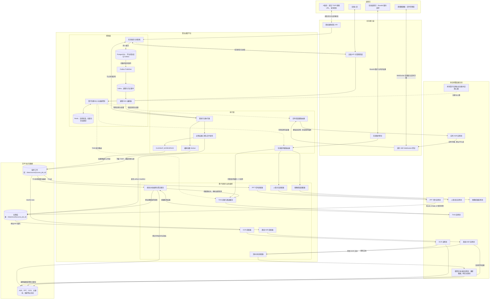

# 算法调度平台详细设计

> 文档版本：3.0  
> 形成日期：2026-07-28  
> 状态：方案设计稿  
> 适用范围：教育课堂三路视频、在线图片分析与实时语音转写

## 1. 文档目的

本文档汇总当前已经确认的算法调度平台设计。平台接管原 A 服务中的部分媒体处理与算法编排能力，在不引入 Kubernetes 的前提下，统一管理已有 Docker 算法服务，并同时支持以下三类业务：

1. 课后离线课程分析：输入同一节课的 T、S、P 三路视频 URL，异步完成媒体准备、ASR、PPT 切片、OCR、文本分析和视觉分析。
2. 在线图片分析：上游直接携带 Base64 图片，同步调用 TIAS、人脸识别和图像质量检测，并根据实例容量分发完整请求。
3. 实时语音转写：通过 WebSocket 建立实时 ASR 会话，为直播播放器提供字幕，不替代课后的离线 ASR 结果。

本文档描述目标边界、组件职责、主要数据流、部署方式、数据与文件目录、算子注册、实例选择和运维要求。TIAS 的自适应视觉分析算法另见《TIAS 自适应视觉分析与适配调度设计》。

## 2. 已确认的业务前提

### 2.1 三路课程视频

同一节课具有三路基本同时开录的视频，允许存在轻微时间偏差，第一版不记录或校正 `start_offset_ms`：

| 标识 | 内容 | 主要用途 |
|---|---|---|
| T | 教师讲台视角 | 教师音轨、教师行为分析 |
| S | 学生视角 | 学生人数、抬头、睡觉、玩手机等行为分析 |
| P | 讲台电脑课件录屏 | PPT 切片、OCR、单页关键词提取 |

A 服务只负责提交任务和查询任务状态。对于离线任务，A 提供三个可下载视频 URL，不负责调度平台内部文件生命周期。

### 2.2 当前部署约束

- 调度平台、算法容器、PostgreSQL、Kafka 和 Redis 部署在同一台服务器。
- PostgreSQL、Kafka 和 Redis 分别运行在独立 Docker 容器中。
- 算法服务继续使用 Docker 运行，不在第一版引入 Kubernetes。
- 同一算法可以部署多个 Docker 实例；一个容器端点视为一个调度实例。
- 容器内部的多个 FastAPI/Uvicorn worker 共享同一个服务端点，不分别向平台注册。
- 离线任务总体并发预计在 10 到 100 之间，允许课后异步处理。
- T、S、P 和中间文件通过同机共享目录传递，Kafka 不传输视频、音频或图片二进制。

### 2.3 已有算法能力

| 能力 | 现有项目 | 主要接口或输入 |
|---|---|---|
| 实时 ASR | `asr_online` | WebSocket 音频流 |
| 离线 ASR | `asr_offline` | WAV 文件 |
| OCR | `ocr` | 单张图片 |
| PPT 切片 | `ppt_slice` | P 视频 |
| VBas 视觉推理 | `vbas` | T/S 抽取的图片，`/ImageDetect/student/v1.0.0`、`/ImageDetect/teacher/v1.0.0` |
| 课程文本分析 | `text_analysis` 服务 | `/v1/course_overviews`、`/v1/extract_keywords` |
| 人脸识别 | `facerec` | `/recognize` 或 `/recognize/batch` |
| 图像质量检测 | `screen_det` | `/detect_all` |

## 3. 设计目标与非目标

### 3.1 设计目标

- 为离线课程建立可查询的任务与节点状态。
- 将大文件下载与算法调用从 A 服务中移入调度平台。
- 对多个算法实例执行容量感知的请求路由。
- 统一算子注册、心跳、健康状态和实例摘除。
- 复用现有同步 FastAPI 算法接口，通过适配器隔离接口差异。
- 让离线、在线图片和实时语音使用不同的调度粒度。
- 为运维人员提供任务、节点、队列、实例和资源状态视图。
- 区分临时工作文件与长期结果文件，避免任务清理误删业务资产。

### 3.2 第一版非目标

- 不引入 Kubernetes、Service Mesh 或复杂工作流产品。
- 不把视频或图片二进制放入 Kafka。
- 不在同步在线网关内接入 RTSP、拉流或截图。
- 不把一个在线多图请求拆到多个算子实例。
- 不要求所有算法项目立即改造成完全一致的内部实现。
- 不由平台任务库替代各算法已有的业务结果数据库。
- 不解决三路视频轻微时间偏移的自动对齐。

## 4. 总体架构

### 4.1 Mermaid DSL 总图



图中实线表示业务请求、媒体、结果或事件流，虚线表示注册、心跳、状态和调度元数据流。在线三类接口只接收上游传入的 Base64 图片，不包含 RTSP 拉流和截图；一个完整请求只路由到一个算子实例。视觉分析编排与聚合服务根据帧级结果生成下一轮抽帧计划，因此会多次调用 TIAS 适配与路由服务。

若 Markdown 阅读器不支持 Mermaid，可参考以下简化结构图：

```text
                         ┌──────────────────────────────┐
                         │          A / 上游             │
                         │ 离线任务、Base64 图片、音频流 │
                         └──────────────┬───────────────┘
                                        │
              ┌─────────────────────────┼─────────────────────────┐
              │                         │                         │
              ▼                         ▼                         ▼
      离线任务接入 API            在线图片网关              实时 ASR 网关
              │                         │                         │
      任务库 + Outbox             请求级实例路由              会话级实例路由
              │                         │                         │
            Kafka                       │                         │
              │                         │                         │
        课程 DAG 编排                    │                         │
              │                         │                         │
        离线执行 Worker                  │                         │
              └──────────────┬──────────┴──────────┬──────────────┘
                             ▼                     ▼
                         算子适配器             算子注册中心
                             │                     │
                             └──────────┬──────────┘
                                        ▼
                                多实例算法服务池

支撑：PostgreSQL | Kafka | Redis | /data/course | /data/result
```

### 4.2 平台分层

| 分层 | 主要组件 | 职责 |
|---|---|---|
| 北向接入层 | 离线任务 API、在线图片 API、WebSocket 网关、运维 API | 接收上游请求并提供统一协议 |
| 控制面 | 任务服务、Outbox、DAG 编排器、注册中心、运维控制 | 管理状态、依赖、实例元数据和调度决策 |
| 执行面 | Kafka Consumer、媒体 Worker、节点执行器、算子适配器 | 消费任务、准备文件、调用算法并回写状态 |
| 算子层 | ASR、PPT、OCR、文本分析、TIAS、人脸、图像质量 | 执行模型推理或算法处理 |
| 数据与资源层 | PostgreSQL、Redis、Kafka、业务库、本地目录 | 保存任务状态、实例状态、事件和文件 |

控制面不等同于 Kafka Consumer。Kafka Consumer 属于执行面入口；控制面还包含任务接入、DAG、状态机、注册中心和运维控制。

算子实例向平台注册中心注册，不向某个算子适配器注册。适配器在调用时查询注册中心并选定目标实例。

## 5. 北向接口边界

### 5.1 离线课程任务

建议提供以下平台接口：

```text
POST /v1/course-jobs
GET  /v1/course-jobs/{course_job_id}
GET  /v1/course-jobs/{course_job_id}/nodes
POST /v1/course-jobs/{course_job_id}/cancel
POST /v1/course-jobs/{course_job_id}/retry
```

任务提交请求只包含课程标识、T/S/P URL 和必要业务元数据。HTTP 请求内不下载大文件；成功写入任务状态与待发布事件后即可返回 `course_job_id`。

### 5.2 在线同步图片

```text
POST /v1/online/tias/analyze
POST /v1/online/face/recognize
POST /v1/online/image-quality/detect
```

- 上游直接发送 Base64 图片。
- 上游应尽量使用一图一请求，但平台不强制拒绝多图请求。
- 调度单位是完整 HTTP 请求。
- 一个请求只绑定一个算子实例，不执行请求内跨实例拆图。
- 多个并发请求可以被分配到不同实例。
- 多图请求出现部分成功时，保留算子返回的成功项和失败项。

### 5.3 实时语音

实时 ASR 使用 WebSocket。会话建立时选择一个实时 ASR 实例，并在连接生命周期内保持绑定。实时字幕只服务直播播放器，默认不入库；课程结束后仍执行独立的离线 ASR 并保存正式结果。

## 6. 离线任务可靠接入与 Outbox

任务状态写入 PostgreSQL，而异步执行依赖 Kafka。如果简单执行“先写库、再发 Kafka”，进程可能在两步之间崩溃，产生“任务可查询但永远不执行”的不一致。

采用事务型 Outbox：

```text
接收任务
  → 同一数据库事务写 course_job 和 outbox_event
  → 提交事务并返回 course_job_id
  → Outbox Publisher 扫描 PENDING 事件
  → 发布到 Kafka
  → 标记 outbox_event=PUBLISHED
```

Outbox 是任务接入服务内部的可靠发布机制，不创建 DAG、不调用算法，也不是 Kafka Consumer。架构总览中可将其收进任务接入节点，详细设计和运维视图仍保留其状态。

## 7. 完整离线课程流程

### 7.1 DAG 概览

```text
SUBMIT_COURSE_JOB
  → PREPARE_MEDIA
      ├→ EXTRACT_AUDIO → OFFLINE_ASR → COURSE_OVERVIEW → 保存文本结果
      ├→ PPT_SLICE → [OCR → EXTRACT_KEYWORDS] x N → 保存 PPT 结果
      └→ VISUAL_ANALYSIS → TIAS_ADAPTER x N → 聚合 → 保存视觉结果
  → REQUIRED_RESULTS_JOIN
  → PUBLISH_ARTIFACT_MANIFEST
  → CLEANUP_WORKSPACE
  → COMPLETED
```

`PREPARE_MEDIA`、三条核心业务泳道、结果汇聚和工作目录清理属于当前业务的必需节点。PPT 分支在切片完成后根据 `ppt_image_id` 动态展开 OCR 与关键词节点。

### 7.2 媒体准备

媒体 Worker 异步下载三路视频，并统一写入：

```text
/data/course/{course_job_id}/source/T.mp4
/data/course/{course_job_id}/source/S.mp4
/data/course/{course_job_id}/source/P.mp4
```

所有离线算法容器挂载相同的 `/data/course` 路径。Kafka 消息只包含 `course_job_id`、本地路径、节点标识和少量元数据。

### 7.3 ASR 与课程脑图泳道

```text
T.mp4 或配置的主音轨
  → 提取 /data/course/{course_job_id}/audio/teacher.wav
  → 离线 ASR
  → 结构化转写文本
  → 课程文本分析服务 /v1/course_overviews
  → ASR 与课程脑图写入对应业务库
```

课程文本分析服务由 `text_analysis` 提供。第一版只注册两个接口：

```text
POST /v1/course_overviews
POST /v1/extract_keywords
```

推荐先在原仓库增加最小 FastAPI 启动入口与独立 Docker 目标，复用 LLM Client、Prompt、数据模型、解析、校验和日志代码；稳定后再决定是否迁移为独立仓库。

### 7.4 PPT、OCR 与关键词泳道

```text
P.mp4
  → PPT 像素相似度切片
  → 为每张切片生成唯一 ppt_image_id
  → 将切片保存为长期结果文件
  → 每个 ppt_image_id 调用一次 OCR
  → 每张 OCR 文本调用一次 /v1/extract_keywords
  → 按 ppt_image_id 写入 PPT、OCR 和关键词结果
```

关键词粒度是单张 PPT 图片，不将整节课 OCR 文本合并后再提取。

### 7.5 视觉分析泳道

视觉分析拆成两个明确组件：

1. 视觉分析编排与聚合服务：读取 T/S、生成抽帧计划、缓存帧结果、识别候选窗口、执行多轮加密检测、聚合时间区间和指标、写业务库。
2. TIAS 适配与路由服务：接收图片批次、查询实例注册与容量、选择一个 TIAS 实例、转换 `/AE/SyncTasks2` 协议并返回帧级结果。

两者是多轮调用关系，而不是一次性的单向链路：

```text
视觉分析服务 → 抽帧批次 → TIAS 适配器 → TIAS 实例
      ▲                                      │
      └──── 新一轮抽帧计划 ← 帧级结果 ──────┘
```

TIAS 自适应滑动与行为区间设计在独立文档中说明。

## 8. 文件目录与生命周期

### 8.1 临时课程工作目录

```text
/data/course/{course_job_id}/
├── source/
│   ├── T.mp4
│   ├── S.mp4
│   └── P.mp4
├── audio/
│   └── teacher.wav
├── frames/
│   ├── teacher/
│   └── student/
├── ppt/
│   └── staging/
├── temp/
└── manifest.json
```

该目录是临时工作区。任务所有必需结果确认落库、长期文件发布完成后，`CLEANUP_WORKSPACE` 只能删除 `/data/course/{course_job_id}`。

### 8.2 长期结果目录

```text
/data/result/{course_job_id}/
├── ppt/
│   ├── manifest.json
│   └── slices/{ppt_image_id}.jpg
├── vision/
│   └── snapshots/{snapshot_id}.jpg
└── manifest.json
```

`/data/result` 不参与工作区清理。数据库保存业务标识、相对路径、文件大小、内容校验值和创建时间。ASR、OCR、关键词和视觉事件等结构化结果仍写入对应数据库，不要求重复保存为文件。

发布长期文件时应先写临时名称，写入成功后在同一文件系统内原子重命名。平台应校验清理目标的真实路径必须位于 `/data/course/{course_job_id}`，禁止使用模糊变量或通配符删除目录。

## 9. 算子注册与实例模型

### 9.1 主动注册

算法容器启动并完成模型加载后，主动调用平台注册 API；运行期间定期心跳，停止前主动注销。第一版建议的最小接口：

```text
POST /v1/operator-instances/register
POST /v1/operator-instances/heartbeat
POST /v1/operator-instances/unregister
GET  /v1/operator-instances
```

### 9.2 注册字段

```text
instance_id
service_code
capabilities[]
service_url
status
model_version
api_version
max_concurrency
max_batch_size
inflight
host
gpu_id
last_heartbeat
```

`service_code` 表示服务类型，`capabilities` 表示同一实例支持的能力。例如精简文本分析实例可以同时注册 `course_overviews` 和 `extract_keywords`；TIAS 实例可以注册学生行为、教师行为和教师头部姿态能力。

### 9.3 实例状态

| 状态 | 含义 | 是否接收新请求 |
|---|---|---|
| STARTING | 进程已启动，模型未就绪 | 否 |
| ONLINE | 健康且存在容量 | 是 |
| BUSY | 健康但当前无空余容量 | 否 |
| DRAINING | 主动摘流，等待在途请求结束 | 否 |
| OFFLINE | 心跳超时、注销或健康异常 | 否 |

Redis 保存带 TTL 的实例状态与容量占位。PostgreSQL可以保存必要的实例历史或运维审计，但不用于高频路由读写。

## 10. 三种调度粒度

### 10.1 离线节点级调度

- Kafka 传递课程或节点事件。
- DAG 根据依赖释放可运行节点。
- 执行器按节点能力选择适配器和算子实例。
- 节点可持续数秒到数小时。
- PPT 子节点和视觉批次允许并行，但需要配置并发上限。

### 10.2 在线请求级调度

```text
完整 HTTP 请求
  → 确定 capability
  → Redis 查询 ONLINE 实例
  → 原子占用 inflight
  → 选择一个实例
  → 适配并转发完整请求
  → 返回同步结果
  → 释放 inflight
```

推荐选择顺序综合考虑：当前占用率、近期分配次数、平均延迟、P95 延迟、排队数、近期失败数和实例标识。无可用容量返回 `429`，无在线实例返回 `503`。

### 10.3 实时会话级调度

实时 ASR 在 WebSocket 建连时选择实例，并保持会话粘性。连接内音频帧不能逐帧重新路由。会话断开后重新连接时允许选择新实例。

## 11. 算子适配器职责

适配器隔离平台协议与现有算法接口差异，主要职责包括：

- 将平台输入转换为算子请求格式。
- 从注册中心选择满足 capability、版本和容量要求的实例。
- 设置超时、请求标识和必要鉴权。
- 将算子输出转换为平台统一响应。
- 保留业务级部分成功明细。
- 记录实例、耗时、错误类型和调用计数。

适配器不负责课程 DAG、不负责业务数据聚合、不长期保存结果，也不是算子注册入口。

## 12. 任务与数据模型

### 12.1 平台任务库

建议至少包含：

| 表或实体 | 作用 |
|---|---|
| `course_job` | 一节课程离线任务的根状态与业务关联 |
| `node_run` | DAG 节点实例、依赖、输入摘要和输出摘要 |
| `attempt` | 一次节点执行尝试、实例和错误信息 |
| `outbox_event` | 待发布和已发布 Kafka 事件 |
| `artifact_manifest` | `/data/result` 文件元数据与业务关联 |
| `operation_audit` | 重试、取消、摘除实例等人工操作记录 |

平台任务库只保存编排事实和文件元数据。OCR 文本、课程脑图、关键词、视觉指标等完整业务结果写入现有对应数据库。

### 12.2 状态模型

课程任务建议状态：

```text
RECEIVED → QUEUED → RUNNING → COMPLETED
                         ├→ FAILED
                         └→ CANCELLED
```

节点建议状态：

```text
PENDING → READY → RUNNING → SUCCEEDED
                     ├→ FAILED
                     ├→ RETRY_WAIT
                     └→ CANCELLED
```

第一版可以简化失败处理策略，但状态与数据模型应预留失败、重试和取消，避免以后迁移任务数据。

### 12.3 幂等标识

- 离线任务提交：业务 `request_id` 或 A 提供的唯一课程任务标识。
- DAG 节点：`node_run_id`。
- 执行尝试：`attempt_no`。
- PPT 图片：`ppt_image_id`。
- TIAS 批次：`batch_id`。
- 长期文件：`artifact_id` 与内容校验值。

## 13. 运维与可观测性

### 13.1 运维页面

第一版建议包含四类视图：

1. 课程任务：课程状态、耗时、当前节点、三条泳道进度、结果与文件发布情况。
2. 节点执行：节点输入摘要、目标实例、尝试次数、开始结束时间和错误类型。
3. 算子实例：服务、能力、版本、GPU、状态、心跳、并发占用、平均与 P95 延迟。
4. 基础设施：Kafka lag、Redis 可用性、PostgreSQL 连接、磁盘空间和 `/data/result` 增长。

### 13.2 运维操作归属

| 操作 | 实现组件 |
|---|---|
| 重试失败节点 | 控制面任务与 DAG 服务 |
| 补跑课程任务 | 控制面任务服务 |
| 取消任务 | 控制面写状态，执行器协作停止 |
| 启停或摘除算子实例 | 注册中心与运维控制面 |
| DRAINING 优雅摘流 | 注册中心更新状态，路由器停止新分配 |

### 13.3 指标与日志

至少记录：

- `course_job_id`、`node_run_id`、`attempt_no`、`trace_id`。
- 算子 `instance_id`、模型版本、请求耗时与状态码。
- Kafka topic、partition、offset 和 consumer lag。
- 实例 inflight、最大并发、批次大小、成功率、P95 延迟。
- 临时目录和结果目录占用空间。
- 各 DAG 节点排队、运行和完成数量。

## 14. 单机 Docker 部署建议

```text
宿主机
├── PostgreSQL 容器
├── Kafka 容器
├── Redis 容器
├── 平台 API / 控制面容器
├── Outbox / DAG / Worker 容器
├── 在线图片与实时 ASR 网关容器
├── 算子适配器容器
├── 多个算法容器
├── /data/platform/postgresql
├── /data/platform/kafka
├── /data/platform/redis
├── /data/course
└── /data/result
```

算法容器通过 Docker 参数绑定 GPU。平台根据 `gpu_id` 和注册容量做路由，但不直接管理 GPU 驱动进程。不同容器共享 `/data/course` 和按需共享 `/data/result`；PostgreSQL、Kafka、Redis 的持久化目录必须与课程媒体目录隔离。

## 15. 配置建议

```toml
[platform]
course_root = "/data/course"
result_root = "/data/result"

[kafka]
course_topic = "course.jobs"
consumer_group = "course-orchestrator"

[registry]
heartbeat_interval_seconds = 5
heartbeat_timeout_seconds = 15

[routing]
reservation_ttl_seconds = 120
online_request_timeout_seconds = 60

[cleanup]
enabled = true
require_results_published = true
```

各算法特有配置保留在对应服务中；平台只维护影响编排、容量和接口契约的配置。

## 16. 分阶段落地建议

### 阶段一：平台骨架

- 完成任务接入、PostgreSQL 任务库、Outbox、Kafka 和课程状态查询。
- 实现媒体准备 Worker 和 `/data/course` 目录。
- 建立最小注册、心跳和实例查询。

### 阶段二：离线三泳道

- 接入离线 ASR、精简课程文本分析服务。
- 接入 PPT 切片、OCR、单页关键词。
- 将 PPT 图片和视觉快照发布到 `/data/result`。
- 拆分视觉分析服务与 TIAS 适配路由服务。

### 阶段三：在线与实时

- 发布三个 Base64 在线图片接口。
- 接入实时 ASR WebSocket 会话路由。
- 增加实例容量、延迟和错误监控。

### 阶段四：运维增强

- 增加节点重试、补跑、取消和实例 DRAINING。
- 增加磁盘生命周期、告警和长期结果归档策略。
- 根据实际容量与部署规模再评估 Kubernetes，而不是提前引入。

## 17. 关键设计结论

1. 平台不是单纯的 Kafka Consumer，而是任务、DAG、注册、路由、执行和运维组成的调度系统。
2. 算子主动注册到平台注册中心；适配器查询注册中心并调用实例。
3. 离线使用节点级异步调度，在线图片使用请求级同步调度，实时 ASR 使用会话级粘性调度。
4. `/data/course/{course_job_id}` 是可清理工作区，`/data/result/{course_job_id}` 是长期结果区。
5. Outbox 保留为可靠发布机制，但在总览中归入任务接入内部实现。
6. `text_analysis` 第一版只注册课程脑图和关键词两个接口。
7. 视觉分析编排与 TIAS 适配路由分离，并允许视觉服务多轮调用 TIAS。
8. 在线多图请求不跨实例拆分；离线视觉批次大小与并发数可配置，不同批次可以分配到不同实例。

## 18. 验收标准

- A 能提交 T/S/P URL 并查询课程任务与节点进度。
- 三路视频只下载一次，所有离线容器读取统一本地路径。
- ASR、PPT、视觉三条泳道能够并行并在结果落库后汇聚。
- 每张 PPT 图片具有唯一 `ppt_image_id`，OCR 和关键词按单图执行。
- 工作目录清理不会删除 `/data/result` 长期文件。
- 多个算法实例能主动注册、心跳并按容量接收请求。
- 三个在线图片接口按完整请求选择实例，不接入视频流或截图。
- 实时 ASR 会话保持实例绑定，课后离线 ASR 独立入库。
- 运维人员能够查看任务、节点、Kafka lag、实例状态、容量和磁盘占用。
- TIAS 视觉服务能通过独立适配器执行可配置批次和多轮自适应检测。
