# 算法功能调度平台总体设计

> 文档版本：6.2（V2 文件版）<br>
> 更新日期：2026-08-27<br>
> 文档状态：架构收口与实施中  
> 适用范围：教育课堂 T/S/P 三端视频课后分析、在线图片路由、实时 ASR 与算子运行管理  
> 暂不展开：完整失败重试/取消/补跑、视频自动对齐、运维前端

> **当前范围权威：** 自 2026-08-21 起，平台当前范围为七类算子、21 个实例；新 PPT DAG 为
> `PPT_SLICE -> PPT_OCR`，新 ASR DAG 仅有 `ASR_TRANSCRIPTION`。文中较早版本的八算子、
> `PPT_KEYWORDS` 和 `COURSE_OVERVIEW` 内容保留为历史设计与实施事实；与当前范围冲突时，以
> `ARCH-005`、`DAG-002`、`ARCH-007` 及相邻的当前范围说明为准。

## 1. 文档目的

本文档替代“仅离线课程任务”的命名口径，汇总离线课程处理、在线图片路由、实时语音转写、服务边界、任务模型、实例路由、文件生命周期与开发顺序，作为算法功能调度平台实现基线。旧《离线课程任务调度处理设计》保留为历史版本。平台需要解决：

1. A 提交课程任务后，平台可靠异步执行并可查询。
2. 同一课程的 PPT、ASR、教师行为、学生行为可分次请求、独立查询、避免重复计算。
3. 多个 Docker 算法端点可统一注册、选择、排空和观察。
4. 离线、在线图片、实时语音采用不同调度方式，互不阻塞。
5. 临时媒体可安全清理，PPT 切片和证据图片长期保留。
6. 结构化结果存 PostgreSQL，并按现有算子真实响应返回。

## 2. 业务输入与已有能力

### 2.1 三端视频

同一节课可能有三路基本同时开录的视频，允许轻微偏差。第一版不记录 `start_offset_ms`，不做自动对齐。

| 标识 | 内容 | 用途 |
|---|---|---|
| T | 教师讲台视角 | 教师音频；站、坐、板书、讲授等行为 |
| S | 学生视角 | 人数、到课率、前后排分布、学生行为 |
| P | 课件录屏 | PPT 切片、单页 OCR |

A 只提供任务参数和可下载 URL，主动查询状态和结果；A 不直连平台数据库，也不管理平台临时文件。

### 2.2 当前算子

| 能力 | 项目 | 主要协议 |
|---|---|---|
| 离线 ASR | `asr_offline` | `POST /v1.1.8/seacraft_asr`，输入 WAV |
| 实时 ASR | `asr_online` | WebSocket |
| PPT 切片 | `ppt_slice` | 输入 P 视频 |
| OCR | `ocr` | 单张图片，`operator_code=ocr` |
| 视觉帧级推理 | `vbas` | 教师/学生图片检测 |
| 人脸对比 | `facerec` | 图片识别 |
| 图像质量 | `screen_det` | `detect_all` |

`text_analysis/` 源码仍保留为独立的非平台项目，但平台不再构建、部署、注册、路由、租赁或调用它。
历史任务中的关键词、课程脑图结果和实例审计仍可查询。

### 2.3 三种调用模式

| 模式 | 输入 | 调度粒度 | Kafka | 正式结果持久化 |
|---|---|---|---|---|
| 课后离线 | 视频 URL | 节点/批次 | 是 | 是 |
| 在线图片 | Base64 图片 | 完整 HTTP 请求 | 否 | 默认否 |
| 实时 ASR | WebSocket 音频 | 整个会话 | 否 | 默认否，课后另做离线 ASR |

## 3. 目标与非目标

### 3.1 目标

- 持久化并查询课程、任务类型、内部节点和结果。
- 支持同一 `task_id` 分次追加不同任务类型。
- 使用 Outbox + Kafka 可靠触发离线任务。
- 使用 Redis 容量租约选择多个算法端点。
- 支持 `URGENT`、`NORMAL` 两级非抢占优先级。
- 复用现有同步 FastAPI/WebSocket 协议，通过适配器隔离差异。
- 视觉支持粗扫、加密抽帧、反复检测和区间聚合。
- 为运维查询准备任务、节点、队列、实例和容量数据。

### 3.2 第一版非目标

- 不引入 Kubernetes、Service Mesh 或通用工作流引擎。
- 不把媒体二进制放入 Kafka 或 PostgreSQL。
- 在线图片接口不拉 RTSP、不截图。
- 不把一个在线多图请求拆到多个实例。
- 不自动校正 T/S/P 时间偏差。
- 第一版不做数据库分区和历史归档策略。
- 状态预留失败/取消，但完整重试、取消、补跑后续设计。

## 4. 部署与仓库

第一阶段在同一台服务器部署四个平台服务、全部算法容器、PostgreSQL、Kafka、Redis、MongoDB，并共享 `/data/course` 与 `/data/result`。当前不使用 Kubernetes；Kubernetes 未来可以做容器编排和跨机弹性，但不能替代业务任务编排。

里程碑 2B 的固定目标为 x86_64 三卡服务器 `root@192.168.29.11:22`，登录密码
`kedacom_123`，代码目录 `/root/workspace/algorithm-scheduling`。

目标工作区：

```text
算法功能调度/
├── control_service/{app,tests,docker,config.toml,requirements.txt}
├── orchestrator_service/{app,tests,docker,config.toml,requirements.txt}
├── vision_orchestrator_service/{app,tests,docker,config.toml,requirements.txt}
├── online_gateway_service/{app,tests,docker,config.toml,requirements.txt}
└── algorithm-scheduling-platform/
    ├── packages/{platform_common,platform_contracts,operator_registry_client}
    ├── migrations/
    ├── deploy/
    ├── harness/
    └── tests/
```

四个服务共享代码仓库和公共包，但独立启动、健康检查和部署。

每个服务的 `app/` 按 `api`、`application`、`domain`、`infrastructure`、`core` 分层；`config.toml` 每个字段带相邻中文说明，加载优先级为代码默认值、TOML、环境变量。当前里程碑 2B 不使用 `.env`，并经用户批准把部署模板、服务器登录合同和受控服务默认值提交到 Git。该批准不覆盖模型解密密钥、SSH 私钥/Deploy Key、人脸原图、课程媒体、大型 fixture 和外部可信模型 manifest，这些仍保留在 Git 工作树外。

基础设施使用四个独立 Docker 容器和持久卷：PostgreSQL、Kafka、Redis、MongoDB。宿主机进程分别连接 `127.0.0.1:5432`、`127.0.0.1:9092`、`127.0.0.1:6379`、`127.0.0.1:27017`；平台/算子容器分别连接 `postgres:5432`、`kafka:29092`、`redis:6379`、`mongodb:27017`。Kafka 监听 `EXTERNAL://:9092` 与 `INTERNAL://:29092`，分别广播 `EXTERNAL://127.0.0.1:9092` 与 `INTERNAL://kafka:29092`；容器内不能使用宿主机广播地址。

当前单机 Compose 入口为：

```bash
cd algorithm-scheduling-platform
EXPECTED_GIT_SHA="$(git -C .. rev-parse HEAD)"
docker compose -f deploy/docker-compose.platform.yml config --quiet
EXPECTED_GIT_SHA="$EXPECTED_GIT_SHA" \
  docker compose -f deploy/docker-compose.platform.yml up -d --build
deploy/scripts/preflight runtime --git-sha "$EXPECTED_GIT_SHA"
```

该 Compose 包含 PostgreSQL、Kafka、Redis、MongoDB 和四个平台服务，统一加入 `algorithm-platform` 网络并挂载同一 `/data/course`、`/data/result`。只有 `18100`（control）和 `18103`（online）绑定全部宿主机地址，作为 A/远程可信内网入口；`5432`、`9092`、`6379`、`27017`、`18101`（orchestrator）、`18102`（vision）和全部 21 个算子宿主机端口只绑定 `127.0.0.1`。容器间仍使用 Compose 服务名和内部端口。算子 Compose 可在平台就绪后按 profile 独立启动。

里程碑 2B 把 Git 外已有的 `model-assets.manifest.json` 视为可信交付基线，部署只允许
`stage-model-assets` 和 `verify-model-assets`，不能重新生成基线。OCR 镜像构建时从可信
基线投影出的运行时 manifest 只用于镜像内校验，不成为第二个交付权威。

2B 生命周期固定为“快照 -> 只暂停用户明确允许的原 `ocr-v6-amd` -> 通过原子 ledger
启动并记录本轮新增算子 ID -> 验收 -> 只停止 ledger 中的新增算子，不删除容器 ->
恢复 `ocr-v6-amd`”。平台和
四类基础设施不执行 `down`，禁止 prune、`down -v`、删除卷和删除 `/data/result`。

## 5. 四个可部署服务

### 5.1 `control-service`

- 暴露 `POST /api/course-jobs` 和 `GET /api/course-jobs/{task_id}`。
- 保存课程请求、任务类型、节点状态和结构化结果。
- 同一 PostgreSQL 事务写任务与 Outbox。
- 提供算子注册、心跳、注销、列表、容量租约与排空控制。
- 为后续运维页面提供任务和实例查询。

它不下载视频、不运行 FFmpeg、不调用模型、不消费课程 Kafka 事件。

### 5.2 `orchestrator-service`

- Outbox Publisher 发布待发送事件。
- Kafka Consumer 幂等创建被请求的业务管道。
- 根据前置依赖、优先级和容量释放节点。
- 下载视频、提取 WAV、管理课程临时目录。
- 调用 PPT、OCR、离线 ASR 等适配器。
- 向视觉服务发课程级命令，消费视觉进度及成功/失败终态事件。
- 幂等忽略终态后的迟到视觉进度和重复完成事件；任务身份不一致等真实协议错误仍失败关闭。
- 写回状态并触发临时目录清理。

Publisher、Consumer 和节点执行器是同一服务内的独立循环，长时间算法调用不得阻塞 Outbox 发布。

### 5.3 `vision-orchestrator-service`

- 消费教师/学生课程级视觉命令。
- 读取 T/S，生成粗扫、候选窗口、边界细化和矛盾点补帧计划。
- 缓存抽取帧和帧级推理结果。
- 按配置批次和并发反复调用 VBas。
- 聚合教师行为区间、学生人数/行为/区域指标。
- 保存少量长期证据图片和结构化结果。
- 发布进度和完成事件。

它拥有“为什么还要再检测一轮”的决策权，不只是 VBas 适配器。

### 5.4 `online-gateway-service`

```text
POST      /api/online/vbas/analyze
POST      /api/online/face/recognize
POST      /api/online/image-quality/detect
POST      /api/online/ocr/recognize
WebSocket /api/online/asr/stream
```

图片接口接收 A 直接提供的 Base64，不拉流、不截图、不建离线任务。一次完整请求只选一个实例；多个并发请求可进入不同实例。实时 ASR 建连时选择实例并保持会话粘性。

人脸库不新增第五个平台服务。`facerec + MongoDB` 是人物 embedding 的领域权威，A 服务通过
`online-gateway-service` 的独立人脸库管理路由代理人物入库、更新和删除，不直接连接 MongoDB。
人脸库管理不进入离线 Kafka/DAG，也不写平台 PostgreSQL；具体北向路径在 A 对接契约冻结时确定，
不得直接复用离线课程任务接口。默认 `save_person_photo=false`，只保存识别所需 embedding 和人物
元数据，不保存人物裁剪图；该开关不改变 embedding 生成、入库和对比识别。

## 6. 总体架构 Mermaid DSL

### 6.1 架构图版本与留存规则

架构图是设计决策记录，不使用新图覆盖旧图。每次讨论形成并被确认的图都应：

1. 分配稳定的图编号、版本日期、视角和状态。
2. 原图保留在本文档中；若设计演进，追加新图并说明与旧图的关系。
3. “历史视图”表示当时讨论的结构记录，不表示其中所有实现状态仍是当前结论。
4. 当前有效图可以从不同视角同时存在；组件全景图和服务边界图互为补充，不互相替代。

| 图编号 | 形成时间 | 视角 | 状态 |
|---|---|---|---|
| ARCH-001 | 2026-08-07（提交 `3363d3e`） | 平台、基础设施与八算子的一体化组件全景 | 历史八算子视图 |
| ARCH-002 | 2026-08-07 | 离线、在线和运维三条边界 | 当前有效 |
| SEQ-001 | 2026-08-07 | 方案 C 基础任务闭环时序 | 当前有效，2A 已验证、2B 部署验收中 |
| ARCH-003 | 2026-08-15 | 单机三卡八算子部署、暴露面与镜像 attestation | 历史八算子视图 |
| ARCH-004 | 2026-08-19 | 统一 TOML 容量、可归属租约和在线 OCR | 当前有效，容量租约实施视图 |
| ARCH-005 | 2026-08-21 | 单机三卡七算子部署与服务边界 | 当前部署权威 |
| DAG-002 | 2026-08-21 | PPT/OCR、ASR-only 与视觉任务 DAG | 当前新任务权威 |
| ARCH-006 | 2026-08-23 | 常驻发布、A 服务极限负载与证据闭环 | 当前里程碑 2B 验收视图 |
| ARCH-007 | 2026-08-27 | 公共实时负载路由与有界视觉执行 | 当前实例选择与视觉并发权威 |

### 6.2 ARCH-001：历史总体组件图

该图保留此前讨论形成的一体化结构，重点是完整展示 PostgreSQL、Kafka、Redis、共享目录和八类算子实例。后续形成 ARCH-002 是为了强调三类业务边界，并非替换本图。

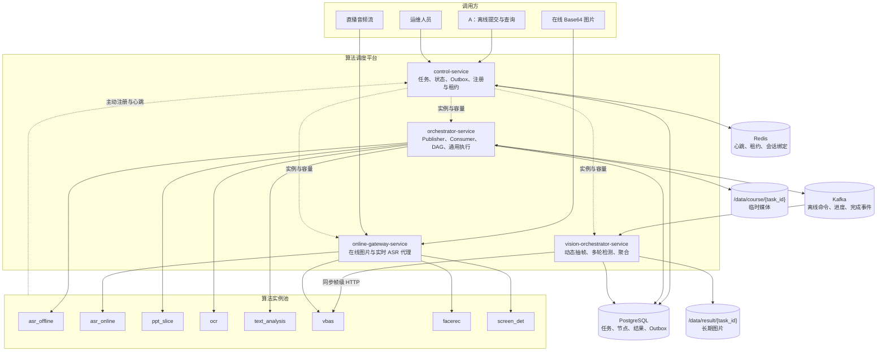

### 6.3 ARCH-002：当前服务边界图

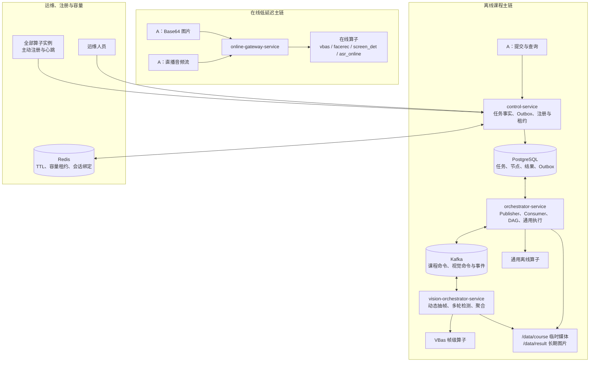

控制面不等于 Kafka Consumer；算子向平台注册中心而非适配器注册。通用编排到视觉服务使用 Kafka，
视觉服务到 VBas 使用同步 HTTP。在线路径不进入 Kafka。

### 6.4 SEQ-001：方案 C 基础任务时序图

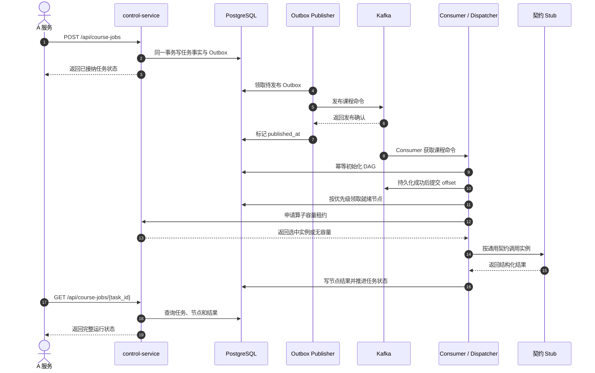

Publisher 与 Consumer 虽部署在同一个 `orchestrator-service`，仍是互不阻塞的独立后台循环。
`control-service` 只在数据库事务中写 Outbox，不在 API 请求内直接发布 Kafka。

### 6.5 ARCH-003：单机三卡部署、暴露面与镜像证明图

ARCH-003 在不替换 ARCH-001/ARCH-002/SEQ-001 的前提下，记录当时八算子 2B 的物理部署和
验收边界。它已被 ARCH-005 的七算子部署图取代，但原图和原数量作为历史事实保留。图中的 `127.0.0.1` 仅表示宿主机暴露面；容器内部仍通过
`algorithm-platform` 网络和服务名互通。

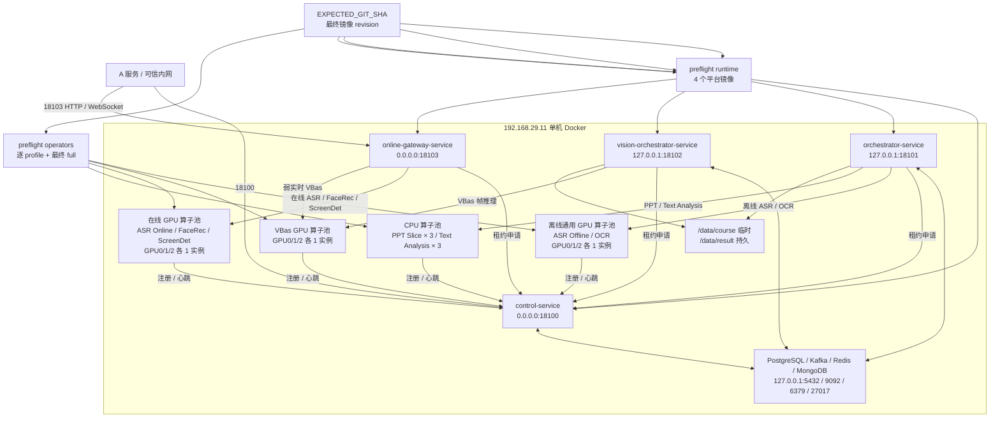

ARCH-003 中的三个 GPU 逻辑算子池均由 GPU0/GPU1/GPU2 上的对应实例组成，合计
18 个 GPU 实例；CPU 池有 6 个实例。`control-service` 只接收算子注册/心跳并向
执行服务发放容量租约，不直接调用模型。离线通用和 CPU 算子由
`orchestrator-service` 调用，VBas 离线自适应推理由 `vision-orchestrator-service`
调用，在线 ASR/VBas/FaceRec/ScreenDet 由 `online-gateway-service` 调用。

平台构建必须显式传入完整 `EXPECTED_GIT_SHA`。`preflight runtime --git-sha` 对四个
运行中平台容器所用最终镜像验签；`preflight operators --profile ... --git-sha` 对每个
profile 的最终算子镜像、容器身份、注册和首次心跳验收；全 24 实例同时 ONLINE 后再执行
`preflight operators --full --git-sha`。Smoke 的 `--git-sha` 只标记报告归属，不替代镜像
attestation。

### 6.6 ARCH-004：统一容量与可归属租约图

ARCH-004 追加本次容量模型，不替换此前服务边界和物理部署图。类型级平台注册参数来自算子
TOML；实例身份和 GPU 绑定仍来自 Compose。在线与离线调用都先向 Control Service 申请同一
共享容量池，区别只在容量不足后的处理方式。

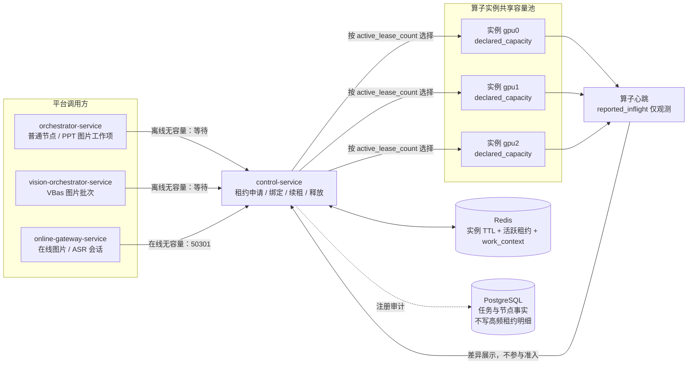

租约对应真实工作单元：普通离线 HTTP 一次一个、PPT Slice 后台任务一个、PPT OCR
每张图片一个、VBas 每批一个、在线图片每请求一个、实时 ASR 每 WebSocket 会话一个。同步
HTTP 具有有限硬超时；调用跨越单次 TTL 时续租原租约，终止后释放，调用方失联后由 TTL 回收。

### 6.7 ARCH-005：单机三卡七算子部署权威图

ARCH-005 保留 ARCH-003 的物理部署视角，但按 2026-08-21 当前范围移除 Text Analysis。
七类算子共 21 个实例：六类 GPU 算子在三张卡上各一套，共 18 个实例；PPT Slice 在 CPU
profile 部署 3 个实例。四个平台服务仍保持独立部署。

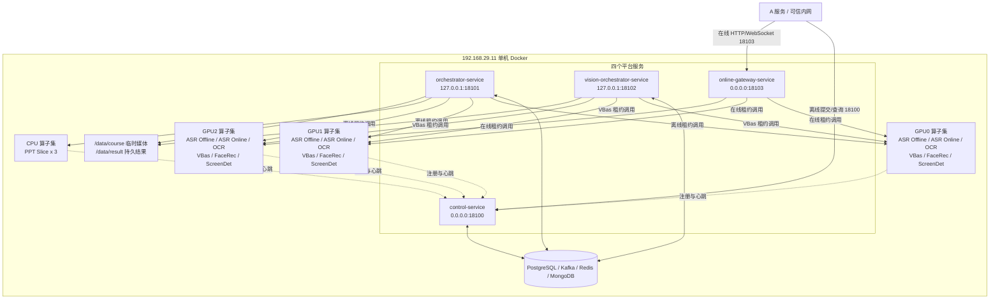

### 6.8 DAG-002：当前新任务 DAG 权威图

新任务只创建下图中的实际节点，不为退役能力创建占位节点。历史查询仍可返回旧任务中已经
存在的 `PPT_KEYWORDS` 和 `COURSE_OVERVIEW`。

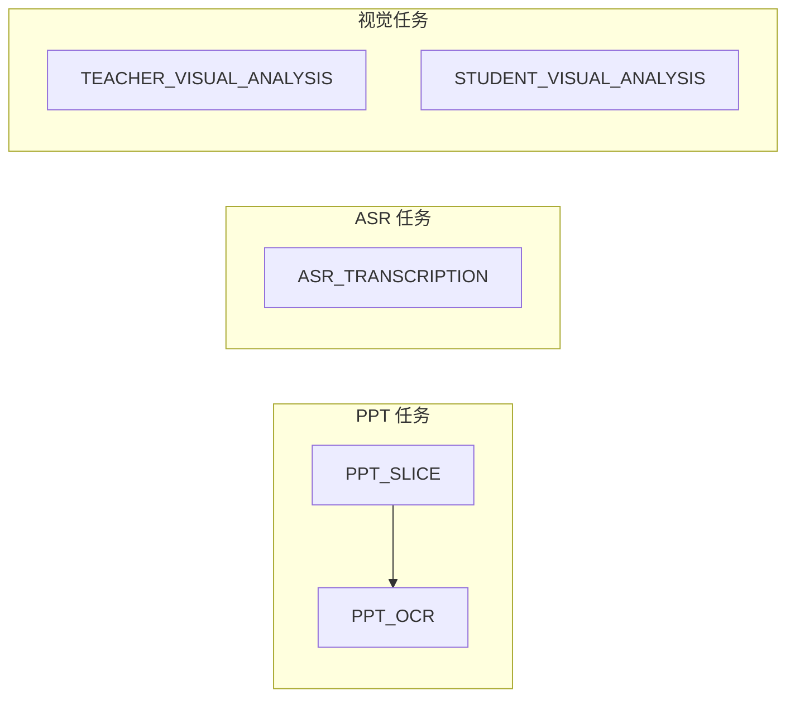

### 6.9 ARCH-006：常驻发布、A 服务负载与证据闭环

ARCH-006 追加里程碑 2B 的发布和验收视角，不替换 ARCH-002 的业务边界、ARCH-005 的物理
拓扑或 DAG-002 的任务关系。A 服务模拟器与目标服务器分离，只访问 `18100` 和 `18103`；
常驻生命周期、负载阶段、指标、护栏和精确镜像清理由独立部署/Harness 入口控制，不进入四个
业务服务的职责。

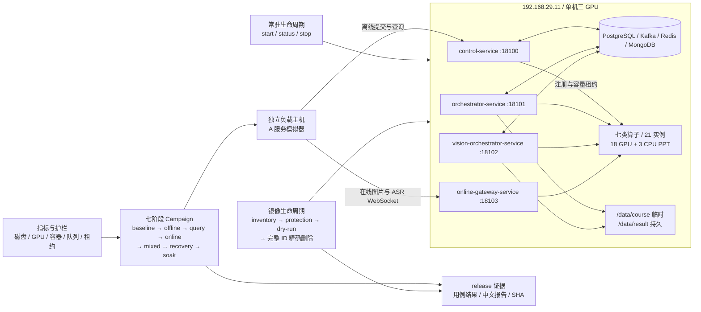

当前发布权威只包含七算子，不包含 `text_analysis`。镜像清理必须先生成保护集和只含完整
容器/镜像 ID 的 dry-run；构建前保留当前可回滚基线，新版全部必需门禁符合后才允许精确退役
上一版。禁止通过 prune、删除卷或删除 `/data/result` 换取空间。

## 7. 任务与节点模型

`task_id` 是 A 提供的全局唯一课程标识。任务类型只保留：

```text
PPT
ASR
TEACHER_BEHAVIOR
STUDENT_BEHAVIOR
```

唯一业务管道键为 `(task_id, task_type)`：不存在则创建；运行中返回状态；已完成直接返回；同一课程新类型只创建新增管道。不要求 PPT 第一个触发，但业务上每节课最终应请求 PPT。

内部节点：

```text
PPT:              PPT_SLICE -> PPT_OCR
ASR:              ASR_TRANSCRIPTION
TEACHER_BEHAVIOR: TEACHER_VISUAL_ANALYSIS
STUDENT_BEHAVIOR: STUDENT_VISUAL_ANALYSIS
```

只为新任务创建上述实际节点，不创建退役节点占位符。历史任务中已经存在的
`PPT_KEYWORDS`、`COURSE_OVERVIEW` 及其结果继续原样可查。

## 8. 整数状态

| 状态 | 含义 |
|---:|---|
| 0 | 未请求 |
| 10 | 待处理 |
| 20 | 等待前置节点 |
| 30 | 等待算子 |
| 40 | 已排队 |
| 50 | 处理中 |
| 60 | 已完成 |
| 70 | 处理失败 |
| 80 | 已取消 |

节点同时返回 `status_text` 和中文 `reason`。未检测到某行为是正常完成 60，不是失败。

## 9. A 提交接口

```text
POST /api/course-jobs
```

A-facing 普通 HTTP API 统一 HTTP 200，通过 `code/message/data` 表达业务结果；任务库暂时不可用时返回业务码 `50000` 和中文原因，不把数据库异常栈暴露给 A。内部注册、租约、健康和运维接口保留真实 HTTP 400/404/429/503。

完整示例：

```json
{
  "task_id": "course-001",
  "task_types": ["PPT", "ASR", "TEACHER_BEHAVIOR", "STUDENT_BEHAVIOR"],
  "priority": "NORMAL",
  "teacher_video_path": "http://.../teacher.mp4",
  "student_video_path": "http://.../student.mp4",
  "slides_video_path": "http://.../ppt.mp4",
  "front_points": [{"X": 0, "Y": 0}, {"X": 1920, "Y": 0}, {"X": 1920, "Y": 540}],
  "back_point": [{"X": 0, "Y": 540}, {"X": 1920, "Y": 540}, {"X": 1920, "Y": 1080}],
  "student_count": 38,
  "asr_options": {"showRoleIdentify": false}
}
```

保留 `student_count`、`front_points`、`back_point`，不增加座位容量字段。

稀疏请求合法：

```json
{
  "task_id": "course-001",
  "task_types": ["PPT"],
  "slides_video_path": "http://.../ppt.mp4"
}
```

| 类型 | 必须字段 | 可选字段 |
|---|---|---|
| PPT | `task_id`、`slides_video_path` | `priority` |
| ASR | `task_id`、`teacher_video_path` | `priority`、`asr_options` |
| TEACHER_BEHAVIOR | `task_id`、`teacher_video_path` | `priority` |
| STUDENT_BEHAVIOR | `task_id`、`student_video_path`、`student_count` | `priority`、区域字段 |

未请求类型字段可以不传，也不参与校验。接收响应示例：

```json
{
  "code": 0,
  "message": "任务已接收",
  "data": {
    "task_id": "course-001",
    "priority": "NORMAL",
    "tasks": {"PPT": {"status": 10, "status_text": "待处理", "reason": "等待异步处理"}}
  }
}
```

## 10. Outbox 与 Kafka

Outbox 解决“数据库已写入但 Kafka 未发送”的崩溃窗口：

```text
同一事务写任务与 Outbox
-> 提交并返回
-> Publisher 扫描待发布事件
-> 发布 Kafka
-> 标记已发布
```

Outbox Publisher 合并在 `orchestrator-service` 的部署中，但代码上是独立循环。Kafka 只传 ID、类型、优先级、本地路径和策略元数据，不传视频、WAV、Base64 或大结果。

## 11. 带序号的完整离线流程

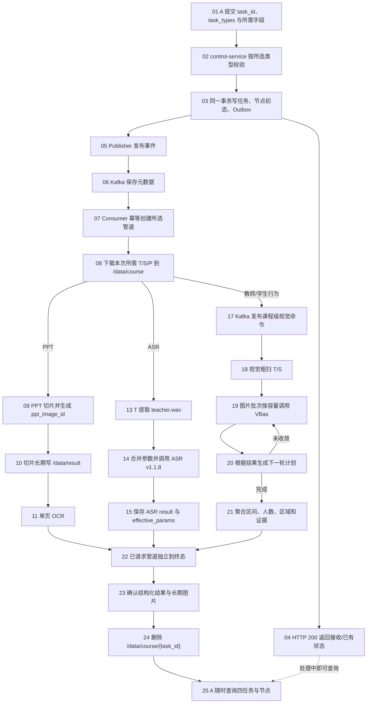

不是所有管道都必须存在。清理只等待本次共享临时工作区的已请求管道。

## 12. 媒体准备与本地目录

```text
/data/course/{task_id}/
├── submissions/{submission_id}/
│   ├── media/teacher.mp4、student.mp4、slides.mp4
│   └── audio/teacher.wav
└── vision/t、s
```

- 同一请求同时选择 ASR 和教师行为时，T 下载一次并共享。
- 以后分开追加任务时重新下载，不为潜在任务长期保留 MP4/WAV。
- 下游容器通过相同 `/data/course` 挂载读取本地文件。
- 容器内 `127.0.0.1` 指向容器自身，正式下载 URL 必须从实际执行环境可达。

## 13. PPT 与 OCR

### 13.1 PPT 切片

PPT 算子是调度平台内部服务，本版本不兼容旧的逐图 Base64 回调。P 视频按像素相似度切片，算子直接写共享目录：

内部提交接口保持 `POST /LocalVideoPPTSliceTasks/v1.0.0`，但请求和响应已改为严格 snake_case 新协议，不接受旧 `taskId/resultCallbackUri/snapImage` 字段：

```json
{
  "video_path": "/data/course/course-001/source/P.mp4",
  "task_id": "course-001",
  "operator_task_id": "ppt-node-101-attempt-1",
  "result_callback_uri": "http://orchestrator-service:18101/internal/ppt-slice/callback/101",
  "threshold": 0.98
}
```

受理响应的 `status=50`；终态回调使用 `status=60/70`。PPT 容器固定一个 Uvicorn Worker，但权威配置 `platform.max_concurrent_requests` 控制进程内 N 路视频并发，并映射为注册的 `declared_capacity`；心跳 `inflight` 必须反映该任务管理器的实际在途数。

```text
/data/result/{task_id}/ppt/
├── slices/slide_000001.jpg
├── slices/slide_000002.jpg
└── manifest.json
```

普通图片写入期间不代表任务完成。算子关闭全部图片文件后先生成 `manifest.json.part`，再原子替换为 `manifest.json`，最后只向 `orchestrator-service` 回调一次 `task_id`、`operator_task_id`、`status`、`path`、`manifest_path`、`count`、`reason` 和 `dynamic_segments`，不传图片字节。`dynamic_segments` 保存疑似播放视频或持续滚动内容的时间区间，不计入 PPT 图片 `count`。

`orchestrator-service` 校验任务身份、目录必须位于 `/data/result/{task_id}/ppt`、路径祖先不得包含符号链接、manifest 终态、动态区间一致性、条目数量和文件存在性。验证及数据库事务成功后，才把 `PPT_SLICE` 更新为 60、保存 `dynamic_segments`、生成稳定 `ppt_image_id` 和 OCR 子任务。`status=70` 时把运行中节点推进为失败并保存中文原因。成功或失败重复回调必须幂等；回调丢失时由运行中节点和 manifest 对账恢复。

```json
{
  "PPT_SLICE": {
    "status": 60,
    "status_text": "已完成",
    "reason": "处理完成",
    "path": "/data/result/course-001/ppt/slices",
    "count": 30,
    "result": null
  }
}
```

`path` 是服务器本地或共享挂载路径，不是 URL。

### 13.2 OCR

每个 `ppt_image_id` 是一个 OCR 逻辑项，可按实例容量并行。OCR 文本是结构化数据，不先写本地 JSON：

```json
{
  "PPT_OCR": {
    "status": 60,
    "status_text": "已完成",
    "reason": "处理完成",
    "path": null,
    "completed_count": 30,
    "total_count": 30,
    "result": {
      "items": [{"ppt_image_id": "ppt-001", "text": "第一页识别文本"}]
    }
  }
}
```

### 13.3 历史单页关键词结果

> 本节只解释历史任务返回格式。新 PPT 任务在 `PPT_OCR` 完成后直接进入终态，不再创建或
> 调用 `PPT_KEYWORDS`。

每页 OCR 文本独立调用 `/v1/extract_keywords`：

```json
{
  "PPT_KEYWORDS": {
    "status": 60,
    "status_text": "已完成",
    "reason": "处理完成",
    "path": null,
    "completed_count": 30,
    "total_count": 30,
    "result": {
      "items": [{"ppt_image_id": "ppt-001", "keywords": ["概率", "联合分布"]}]
    }
  }
}
```

历史任务仍可查询已经持久化的关键词结果。对于新任务，切片完成但 OCR 未部署时，
`PPT_SLICE` 仍为 60 且图片可查询，`PPT_OCR` 显示等待算子；不存在关键词等待节点。

## 14. 离线 ASR

### 14.1 ASR 参数

默认参数：

```json
{
  "language": "auto",
  "showSpk": true,
  "showEmotion": true,
  "showRoleIdentify": false,
  "wordTimestamps": false,
  "hotWords": []
}
```

A 可用 `asr_options` 覆盖部分值。平台合并后保存 `effective_params`：

- `/v1.1.8/seacraft_asr` 是唯一离线 ASR 接口；`language` 会先去除首尾空白并转为小写。
- `language=auto/zh/en` 使用 Paraformer，按现有能力处理说话人、角色和情绪；当前唯一小语种白名单 `fr` 使用 Faster-Whisper，不调用这些模型。
- `fr` 请求 `showSpk=true` 或 `showRoleIdentify=true` 时，每段返回 `role: null`；两者均为 `false` 时不返回 `role`。
- `fr` 请求 `showEmotion=true` 时，每段返回 `emotion: null`；为 `false` 时不返回 `emotion`。
- `segment_words` 每段始终存在：`wordTimestamps=false` 时为 `[]`，为 `true` 时返回 Whisper 真实词时间，个别无法对齐的段允许为 `[]`。
- 算子 `open_mul_lang=false` 或 Whisper 模型未就绪时，`fr` 返回 HTTP 200、`code=4003`；空值或其他未支持语言返回 HTTP 200、`code=4009`。平台必须将二者视为业务失败。
- 已完成 ASR 再收到不同参数时复用旧结果，不重跑、不做多版本；`effective_params` 表示生成当前结果时的参数。

### 14.2 v1.1.8 真实结果

`ASR_TRANSCRIPTION.result` 原样保存成功响应：

```json
{
  "ASR_TRANSCRIPTION": {
    "status": 60,
    "status_text": "已完成",
    "reason": "处理完成",
    "effective_params": {
      "language": "auto",
      "showSpk": true,
      "showEmotion": true,
      "showRoleIdentify": false,
      "wordTimestamps": false,
      "hotWords": []
    },
    "path": null,
    "result": {
      "language": "auto",
      "segments": [
        {
          "segment_text": "授课文本",
          "bg": "1.75",
          "ed": "3.47",
          "speed": 317,
          "segment_words": [],
          "role": "spk_0",
          "emotion": "平淡"
        }
      ],
      "text": "完整转写文本",
      "speed_info": [
        {"unit": 1, "segment_info": {"segment_count": 8, "speed": [307, 264]}}
      ],
      "load_audio_time_ms": "5.57",
      "gpu_time_ms": "6597.73"
    }
  }
}
```

成功响应保持算子现有顶层字段 `language`、`segments`、`text`、`speed_info`、`load_audio_time_ms` 和 `gpu_time_ms`，平台不得添加能力状态或成功业务码字段。每段 `speed` 使用 `int(内容数量 × 60 / (ed-bg) × 0.4)`；`speed_info` 保持 1/5/10 分钟窗口统计且不乘 `0.4`。

ASR 业务错误以 HTTP 200 + `code/msg` 返回，包括小语种关闭或模型未就绪的 `4003` 和非法语言的 `4009`；适配器必须检查响应体，不能只看 HTTP 状态。

### 14.3 历史课程脑图结果

> 本节只解释历史任务返回格式。新 ASR 任务在 `ASR_TRANSCRIPTION` 完成后直接进入终态，
> 不再创建或调用 `COURSE_OVERVIEW`。

ASR 分段转换为 `/v1/course_overviews` 的 `textSegments`。`COURSE_OVERVIEW.result` 保存完整 `GenericResponse`：

```json
{
  "COURSE_OVERVIEW": {
    "status": 60,
    "status_text": "已完成",
    "reason": "处理完成",
    "path": null,
    "result": {
      "model": "实际模型名称",
      "id": "seaCraft-xxxxxxxx",
      "result": {
        "overview": {
          "full_overview": "课程完整概述",
          "key_points": ["知识要点一", "知识要点二"],
          "document_skims": [
            {"time": "0-600", "overview": "本段概览", "content": "本段主要讲述……"}
          ],
          "mindmap": {
            "overall_label": "课程主题",
            "total_time": "0-3600",
            "nodes": [
              {"id": "1", "label": "主题节点", "time": "0-600", "children": []}
            ]
          }
        },
        "finished_time": 1785900000,
        "process_time_ms": 35000,
        "finished_reason": "stop"
      },
      "usage": {
        "prompt_tokens": 1000,
        "completion_tokens": 500,
        "total_tokens": 1500
      }
    }
  }
}
```

平台 `result` 内保留算法自身的 `result`，不随意改名或丢弃 `model/id/usage`。

## 15. 视觉服务与 VBas

### 15.1 服务通信

```text
orchestrator-service
-> Kafka：课程级教师/学生视觉命令
-> vision-orchestrator-service
   -> 本地 T/S 抽帧
   -> HTTP + 容量租约：VBas 图片批次
   <- 帧级结果
   -> 下一轮计划与聚合
<- Kafka：进度与完成事件
```

视觉服务可与其他泳道共用一个 PostgreSQL 实例，但不沿用旧视觉项目的 MySQL 表名或旧表设计。

### 15.2 配置

```toml
[visual_analysis]
coarse_interval_seconds = 30
refine_intervals_seconds = [10, 5, 2, 1]
vbas_batch_size = 8
batch_concurrency = 2
max_refine_rounds = 4
max_detection_points_per_course = 5000

[visual_analysis.writing]
max_gap_seconds = 3

[visual_analysis.sitting]
max_gap_seconds = 5
```

粗扫间隔、批次大小和并发可配置。一个批次只进入一个实例，不再拆分；不同批次可进入不同实例。

### 15.3 自适应检测

1. 粗扫全课程，发现候选行为点。
2. 相距很远的命中点分别建立候选，不假设中间持续。
3. 向左右扩展直到找到行为/非行为边界括号。
4. 扫描候选窗口拓扑，判断一段还是多段。
5. 对边界按 10/5/2/1 秒逐级细化。
6. 对单帧反向、主体缺失、疑似坐姿等矛盾点补帧。
7. 最终区间用半开区间 `[start,end)`。

```text
粗扫：20:00 板书
10s：19:40 否、19:50 是、20:00 是、20:10 否
5s：19:45 否、20:05 是
2s：19:47 否、19:49 是、20:07 是、20:09 否
1s：19:48 否、20:08 否
结果：约 [19:49,20:08)
```

### 15.4 缺口与空区间

```text
gap <= max_gap_seconds：合并
gap >  max_gap_seconds：分段
```

板书 `[1,9)` 与 `[12,21)` 的缺口为 3 秒，配置为 3 时合并。

- 有足够有效画面但没检测到某行为：节点 60、该行为 `[]`、不生成代表图片。
- 部分行为存在：存在的正常返回，不存在的为空数组。
- 教师未入镜/有效帧不足：不伪造区间，中文 `reason` 说明无法形成区间。
- 媒体无法读取或 VBas 调用失败才是系统失败。
- 站/坐二选一仅适用于教师被有效检测到的时间点，无效画面不能强行补齐。

### 15.5 长期证据图片

保留现有五类：学生抬头 Top K、阅读 Top K、睡觉阈值、玩手机阈值、教师连续非正视/低头告警；增加板书、坐姿、讲授区间代表帧。保存到：

```text
/data/result/{task_id}/vision/snapshots/{snapshot_id}.jpg
```

普通帧在 `/data/course`，任务后清理。

## 16. 学生人数、区域与兜底

统计口径：

```text
到课率     = 稳定识别人数 / student_count
前排入座率 = 前排稳定人数 / 识别总人数
后排入座率 = 后排稳定人数 / 识别总人数
```

不引入 `front_seat_capacity`、`back_seat_capacity`。

- 提供 `front_points`：按前排区域计算，`front_region_provided=true`。
- 提供 `back_point`：按后排区域计算，`back_region_provided=true`。
- 缺少某区域：从 config 的对应最小/最大值首次生成一次兜底比例并持久化。
- 同一 `task_id` 后续稳定返回，不在查询时重新随机。
- 不增加 `is_estimated` 或 `source`。

```toml
[vision.fallback_seating_rate]
front_min = 0.10
front_max = 0.15
back_min = 0.25
back_max = 0.40
decimal_places = 4
```

## 17. 两级优先级

只支持 `URGENT` 和 `NORMAL`，默认 `NORMAL`：

- 运行中的节点不抢占。
- 相同能力释放容量时，等待 URGENT 先于 NORMAL。
- 同优先级按进入 READY 的先后顺序。
- 优先级按能力分别生效；紧急 OCR 不阻止空闲 ASR 执行普通任务。
- 课程节点查询返回可空 `claimed_at` 和 `started_at`，分别表示已领取和已开始；优先级验证以这两个 PostgreSQL 时间事实为准，不使用客户端发送顺序代替。
- Kafka 只负责可靠通知；最终顺序由节点调度器决定。

## 18. 算子注册与容量

### 18.1 注册关系与接口

算子实例向 `control-service` 注册；适配器查询注册中心并申请容量，不向适配器注册。

```text
POST /api/operator-instances/register
POST /api/operator-instances/heartbeat
POST /api/operator-instances/unregister
GET  /api/operator-instances
POST /internal/operator-instances/lease
POST /internal/operator-instances/lease/context
POST /internal/operator-instances/lease/renew
POST /internal/operator-instances/release
GET  /ops/operator-instances/{instance_id}/active-leases
```

最小注册信息：

```text
instance_id、operator_code、capabilities、service_url
model_version、api_version、declared_capacity、gpu_id/cpu labels、status
```

状态：

- `ONLINE`：可接新请求。
- `DRAINING`：拒绝新请求，允许存量完成。
- `OFFLINE`：不参与选择。

注册采用“声明后激活”两步语义：

1. `register` 先将实例声明和注册事实写入 PostgreSQL/Redis，清理同 `instance_id` 的旧心跳和旧租约，并返回 `OFFLINE`。
2. 注册客户端立即发送首次心跳；只有心跳成功且模型 ready 后，实例才成为 `ONLINE` 租约候选。`start()` 在首次心跳成功前不完成，后续短暂 HTTP 故障按心跳周期继续重试。

Redis 保存心跳 TTL 和原子容量租约。必须先租约成功再调用实例，结束或超时释放。PPT 等异步长任务在“已受理”后继续由 orchestrator 续租，数据库完成事务提交后才释放，避免原 TTL 到期后同一实例被超额分配。注册、心跳、生命周期和租约的基础设施故障统一返回 HTTP 503。

心跳有效性只控制新租约准入。已经取得、尚未过期且由调用方按时续期的在途租约，不因算子单 Worker 推理短暂阻塞心跳而失效；心跳恢复前实例仍拒绝新租约，旧租约继续计入容量。注销、同 ID 重注册、显式 `OFFLINE`、Redis 运行标识变化和租约自身到期仍会终止旧租约。

平台分发占用只使用当前有效的 `active_lease_count`。心跳 `reported_inflight` 继续表示算子实际
接收的请求或会话数，用于发现直连请求、心跳时差和漏租约，但不参与拒绝新租约。同一
`instance_id` 的全部 capability 共享一个 `declared_capacity` 和租约集合，不能把 VBas 的
多个能力横向相加。运维查询同时展示两者及差异，不把差异伪造成任务。

已知身份的在线请求、图片工作项和视觉批次在申请时写入 `work_context`；普通离线节点先申请
租约、领取节点后再通过 context 接口绑定。上下文只包含服务、工作类型、工作 ID、可选任务/
节点/图片/追踪 ID，不保存 Base64、媒体或识别文本。活跃明细只存在 Redis，不新增逐租约
PostgreSQL 高频写入。

当前协议没有进程世代令牌，因此同一 `instance_id` 同一时刻只允许一个存活进程。滚动部署时不得让新旧容器共用 ID；如未来需要同 ID 世代重叠，必须在心跳和注销契约中增加不可伪造的世代令牌。

`enabled_task_types` 定义本次交付明确支持的离线任务类型；实例注册反映当前运行容量。任务类型已启用但暂时没有算子时仍接收任务，节点进入状态 30 并显示缺失能力，不因一次短暂心跳超时改变平台能力边界。

### 18.2 control-service 就绪语义

- `/health` 只表示进程存活，依赖故障时仍返回 200。
- `/ops/readiness` 并行检查 PostgreSQL、Redis 和 schema，任一不符合时返回 503。
- schema 契约包含 10 张表、全部预期字段及中文说明、`0005` 历史索引与三个状态字段的准确语义；只执行到 `0004` 不得 ready。
- `dependency_timeout_seconds` 最小为 2 秒，PostgreSQL 在连接与语句间分配该预算；Redis 就绪探针使用独立短超时连接，不改写注册中心的运行超时配置。

### 18.3 算子运行接口

```text
GET  /ops/health
GET  /ops/status
POST /ops/drain
```

`health` 判断进程存活，`status` 判断模型就绪与容量，`drain` 优雅摘流。

### 18.4 算子任务状态与汇报职责

平台任务状态的唯一权威来源是 PostgreSQL，由执行节点的编排服务负责推进。算子不得直接修改平台任务表，也不应把课程任务状态直接汇报给 `control-service`。否则同一个节点会同时受算子、编排器和控制面更新，无法保证状态顺序、幂等和故障恢复。

同步 HTTP 算子的调用关系：

1. `orchestrator-service` 或 `vision-orchestrator-service` 取得容量租约。
2. 编排服务先把节点或工作项写为 50（处理中），再调用算子。
3. 算子在 HTTP 响应中返回本次调用的成功结果或标准错误。
4. 编排服务校验响应并在同一数据库事务中保存结果、推进节点，再释放租约。
5. 超时、断连等不确定结果由编排服务按调用事实处理，算子不越权写平台状态。

因此，OCR、离线 ASR、VBas、Facerec 和 ScreenDet 等同步调用通常不需要额外的逐任务回调。它们的心跳只报告实例级事实，例如 `model_ready`、`inflight` 和容量，不报告课程 DAG 状态。

PPT 等异步长任务需要额外的算子任务协议：

- 提交时携带平台生成的 `operator_task_id` 和幂等键，算子返回“已受理”。
- 算子内部可维护自己的 `QUEUED/RUNNING/SUCCEEDED/FAILED` 状态，但它不是平台任务状态。
- 编排服务在算子运行期间续租；需要运维进度时，可通过查询接口或进度通知读取 `operator_task_id` 的百分比和阶段。
- 算子只发终态通知或发布原子 manifest；编排服务校验身份、文件与结果后，才把平台节点写为 60/70。
- 终态通知丢失时由编排服务查询算子任务或对账 manifest，重复通知必须幂等。

实时 ASR 不创建离线课程节点。`online-gateway-service` 在 WebSocket 建连时取得会话级租约并保持实例粘性；算子心跳的 `inflight` 包含当前活动会话数，断连后由网关释放租约。

### 18.5 算子接入调度平台的统一改善项

当前七个算子的 `app.main` 都应调用公共 `install_operator_runtime`，具备 `/ops/health`、
`/ops/status`、`/ops/drain` 和注册心跳。注册开关、Control 地址、心跳与容量统一从所选 TOML
的 `[platform]` 读取，GPU 强制检查从 `[runtime].require_gpu` 读取；根配置默认不注册且不
强制 GPU，受控部署 TOML 开启注册。Compose 只继续提供 Token、实例 ID、服务 URL、GPU
绑定、`CONFIG_PATH`、端口、单 worker、镜像、挂载和资源限制。旧
`PLATFORM_REGISTRATION_ENABLED`、`PLATFORM_CONTROL_SERVICE_URL`、
`PLATFORM_HEARTBEAT_INTERVAL_SECONDS`、`PLATFORM_DECLARED_CAPACITY`、`REQUIRE_GPU`
和 `GPU_PROCESS_NAME` 不再是配置权威。

确认的每实例容量为 ASR Online `10`、ASR Offline `4`、FaceRec `128`、OCR `256`、
ScreenDet `128`、PPT Slice `10`、VBas `128`。除 PPT Slice 将统一
字段同时作为本地任务上限外，算子内部队列、锁、线程池、批量和模型安全边界继续独立生效。

每个算子在保留现有业务接口的前提下，应逐项补齐以下能力。首批接入不要求一次实现所有增强，但容量、就绪、错误和可观测性必须真实可用。

| 能力 | 最小要求 | 目的 |
|---|---|---|
| 身份与元数据 | 稳定 `instance_id/operator_code/api_version/model_version/service_url` | 区分不同 GPU、端口和模型版本 |
| 注册与首次心跳 | 启动注册，模型 ready 后首次心跳激活 | 防止模型未加载完成就被路由 |
| 存活与就绪 | liveness 只看进程；readiness/status 看模型和依赖 | 正确摘除不可推理实例 |
| 真实容量 | `declared_capacity`、`inflight` 与进程实际并发一致 | 避免同一 GPU 过载 |
| 过载行为 | 无本地容量时快速返回明确的 429/503，不无限排队 | 让调度器重新选择或等待 |
| 错误分类 | 区分参数错误、过载、暂时故障、模型失败和不可重试错误 | 让编排器作出一致状态决策 |
| 关联标识 | 日志携带 `trace_id/task_id/node_run_id/operator_task_id` 中适用项 | 串联平台与算子日志 |
| 幂等 | 异步提交必须支持幂等；同步推理至少避免副作用 | 支持消息重复和重启恢复 |
| 优雅排空 | DRAINING 后拒绝新任务并允许存量完成 | 支持维护和替换实例 |
| 结果契约 | 明确结构化结果大小、文件路径根和文件完成标志 | 防止半成品或越界路径入库 |
| 长任务状态 | 仅异步长任务提供任务查询、终态通知和恢复对账 | 解决 PPT 等调用跨越租约 TTL 的问题 |
| 实时会话 | 仅实时算子提供会话粘性、活动会话数和断连清理 | 保证 WebSocket 生命周期一致 |

### 18.6 VBas 命名

平台只使用 `operator_code=vbas`，不保留 `tias` 兼容标识、路径、环境变量或容器名。旧视觉聚合职责不回迁到 `vbas` 算子。

## 19. 单 Worker 与多 GPU 全量算子集群

全部算法算子容器使用一个 Uvicorn Worker。单个 PPT 进程可通过内部线程和任务队列并发处理配置的 N 路视频；“一个 Uvicorn Worker”不等于“只能处理一个任务”。

里程碑 2B 的当前权威拓扑为三张 GPU，每张卡部署一套六类 GPU 算子；CPU profile 另部署
三套 PPT，共 21 个算子实例：

```text
GPU0: asr_offline、asr_online、ocr、vbas、facerec、screen_det，workers=1
GPU1: asr_offline、asr_online、ocr、vbas、facerec、screen_det，workers=1
GPU2: asr_offline、asr_online、ocr、vbas、facerec、screen_det，workers=1
CPU:  ppt_slice × 3，workers=1
```

各容器使用不同 `instance_id`、`service_url` 和 `gpu_id` 注册。control-service 在同能力实例间按容量租约分配。离线算子使用请求或异步任务租约；实时 ASR 使用会话级租约；Docker restart policy 负责进程恢复。

每个 GPU 实例的验收必须在真实推理期间采集 CUDA PID/UUID/cgroup 证据，随后停止并验证
`--assert-stopped`，立即重启并等待首次心跳、`ONLINE`、`model_ready=true` 后再继续。
FaceRec 三实例必须同时运行；PPT 三实例必须逐实例 Smoke；最终 21 实例必须同时 ONLINE，
再执行 full preflight 和七类 full Smoke。

## 20. 在线图片与实时语音

### 20.1 在线图片边界

- A 直接发送 Base64，不存在“视频流 -> 截图”。
- 上游尽量一图一请求，代码不强制拒绝多图。
- 多图请求不跨实例拆分，按完整请求选择实例。
- 多图的成功项/失败项按算子真实结果返回。
- VBas、FaceRec、ScreenDet 和 OCR 四个接口都根据当前注册、健康和容量选实例。
- 在线请求不入 Kafka、不创建离线节点。

单图 OCR 使用 `POST /api/online/ocr/recognize`，请求字段为必填 `image`、可选
`image_id` 和可选严格布尔 `enable_formula`（默认 `false`）。网关将其转换成 OCR 现有
`/ocr/prediction` 单元素 `key/value` 协议。请求正文最大 72 MiB，Base64 解码后单图最大
50 MiB，两项都在申请租约前检查；容量不足直接返回 HTTP 200、业务码 `50301`，不在网关或
Control Service 排队。在线与 PPT OCR 平等竞争同一个 `ocr` 实例池。

### 20.2 实时 ASR

实时 ASR 用于直播字幕，默认不入库。课程结束后另跑离线 ASR 并保存正式结果。WebSocket 建连时选实例，连接期间保持粘性，断开时释放容量。

## 21. 文件与结构化结果

### 21.1 运行日志边界

七个当前算子和四个平台服务统一将运行日志写入项目根
`logs/{instance_id}/application.log`，同时输出到 stdout。默认单个活动文件最大 100 MiB，
归档保留 7 日；每个项目根 `config.toml` 的 `[logging]` 段可以调整级别、目录、文件名、
大小、保留天数和双输出开关。Docker 镜像会预创建 `logs/`，因此不挂载宿主机目录时仍可
进入容器查看；跨容器重建保留日志时，使用平台 `deploy/docker-compose.logs.yml` 可选覆盖层，
每个实例挂载到独立的 `/data/logs/algorithm-scheduling/{service}/{instance_id}` 目录。

日志只记录服务、实例、任务/节点标识、算子、耗时和状态等允许字段，禁止写入 Base64、
音视频/图片字节、完整请求或响应、Token、Cookie、密码、完整数据库 DSN、完整 ASR/OCR
文本和 embedding。日志路径不属于 A 服务接口，A 只通过既有任务查询接口获取业务状态和结果。
`text_analysis` 是后续范围调整已废止的非平台项目，不纳入上述日志、镜像或部署范围。

| 数据 | 位置 | 查询方式 |
|---|---|---|
| T/S/P、WAV、普通帧 | `/data/course/{task_id}` | 不作为长期结果 |
| PPT 切片 | `/data/result/{task_id}/ppt/slices` | `path`、`count` |
| 视觉证据图 | `/data/result/{task_id}/vision` | `path`、`count`、图片元数据 |
| OCR | PostgreSQL | 节点 `result` |
| ASR | PostgreSQL | 节点 `result` |
| 行为区间、人数、区域指标 | PostgreSQL | 节点 `result` |
| 任务、节点、Outbox | PostgreSQL | 查询 API |
| 心跳、租约、会话 | Redis | 运维 API/指标 |
| 命令和事件 | Kafka | 不直接返回 A |

第一版不要求结构化结果另写本地 JSON，也不为普通结构化结果强制生成通用 `manifest.json`；PPT 切片自己的完成 manifest 是例外且为强制契约。

## 22. 查询接口与响应

第一版只提供：

```text
GET /api/course-jobs/{task_id}
```

一个响应返回四类任务和内部节点，未请求类型为 0，不单独设计 `/tasks/PPT`。当前已实现接口使用 `tasks` 数组，每项用 `task_type` 标识类型；`nodes` 同样是数组：

```json
{
  "code": 0,
  "message": "查询成功",
  "data": {
    "task_id": "course-001",
    "tasks": [
      {
        "task_type": "PPT",
        "status": 50,
        "status_text": "处理中",
        "reason": "正在执行 OCR",
        "priority": "NORMAL",
        "nodes": [
          {"node_code": "PPT_SLICE", "status": 60},
          {"node_code": "PPT_OCR", "status": 50}
        ]
      },
      {
        "task_type": "ASR",
        "status": 60,
        "status_text": "已完成",
        "reason": "处理完成",
        "nodes": []
      },
      {
        "task_type": "TEACHER_BEHAVIOR",
        "status": 30,
        "status_text": "等待算子",
        "reason": "当前没有可用 VBas 容量",
        "nodes": []
      },
      {
        "task_type": "STUDENT_BEHAVIOR",
        "status": 0,
        "status_text": "未请求",
        "reason": "尚未请求学生行为分析",
        "nodes": []
      }
    ]
  }
}
```

节点对象填入前文定义的状态、文件、进度和 `result`。ASR 等大结果第一版仍完整返回；真实数据量验证后再决定分页或独立结果接口。

## 23. 临时目录清理

临时输入按“最后一个实际消费者终态”释放，终态包括成功、失败和取消：

1. `PPT_SLICE` 终态后删除同提交的 `slides.mp4`；`PPT_OCR` 读取的是已经落入
   `/data/result/{task_id}/ppt` 的切片，不依赖原视频。
2. ASR 终态后删除同提交的 `teacher.wav`。
3. 同一 `submission_id` 中实际存在的 ASR、教师行为消费者全部终态后删除共享
   `teacher.mp4`；一项成功、一项失败时也应释放。未在该提交中请求的任务不参与等待。
4. 学生行为终态后删除同提交的 `student.mp4`。
5. 教师或学生视觉任务终态后删除对应普通抽帧目录；已经复制到 `/data/result` 的证据图保留。

所有已请求任务类型终态、结构化结果已入库且完成节点声明的长期文件真实位于
`/data/result/{task_id}` 后，删除整个 `/data/course/{task_id}`。即时终态事件和周期对账都会
尝试清理，避免进程在终态落库与删除之间退出后永久残留。未知目录没有 PostgreSQL 任务事实时
不得删除。绝不能删除 `/data/result/{task_id}`；以后追加新任务时重新下载并建立临时目录。

## 24. 运维可见性

后端应支持后续页面展示：

- 课程四类任务及节点状态。
- 等待算子、排队和运行节点。
- URGENT/NORMAL 等待数量。
- Outbox 未发布数量和最老事件时间。
- Kafka Consumer lag。
- 实例 ONLINE/DRAINING/OFFLINE、GPU、容量和模型版本。
- 调用延迟、成功/业务失败、目标实例。
- `/data/course`、`/data/result` 磁盘占用。

日志至少关联：

```text
task_id + task_type + node + trace_id + instance_id + model_version + elapsed_ms
```

## 25. 数据库逻辑边界

第一版使用同一个 PostgreSQL 数据库中的 10 张正式调度表：

| 表 | 持久化职责 |
|---|---|
| `course_jobs` | 课程主任务与 `task_id` 唯一事实 |
| `course_task_types` | PPT、ASR、教师行为、学生行为四类任务状态 |
| `task_nodes` | DAG 节点、领取、状态和优先级 |
| `task_node_dependencies` | DAG 节点直接依赖关系 |
| `node_results` | 节点结构化结果、长期文件元数据和进度 |
| `node_work_items` | PPT OCR 动态子项状态和结果 |
| `outbox_events` | 与任务同事务写入的待发布事件 |
| `operator_instances` | 算子注册声明和持久化审计快照 |
| `operator_instance_events` | 注册、排空、注销等实例运维事件 |
| `visual_fallback_values` | 学生视觉缺少区域时一次生成并稳定复用的兜底值 |

完整物理字段、约束和基础索引由 `algorithm-scheduling-platform/migrations/0001-0003` 定义；
`0004_schema_comments.sql` 使用 PostgreSQL `COMMENT ON TABLE/COLUMN` 为每张表和每个字段补充
中文说明；`0005_operator_audit_and_status_comments.sql` 增加算子历史查询索引，并将任务类型、节点和子项状态统一为 `40 已排队、50 处理中`。以后新增字段必须在新的前向迁移中同步增加字段注释，不得只修改已执行过的旧迁移。

这些表共同表达：

- 课程标识与最新请求摘要。
- 四种 `(task_id, task_type)` 管道。
- 内部节点状态、原因、进度和更新时间。
- Outbox 发布事实。
- 结构化结果与文件元数据。
- ASR `effective_params`。
- 前后排兜底值及 provided 布尔值。
- 算子审计信息；实时心跳和租约主要在 Redis。

视觉和其他泳道共用一个 PostgreSQL 容器和数据库，通过 Repository 所有权分隔；算子不得直接访问平台数据库。

2026-08-07 对本机容器 `algorithm-scheduling-platform-postgres-1` 的只读审计结果：正式业务库
`algorithm` 当前没有用户表；`algorithm_migration_test` 有 9 张调度测试表，
`algorithm_repository_test` 有上述全部 10 张调度测试表，未发现非调度业务表。测试库中的表和数据
均保留不动；正式部署应由迁移工具按顺序在目标业务库执行 `0001-0005`，而不是复制测试库。

### 25.1 当前实现成熟度（2026-08-19）

下表中八算子/24 实例条目是 2026-08-19 当时的不可变历史证据。2026-08-21 后的当前交付
必须以七算子、21 实例、14 个配置解析进程、7/7 Smoke、217 条反例、26 条压力/恢复和
6 项 B 级复核重新取证，不能复用旧 release 补足。

| 范围 | 当前证据 | 结论 |
|---|---|---|
| 四服务 FastAPI 项目、注释配置、Dockerfile、单机 Compose | 结构/入口测试和 `docker compose ... config --quiet` | 已完成交付骨架 |
| control 提交/查询、整数状态、Outbox 事务、PostgreSQL 算子审计、Redis 注册和可续租容量 | FastAPI 运行时、单元、真实 PostgreSQL/Redis 联合测试 | 里程碑 1 已完成；不包含 Kafka、DAG 或算子调用 |
| PostgreSQL 调度表、依赖关系、索引和中文注释 | `0001-0005` 迁移、完整 schema readiness 及迁移约束测试 | DDL 基线已形成；本机正式业务库尚未自动执行迁移 |
| PPT 算子共享落盘、动态内容排除、原子 manifest、终态通知和 N 路容量 | 99 项算子测试、合成 MP4 HTTP 运行验证和一次真实终态回调 | 组件合同已冻结；尚缺真实课程 P 视频语料验收 |
| orchestrator 的 PPT 适配器与执行链路 | 真实回调模型、动态区间持久化、失败终态、符号链接防护、工作项恢复和租约组件测试 | 适配器合同已对齐；完整真实 P 泳道仍需最终 SHA 验证 |
| 算子注册客户端 | 独立 wheel 构建、隔离导入并安装到本机算子环境 | Python 3.10+ 轻量交付成立；生产制品库发布流程待建设 |
| 历史八算子本机真实推理 | ASR、FaceRec、OCR、ScreenDet、VBas、Text Analysis、PPT 合成视频逐项运行 | 历史证据保留；Text Analysis 不进入当前平台验证 |
| Outbox 到真实 Kafka、课程 Consumer、节点执行、状态汇总和恢复 | 真实 PostgreSQL/Redis/Kafka、实际 control/orchestrator、HTTP 契约 Stub 和确定性重启 Harness | 里程碑 2A 已完成；不等于真实算子泳道完成 |
| vision 的 Kafka Consumer、抽帧与 `VisualAnalyzer` 组合运行 | 只有扫描/聚合组件与服务骨架 | 未完成运行闭环 |
| online 请求级路由、实时 ASR 粘性和单图 OCR | 路由、大小边界、租约续期/释放与错误映射测试 | 组件实现完成；仍需真实 OCR 与并发共享池验收 |
| 历史八类算子统一镜像 | `1aa5da67` 已在 x86_64 三卡服务器完成八镜像、24 实例、真实推理和 revision 归属验证 | 只证明旧范围事实，不满足当前七算子门禁 |
| 当前七算子最终 release | 目标为 21 实例、18/18 GPU、3/3 CPU、7/7 Smoke、217 条反例、26 条压力/恢复和 6 项复核 | 尚未取得同一最终 SHA 的完整证据 |

因此，“四服务已搭建”只表示项目边界和部分组件已形成，不表示 A 提交后已经能够自动跑完整 DAG。
当前方案 C 的 control 事实闭环和 orchestrator 契约 Stub 通用运行时已经分别取得证据。
里程碑 2B 的旧八算子 8A.3 曾在 `1aa5da672f75adfa7aea5f767bc91e9ac4889cce` 通过部署门禁：
四个平台服务与四类基础设施 healthy，24 个算子实例完成注册，18/18 GPU 实例的真实推理、
CUDA 进程归属与停止残留证据通过，6/6 CPU 实例和八类 full Smoke 通过。该结论只关闭部署层；
该历史结论不满足当前七算子范围。217 条反例、26 条压力用例、6 项 B 级复核和 Kafka 驱动的
PPT/OCR、ASR-only、视觉、在线业务泳道仍需在同一最终 SHA 下执行。

### 25.2 已完成基础里程碑的证据边界与当前 2B 测试

里程碑 1 的“闭环”准确含义是 **control 事实与注册容量闭环**，不是 A 到真实算子的业务端到端闭环。

已经使用真实组件验证的部分：

- `control-service` 的 FastAPI lifespan、HTTP 提交和查询。
- PostgreSQL 17.10 的事务、迁移、任务事实、Outbox 和算子审计。
- Redis 7.4 的注册、首次心跳激活、TTL、排空和可续租容量。
- 并发幂等、事务回滚、依赖故障和 readiness 边界。

里程碑 2A 已进一步使用真实 Kafka、实际 `control-service`/`orchestrator-service` 和独立
HTTP 契约 Stub 验证 Outbox Publisher、Consumer、DAG、租约、结果持久化与重启恢复。
里程碑 2B 又补充了真实算子容器注册、心跳、直接推理、真实 P 视频切片和跨实例
FaceRec 验证。仍由测试程序构造或尚未接通的部分：

- A 服务尚未真正调用 `POST /api/course-jobs` 触发整个流程。
- 2A 的运行时注册和心跳由契约 Stub 产生；旧八算子 2B 虽已由 24 个真实算子上报，
  但尚未把这些实例接入课程 DAG 的完整执行。
- 2B 已执行单算子真实媒体/模型调用，但没有由 Worker 串联下载、FFmpeg、后续算子和
  最终课程终态。
- FaceRec 三实例需在包含 `python3` 探针修复的新 release SHA 下重跑 GPU 证据。
- 217 条反例和 26 条压力用例必须真实执行，不能将“未执行及原因”当作通过。

旧 OpenSpec 7.4/7.5 可依据当时镜像内注册客户端、实际 24 实例注册和部署预检证据标记完成；
这不改变里程碑 2B 整体报告失败，也不得宣称 PPT、ASR、视觉或在线业务泳道已经贯通。

### 25.3 里程碑 2B 常驻发布与极限负载闭环

在原有 217 条反例、26 条压力/恢复和 6 项 B 级人工复核之外，当前新增一套可重放的 A 服务
极限负载 Campaign。它只从独立负载主机访问 `control-service:18100` 与
`online-gateway-service:18103`，不以直连算子、数据库或 Repository 方法替代业务完成。

Campaign 固定按 baseline、offline、control-query、online、mixed、recovery、soak 七阶段
推进，覆盖短媒体 100/300/1000 任务突发、3/6/12/24/36 长课、50–1000 QPS 查询、四类
图片最高 1000 并发、实时 ASR 最高 150 会话、人脸管理/识别、受控故障以及至少 4 小时长稳。
每条用例使用稳定 ID、随机种子、外部 fixture 摘要和 release 相对证据路径；必需用例缺失、
重复、未通过或没有原始证据时，总结论失败关闭。

常驻部署与 Canonical 验收恢复语义分离：`start-production-stack` 负责按四中间件、迁移、
四平台、GPU0/GPU1/GPU2/CPU profile 顺序启动；`status-production-stack` 对账 29 个容器、
21 个注册实例和 GPU/端口/目录事实；`stop-production-stack` 只停止当前 release 权威账本中的
完整容器 ID，不删除容器、镜像、卷、`/data/result` 或报告。数据库迁移由独立连续账本执行。

目标机当前磁盘约只剩 103 GiB、7%，已经触发停止红线。因此远端加压前必须先发布镜像库存、
保护集和完整 ID dry-run，审核后只做构建前精确回收；不得使用宽泛 prune。当前新增的本地代码、
单元/静态验证或 dry-run 能力不等于远端 Campaign 已经通过。只有同一最终 Git SHA 的七算子
release、阶段 0–6、原有门禁和清理后复验均形成真实证据，才可发布初版交付结论；`ASR-013`
若仍失败，性能结果保留，但总结论继续标记为质量阻断。

## 26. 推荐开发顺序

### 阶段一：方案 C - 基础调度闭环

阶段一包含两个连续里程碑，二者都属于当前目标，但必须按顺序完成并分别验收。

#### 里程碑 1：control 事实闭环（已完成）

1. `control-service` 使用真实 PostgreSQL Repository 完成任务幂等提交和完整查询。
2. 在同一事务中写入课程任务、任务类型与 Outbox；control 不发布 Kafka。
3. 完成整数任务状态机、中文 `reason`、任务类型追加与 URGENT/NORMAL 保存。
4. 接通算子注册、心跳摘要、排空意图与 PostgreSQL 审计事实；Redis 负责 TTL 与容量租约。
5. 目标库必须按顺序执行 `0001-0005`，readiness 验证 10 张表、全部预期字段和中文说明、算子历史索引及状态语义。
6. 注册声明不立即开放路由；首次心跳成功后才 ONLINE，后续短暂心跳故障会继续重试。

#### 里程碑 2：orchestrator 通用运行时

里程碑 2 分为两个连续验收层次，先证明平台运行时，再接真实算子：

**里程碑 2A：契约 Stub 基础调度闭环**

1. `orchestrator-service` 的独立 Outbox Publisher 从 PostgreSQL 领取事件并确认发布到 Kafka。
2. Kafka Consumer 成功消费后幂等初始化 DAG，只有业务持久化成功才提交 offset。
3. 节点执行循环按 URGENT/NORMAL 领取节点、申请和续租容量并推进整数状态。
4. 建立通用算子调用框架、执行上下文、状态汇总、就绪检查和优雅停止。
5. 使用独立运行的 HTTP 契约 Stub 验证真实调用和结果持久化；PPT 真实算子在阶段二接入，不作为里程碑 2A 的阻塞条件。
6. 验证无实例时状态 30、实例上线后恢复、重复消息幂等、Worker 重启恢复和不抢占优先级。

**里程碑 2B：三卡七算子部署验证（当前待最终验收）**

1. 使用同一个最终 `EXPECTED_GIT_SHA` 构建并证明四个平台镜像和七类算子镜像。
2. 在三张 GPU 上各部署六类 GPU 算子，CPU 部署三套 PPT；逐
   gpu0/gpu1/gpu2/cpu profile 验证后，再验证 21 实例同时 ONLINE。
3. 对 18 个 GPU 实例逐一执行真实推理、CUDA PID/UUID/cgroup 采样、停止残留验证、重启和
   首次心跳恢复；确认推理进程确实位于指定 GPU。
4. 保持 FaceRec 三实例同时运行，PPT 三个 CPU 实例逐实例 Smoke，随后执行
   七类 full Smoke；对照现有算子响应，不修改已批准业务字段。
5. 执行错误输入、容量耗尽、注册/心跳、Kafka/Redis、磁盘、并发、压力和恢复用例，并按
   release/SHA 留存证据。
6. 本里程碑证明部署与算子直接调用可行性；PPT、ASR、视觉和在线完整业务泳道仍按后续阶段
   分别打通，不能由直接 Smoke 外推为已完成。

2026-08-17 首轮八算子现场结果为：24 实例注册与八类 full Smoke 达标，GPU 证据 `15/18`；
FaceRec 三实例受 Harness 解释器合同错误影响，243 条反例/压力用例未执行。该 release 的
权威结论为“失败”，后续必须新建 release 重跑，不得覆盖 `7efac20` 的旧证据。

#### 阶段一最小验收链路

```text
POST /api/course-jobs
-> PostgreSQL 任务事实 + Outbox
-> orchestrator Publisher -> Kafka -> Consumer
-> DAG 初始化 -> 节点领取 -> 契约 Stub
-> WAITING_OPERATOR / RUNNING / COMPLETED
-> GET /api/course-jobs/{task_id} 查询完整状态
```

验收必须使用真实 PostgreSQL、Redis、Kafka 和实际启动的 control/orchestrator 服务。测试可以使用
契约一致的通用算子 Stub，但不得直接调用 Repository 伪造节点完成。PPT、OCR、ASR、视觉和在线
功能均不是阶段一完成条件。

### 阶段二：PPT 真实算子管道

1. 使用真实课程 P 视频补充动态内容、黑屏和正常切片语料验收，不改变已冻结内部合同。
2. 在 orchestrator factory/执行循环接通提交、共享目录、原子 manifest、容量续约、失败终态和幂等对账。
3. 接入 OCR，按 `ppt_image_id` 持久化子项进度与结果；OCR 全部完成后 PPT 任务直接终态。

### 阶段三：ASR 管道

1. T 下载和 WAV 提取。
2. ASR v1.1.8 适配、完整结果和 `effective_params`。
3. ASR 转写完成后任务直接终态，不再调用课程脑图。

### 阶段四：视觉服务

1. 将 `jy-vision-orchestrator-server` 接入新 Kafka 和注册中心。
2. 先完成固定粗扫闭环。
3. 再实现候选扩展、10/5/2/1 秒细化、缺口合并和证据图片。

### 阶段五：在线与运维

1. 三个在线图片接口。
2. 实时 ASR 会话路由。
3. 运维查询、指标、排空和磁盘治理。

## 27. 完整第一版验收标准

1. A 可用稀疏字段提交任意选定任务类型。
2. 相同 `(task_id, task_type)` 不重复执行，新类型可追加。
3. API 进程重启后 Outbox 仍可发布任务。
4. 查询展示四类任务和节点，未请求为 0。
5. URGENT 等待节点在相同能力下优先于 NORMAL。
6. PPT 切片直接写共享目录，通过原子 manifest 和一次终态回调完成，长期保存；OCR 按 `ppt_image_id` 返回。
7. ASR 保存 v1.1.8 完整响应和 `effective_params`。
8. 视觉多轮调用 VBas、聚合区间并正确返回空区间。
9. 有区域时计算真实区域指标，缺失时生成一次稳定兜底和 provided 标识。
10. 算子主动注册、心跳、租约、续约、排空；每个算子容器一个 Worker，多 GPU 全量实例可独立选择。
11. 在线图片不拉流、不进 Kafka、完整请求选实例。
12. 实时 ASR 会话粘性且不替代离线结果。
13. 清理只删除 `/data/course`，不删除 `/data/result`。

## 28. 配置归属与注释规范

四个服务各自持有根目录 `config.toml`，不得把所有基础设施地址复制给所有服务：

| 配置组 | control | orchestrator | vision | online |
|---|:---:|:---:|:---:|:---:|
| `service` 日志、端口、Worker | 是 | 是 | 是 | 是 |
| PostgreSQL DSN/连接池 | 是 | 是 | 是 | 否 |
| Redis 地址/Key 前缀/心跳 TTL | 是 | 否 | 否 | 否 |
| Kafka topics/groups/manual commit | 否 | 是 | 是 | 否 |
| control-service 地址/租约参数 | 否 | 是 | 是 | 是 |
| `/data/course`、`/data/result` | 查询元数据 | 是 | 是 | 否 |
| 视觉粗扫/细化/区间/证据 | 否 | 否 | 是 | 否 |
| Base64、HTTP、WebSocket 限制 | 否 | 否 | 否 | 是 |

每个字段必须在上一行说明用途、单位、默认值影响和生产覆盖方式。结构配置采用 TOML；
形如 `CONTROL_POSTGRES__DSN`、`ORCHESTRATOR_KAFKA__BOOTSTRAP_SERVERS` 的进程环境变量仍可
覆盖配置，但当前 2B 不使用 `.env`，也不要求把已批准的 committed defaults 全部改成环境
变量。服务器登录合同与受控服务默认值允许提交；模型解密密钥、SSH 私钥/Deploy Key、
人脸原图、课程媒体、大型 fixture 和外部可信模型 manifest 不属于该例外。配置在进程
启动时加载，第一版不建设动态配置中心。

Kafka Producer 使用 `acks=all`，Consumer 禁用自动提交。课程/视觉消息只持有 ID、路径和元数据。长任务不能阻塞 Consumer 心跳：命令先幂等持久化并提交 offset，再由受控 Worker 执行。Vision Orchestrator 对 PostgreSQL 的结果/终态提交先于视觉完成事件；Orchestrator 遇到进度写入与终态事务竞争时二次读取节点，仅在确认已完成时幂等提交迟到事件。

## 29. 后续待定

- PostgreSQL 历史数据保留周期、归档和分区策略。
- A 最终补充的课程字段。
- URL 鉴权、有效期、下载大小和 URI 安全范围。
- 失败重试、取消、补跑和强制重算。
- 大结果分页或独立结果接口。
- 学生稳定人数的最终统计窗口。
- 运维页面范围、权限和审计。
- 单机容量不足后是否迁移对象存储、多机或 Kubernetes。

## 30. 2026-08-27 实时负载路由补充设计

本节是对既有架构的增量补充，不替换第 6 章中已经编号留存的 `ARCH-001` 至 `ARCH-006`。
此前 `d449dbad` 及更早 release/Campaign 记录的是当时实现和现场事实，其中“排序第一实例可以
持续获得任务”只作为旧首次适配路由基线保留，不能作为当前实时负载路由的验收依据。历史
Text Analysis 节点、审计和 Harness 证据同样保持只读，不因本次七算子公共路由调整而重写。

### 30.1 ARCH-007：公共实时负载路由与有界视觉执行

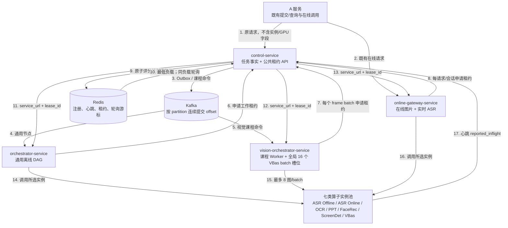

### 30.2 实例选择公式与共享容量

Control 在一个 Redis Lua 原子操作中完成失效租约清理、候选过滤、负载比较、同负载选择和
租约创建。每个候选实例的评分为：

```text
active_lease_count = Redis 中尚有效的实例租约数量
reported_inflight = 算子最近一次心跳上报的实际在途数量
effective_inflight = max(active_lease_count, reported_inflight)
load_ratio = effective_inflight / declared_capacity
```

优先选择最低 `load_ratio`，使用交叉乘法比较不同容量实例，避免浮点误差。最低负载候选相同
时，按 capability 的持久 Redis 游标在稳定排序结果中轮询。活跃租约和上报负载不能相加，
否则同一个平台请求会被重复计数；取较大值既保留原子租约的即时事实，又覆盖心跳看到的直连
或短时差异。

`declared_capacity` 仍是实例全部能力的共享硬上限。同一 VBas 的教师/学生能力、在线/离线
请求共享一个容量池；ASR、OCR、PPT Slice、FaceRec 和 ScreenDet 也统一使用此公共选择器。
因此修复不是 VBas 专用补丁。旧 revision 上对其他算子的 16 路调查只能说明旧路由基线；
新 revision 仍须分别用租约时序、实例请求日志和业务终态复验，不能从共享代码静态推断现场
已经通过。

### 30.3 VBas 与 Vision 的并发边界

VBas 权威配置是 `max_concurrent_requests=1024`、`MaxConcurrentBatches=1024`、
`MaxQueueSize=0` 和 `declared_capacity=1024`。一个最多 8 张图的 HTTP batch 只占一个租约和
一个 `running_batches`。`MaxQueueSize=0` 表示算子内部不隐藏排队；本地过载后调用方释放租约
并有界重选。`running_batches` 是 VBas 心跳、`/ops/status` 与 Worker 快照的上报来源。

Vision 保持 `max_batch_size=8`、`max_concurrency=16`。这 16 个槽位在服务启动时创建，由全部
课程、教师/学生流和区域轮次共享，不得在每个课程内各建一组 16 槽。`[worker].concurrency`
另行限制同时执行的课程命令。Kafka Consumer 按 partition 记录在途 offset 和连续完成水位；
乱序完成时不越过前方未完成消息，停止时不再领取，未在期限内完成的消息不提交并允许重放。

### 30.4 接口兼容和验收边界

本次调整不改变 A 服务的 `POST /api/course-jobs`、任务查询或在线接口，不改变
`task_id`、`task_types`、三个视频路径、区域、人数、ASR 参数、整数状态、响应结构和异步语义。
A 服务不需要感知实例、租约、batch 或 GPU。

当前验收至少包括三类 VBas 场景：20 个唯一 `STUDENT_BEHAVIOR` 任务、1000 路 Online
Gateway 单图请求，以及离线任务已经形成三实例真实租约后再释放在线 1000 路的重叠场景。
权威路由证据是 Control 租约时序与实例容器请求日志；`nvidia-smi` 仅作 GPU 活跃补充。ASR 和
PPT（内部包含 PPT Slice 与 OCR）使用合法北向 `task_types=ASR/PPT` 做并发调查，不能把内部
节点名 `PPT_OCR` 当作 A 服务任务类型。所有远端场景在形成 write-once Harness 结果前均保持
“未验证”，不得因本地测试或共享实现而提前写成现场通过。

## 31. 2026-09-04 视觉编排持续补位与流水线设计

本节新增 `ARCH-008`，用于保留本轮视觉吞吐优化后的结构；它不替换前述 `ARCH-001` 至
`ARCH-007`。旧图继续表达当时的服务边界和容量路由结论，本图只细化 Kafka Consumer、媒体
抽帧和 VBas batch 之间的内部执行关系。

### 31.1 ARCH-008：有界、公平、持续补位的视觉流水线

```mermaid
flowchart LR
    K[("Kafka\n视觉课程命令")]
    C["1 Consumer 长期在途池\nworker.concurrency 课程槽位"]
    P["2 有界 pending\n单次 max_poll_records"]
    D["3 课程命令执行\n任一完成立即补位"]
    B["4 确定性 FrameBatchPlan\n每课程预取 2 batch"]
    F["5 ffprobe / ffmpeg 公平队列\n全局进程硬上限"]
    Q["6 已准备帧有界队列\n首批完成立即消费"]
    L["7 Control 离线容量租约\n动态实例与权威准入"]
    V["8 VBas batch 推理\n与下一批抽帧重叠"]
    A["9 教师区间 / 学生人数聚合\n学生区域复用同一帧"]
    PG[("10 PostgreSQL\n结果与阶段进度")]
    E[("11 Kafka 视觉终态事件")]

    K --> C
    C --> P
    P --> D
    D --> B
    B --> F
    F --> Q
    Q --> L
    L --> V
    V --> A
    A --> PG
    PG --> E
    V -. "释放 batch 后继续" .-> Q
    D -. "完成/失败释放课程槽位" .-> C
```

### 31.2 并发边界与状态语义

- `worker.concurrency` 只限制课程级视觉命令；命令错峰进入或同批快任务先完成时均持续补位。
- `kafka.max_poll_records` 只限制单次预取，不再形成封闭批次的隐式并发上限。pending 未排空前
  不继续预取；同 partition 的高 offset 先完成时，必须等待低 offset 后再连续提交。
- `scan.batch_size` 决定确定性帧批次大小，`scan.batch_prefetch` 默认 `2`，限制每课程媒体
  生产者超前推理消费者的距离。最后不足一批的帧仍完整推理。
- `media.max_concurrent_processes` 是 ffmpeg/ffprobe 全局硬上限。抽帧器只创建固定数量 worker，
  子进程在取消、超时和关闭时回收，不再把整节课数百个时间点一次性排入 Semaphore。
- 学生全画面、前排和后排引用同一批本地图片，仅区域身份和 VBas 请求中的坐标不同。
- 整数状态码与 A 服务响应结构不变。`reason` 依次区分“视觉命令已发布，等待 Vision 消费”、
  校验本地视频、探测时长、抽帧 batch 进度、等待 VBas 容量、推理 batch 进度、聚合及持久化。

本轮服务器发布只替换实际受影响的 Vision 与 Orchestrator 镜像，使用已有 BuildKit 缓存；新
容器通过 revision、架构、源码、health/readiness 和 Kafka Consumer 门禁后，才精确删除旧资产。
最终业务压力测试由用户在部署后执行，本次实现门禁不得把健康检查写成业务压测通过。
