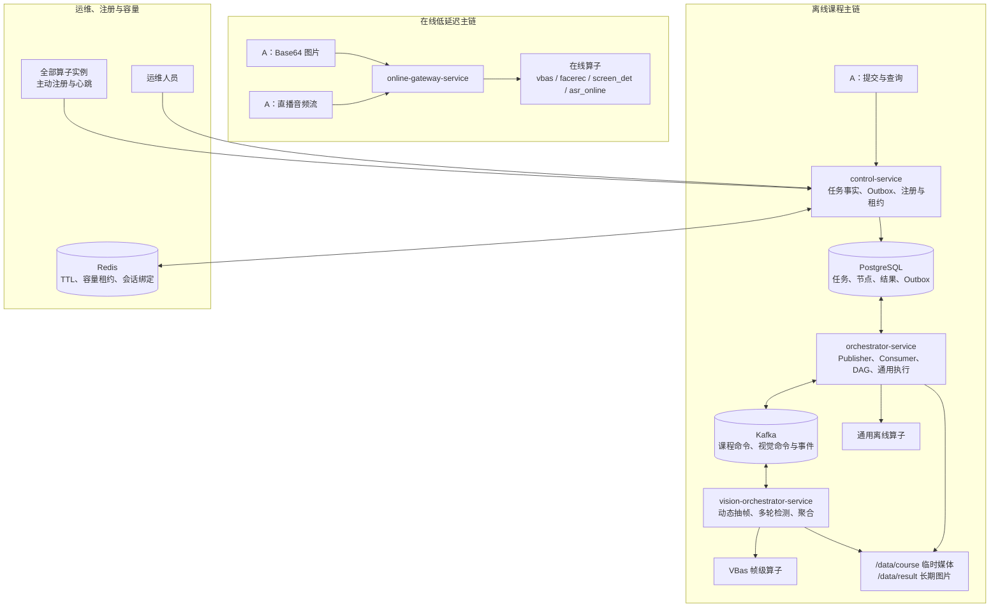
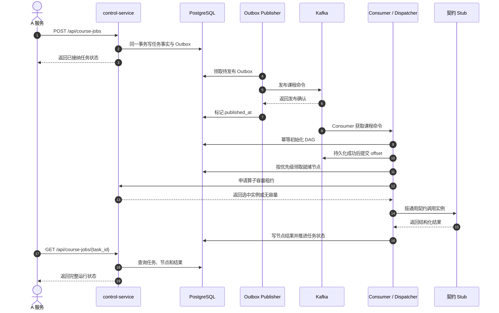
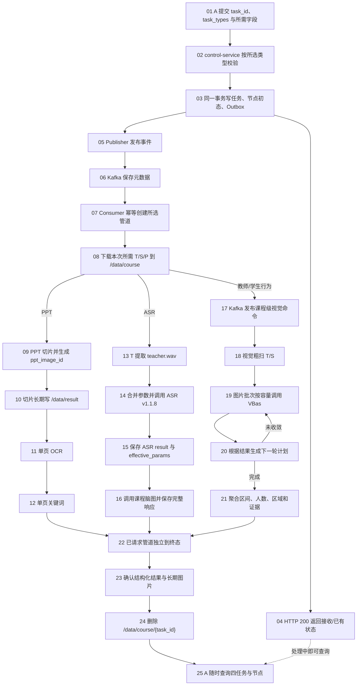

# 算法功能调度平台总体设计

> 文档版本：5.4（V2 文件版）<br>
> 更新日期：2026-08-07<br>
> 文档状态：架构收口与实施中  
> 适用范围：教育课堂 T/S/P 三端视频课后分析、在线图片路由、实时 ASR 与算子运行管理  
> 暂不展开：完整失败重试/取消/补跑、视频自动对齐、运维前端

## 1. 文档目的

本文档替代“仅离线课程任务”的命名口径，汇总离线课程处理、在线图片路由、实时语音转写、服务边界、任务模型、实例路由、文件生命周期与开发顺序，作为算法功能调度平台实现基线。旧《离线课程任务调度处理设计》保留为历史版本。平台需要解决：

1. A 提交课程任务后，平台可靠异步执行并可查询。
2. 同一课程的 PPT、ASR、教师行为、学生行为可分次请求、独立查询、避免重复计算。
3. 多个 Docker 算法端点可统一注册、选择、排空和观察。
4. 离线、在线图片、实时语音采用不同调度方式，互不阻塞。
5. 临时媒体可安全清理，PPT 切片和证据图片长期保留。
6. 结构化结果存 PostgreSQL，并按现有算子真实响应返回。

## 2. 业务输入与已有能力

### 2.1 三端视频

同一节课可能有三路基本同时开录的视频，允许轻微偏差。第一版不记录 `start_offset_ms`，不做自动对齐。

| 标识 | 内容 | 用途 |
|---|---|---|
| T | 教师讲台视角 | 教师音频；站、坐、板书、讲授等行为 |
| S | 学生视角 | 人数、到课率、前后排分布、学生行为 |
| P | 课件录屏 | PPT 切片、单页 OCR、单页关键词 |

A 只提供任务参数和可下载 URL，主动查询状态和结果；A 不直连平台数据库，也不管理平台临时文件。

### 2.2 当前算子

| 能力 | 项目 | 主要协议 |
|---|---|---|
| 离线 ASR | `asr_offline` | `POST /v1.1.8/seacraft_asr`，输入 WAV |
| 实时 ASR | `asr_online` | WebSocket |
| PPT 切片 | `ppt_slice` | 输入 P 视频 |
| OCR | `ocr` | 单张图片，`operator_code=ocr` |
| 课程脑图 | `text_analysis` | `POST /v1/course_overviews` |
| PPT 关键词 | `text_analysis` | `POST /v1/extract_keywords` |
| 视觉帧级推理 | `vbas` | 教师/学生图片检测 |
| 人脸对比 | `facerec` | 图片识别 |
| 图像质量 | `screen_det` | `detect_all` |

`text_analysis` 第一版只注册 `course_overviews` 和 `extract_keywords`，其他历史接口不进入调度流程。

### 2.3 三种调用模式

| 模式 | 输入 | 调度粒度 | Kafka | 正式结果持久化 |
|---|---|---|---|---|
| 课后离线 | 视频 URL | 节点/批次 | 是 | 是 |
| 在线图片 | Base64 图片 | 完整 HTTP 请求 | 否 | 默认否 |
| 实时 ASR | WebSocket 音频 | 整个会话 | 否 | 默认否，课后另做离线 ASR |

## 3. 目标与非目标

### 3.1 目标

- 持久化并查询课程、任务类型、内部节点和结果。
- 支持同一 `task_id` 分次追加不同任务类型。
- 使用 Outbox + Kafka 可靠触发离线任务。
- 使用 Redis 容量租约选择多个算法端点。
- 支持 `URGENT`、`NORMAL` 两级非抢占优先级。
- 复用现有同步 FastAPI/WebSocket 协议，通过适配器隔离差异。
- 视觉支持粗扫、加密抽帧、反复检测和区间聚合。
- 为运维查询准备任务、节点、队列、实例和容量数据。

### 3.2 第一版非目标

- 不引入 Kubernetes、Service Mesh 或通用工作流引擎。
- 不把媒体二进制放入 Kafka 或 PostgreSQL。
- 在线图片接口不拉 RTSP、不截图。
- 不把一个在线多图请求拆到多个实例。
- 不自动校正 T/S/P 时间偏差。
- 第一版不做数据库分区和历史归档策略。
- 状态预留失败/取消，但完整重试、取消、补跑后续设计。

## 4. 部署与仓库

第一阶段在同一台服务器部署四个平台服务、全部算法容器、PostgreSQL、Kafka、Redis，并共享 `/data/course` 与 `/data/result`。当前不使用 Kubernetes；Kubernetes 未来可以做容器编排和跨机弹性，但不能替代业务任务编排。

目标工作区：

```text
算法功能调度/
├── control_service/{app,tests,docker,config.toml,requirements.txt}
├── orchestrator_service/{app,tests,docker,config.toml,requirements.txt}
├── vision_orchestrator_service/{app,tests,docker,config.toml,requirements.txt}
├── online_gateway_service/{app,tests,docker,config.toml,requirements.txt}
└── algorithm-scheduling-platform/
    ├── packages/{platform_common,platform_contracts,operator_registry_client}
    ├── migrations/
    ├── deploy/
    ├── harness/
    └── tests/
```

四个服务共享代码仓库和公共包，但独立启动、健康检查和部署。

每个服务的 `app/` 按 `api`、`application`、`domain`、`infrastructure`、`core` 分层；`config.toml` 每个字段带相邻中文说明，加载优先级为代码默认值、TOML、环境变量。生产密码和令牌只通过环境变量注入。

基础设施使用三个独立 Docker 容器和持久卷。宿主机进程分别连接 `127.0.0.1:5432`、`127.0.0.1:9092`、`127.0.0.1:6379`；平台容器分别连接 `postgres:5432`、`kafka:29092`、`redis:6379`。容器内不能使用宿主机 Kafka 广播地址。

当前单机 Compose 入口为：

```bash
cd algorithm-scheduling-platform
docker compose -f deploy/docker-compose.platform.yml config --quiet
docker compose -f deploy/docker-compose.platform.yml up -d --build
```

该 Compose 包含 PostgreSQL、Kafka、Redis 和四个平台服务，统一加入 `algorithm-platform` 网络并挂载同一 `/data/course`、`/data/result`。宿主机入口为 `18100`（control）、`18101`（orchestrator）、`18102`（vision 映射端口）、`18103`（online 映射端口）。算子 Compose 可在平台就绪后独立启动。

## 5. 四个可部署服务

### 5.1 `control-service`

- 暴露 `POST /api/course-jobs` 和 `GET /api/course-jobs/{task_id}`。
- 保存课程请求、任务类型、节点状态和结构化结果。
- 同一 PostgreSQL 事务写任务与 Outbox。
- 提供算子注册、心跳、注销、列表、容量租约与排空控制。
- 为后续运维页面提供任务和实例查询。

它不下载视频、不运行 FFmpeg、不调用模型、不消费课程 Kafka 事件。

### 5.2 `orchestrator-service`

- Outbox Publisher 发布待发送事件。
- Kafka Consumer 幂等创建被请求的业务管道。
- 根据前置依赖、优先级和容量释放节点。
- 下载视频、提取 WAV、管理课程临时目录。
- 调用 PPT、OCR、文本分析、离线 ASR 等适配器。
- 向视觉服务发课程级命令，消费视觉进度/完成事件。
- 写回状态并触发临时目录清理。

Publisher、Consumer 和节点执行器是同一服务内的独立循环，长时间算法调用不得阻塞 Outbox 发布。

### 5.3 `vision-orchestrator-service`

- 消费教师/学生课程级视觉命令。
- 读取 T/S，生成粗扫、候选窗口、边界细化和矛盾点补帧计划。
- 缓存抽取帧和帧级推理结果。
- 按配置批次和并发反复调用 VBas。
- 聚合教师行为区间、学生人数/行为/区域指标。
- 保存少量长期证据图片和结构化结果。
- 发布进度和完成事件。

它拥有“为什么还要再检测一轮”的决策权，不只是 VBas 适配器。

### 5.4 `online-gateway-service`

```text
POST      /api/online/vbas/analyze
POST      /api/online/face/recognize
POST      /api/online/image-quality/detect
WebSocket /api/online/asr/stream
```

图片接口接收 A 直接提供的 Base64，不拉流、不截图、不建离线任务。一次完整请求只选一个实例；多个并发请求可进入不同实例。实时 ASR 建连时选择实例并保持会话粘性。

## 6. 总体架构 Mermaid DSL

### 6.1 服务边界图



控制面不等于 Kafka Consumer；算子向平台注册中心而非适配器注册。通用编排到视觉服务使用 Kafka，
视觉服务到 VBas 使用同步 HTTP。在线路径不进入 Kafka。

### 6.2 方案 C 基础任务时序图



Publisher 与 Consumer 虽部署在同一个 `orchestrator-service`，仍是互不阻塞的独立后台循环。
`control-service` 只在数据库事务中写 Outbox，不在 API 请求内直接发布 Kafka。

## 7. 任务与节点模型

`task_id` 是 A 提供的全局唯一课程标识。任务类型只保留：

```text
PPT
ASR
TEACHER_BEHAVIOR
STUDENT_BEHAVIOR
```

唯一业务管道键为 `(task_id, task_type)`：不存在则创建；运行中返回状态；已完成直接返回；同一课程新类型只创建新增管道。不要求 PPT 第一个触发，但业务上每节课最终应请求 PPT。

内部节点：

```text
PPT:              PPT_SLICE -> PPT_OCR -> PPT_KEYWORDS
ASR:              ASR_TRANSCRIPTION -> COURSE_OVERVIEW
TEACHER_BEHAVIOR: TEACHER_VISUAL_ANALYSIS
STUDENT_BEHAVIOR: STUDENT_VISUAL_ANALYSIS
```

## 8. 整数状态

| 状态 | 含义 |
|---:|---|
| 0 | 未请求 |
| 10 | 待处理 |
| 20 | 等待前置节点 |
| 30 | 等待算子 |
| 40 | 已排队 |
| 50 | 处理中 |
| 60 | 已完成 |
| 70 | 处理失败 |
| 80 | 已取消 |

节点同时返回 `status_text` 和中文 `reason`。未检测到某行为是正常完成 60，不是失败。

## 9. A 提交接口

```text
POST /api/course-jobs
```

A-facing 普通 HTTP API 统一 HTTP 200，通过 `code/message/data` 表达业务结果；任务库暂时不可用时返回业务码 `50000` 和中文原因，不把数据库异常栈暴露给 A。内部注册、租约、健康和运维接口保留真实 HTTP 400/404/429/503。

完整示例：

```json
{
  "task_id": "course-001",
  "task_types": ["PPT", "ASR", "TEACHER_BEHAVIOR", "STUDENT_BEHAVIOR"],
  "priority": "NORMAL",
  "teacher_video_path": "http://.../teacher.mp4",
  "student_video_path": "http://.../student.mp4",
  "slides_video_path": "http://.../ppt.mp4",
  "front_points": [{"X": 0, "Y": 0}, {"X": 1920, "Y": 0}, {"X": 1920, "Y": 540}],
  "back_point": [{"X": 0, "Y": 540}, {"X": 1920, "Y": 540}, {"X": 1920, "Y": 1080}],
  "student_count": 38,
  "asr_options": {"showRoleIdentify": false}
}
```

保留 `student_count`、`front_points`、`back_point`，不增加座位容量字段。

稀疏请求合法：

```json
{
  "task_id": "course-001",
  "task_types": ["PPT"],
  "slides_video_path": "http://.../ppt.mp4"
}
```

| 类型 | 必须字段 | 可选字段 |
|---|---|---|
| PPT | `task_id`、`slides_video_path` | `priority` |
| ASR | `task_id`、`teacher_video_path` | `priority`、`asr_options` |
| TEACHER_BEHAVIOR | `task_id`、`teacher_video_path` | `priority` |
| STUDENT_BEHAVIOR | `task_id`、`student_video_path`、`student_count` | `priority`、区域字段 |

未请求类型字段可以不传，也不参与校验。接收响应示例：

```json
{
  "code": 0,
  "message": "任务已接收",
  "data": {
    "task_id": "course-001",
    "priority": "NORMAL",
    "tasks": {"PPT": {"status": 10, "status_text": "待处理", "reason": "等待异步处理"}}
  }
}
```

## 10. Outbox 与 Kafka

Outbox 解决“数据库已写入但 Kafka 未发送”的崩溃窗口：

```text
同一事务写任务与 Outbox
-> 提交并返回
-> Publisher 扫描待发布事件
-> 发布 Kafka
-> 标记已发布
```

Outbox Publisher 合并在 `orchestrator-service` 的部署中，但代码上是独立循环。Kafka 只传 ID、类型、优先级、本地路径和策略元数据，不传视频、WAV、Base64 或大结果。

## 11. 带序号的完整离线流程



不是所有管道都必须存在。清理只等待本次共享临时工作区的已请求管道。

## 12. 媒体准备与本地目录

```text
/data/course/{task_id}/
├── source/T.mp4、S.mp4、P.mp4
├── audio/teacher.wav
└── frames/teacher、student
```

- 同一请求同时选择 ASR 和教师行为时，T 下载一次并共享。
- 以后分开追加任务时重新下载，不为潜在任务长期保留 MP4/WAV。
- 下游容器通过相同 `/data/course` 挂载读取本地文件。
- 容器内 `127.0.0.1` 指向容器自身，正式下载 URL 必须从实际执行环境可达。

## 13. PPT、OCR 与关键词

### 13.1 PPT 切片

PPT 算子是调度平台内部服务，本版本不兼容旧的逐图 Base64 回调。P 视频按像素相似度切片，算子直接写共享目录：

内部提交接口保持 `POST /LocalVideoPPTSliceTasks/v1.0.0`，但请求和响应已改为严格 snake_case 新协议，不接受旧 `taskId/resultCallbackUri/snapImage` 字段：

```json
{
  "uri": "/data/course/course-001/source/P.mp4",
  "task_id": "course-001",
  "operator_task_id": "ppt-node-101-attempt-1",
  "result_callback_uri": "http://orchestrator-service:18101/internal/ppt-slice/callback/101",
  "threshold": 0.98
}
```

受理响应的 `status=50`；终态回调使用 `status=60/70`。PPT 容器固定一个 Uvicorn Worker，但 `max_concurrent_tasks` 控制进程内 N 路视频并发，注册的 `declared_capacity` 和心跳 `inflight` 必须与该任务管理器一致。

```text
/data/result/{task_id}/ppt/
├── slices/slide_000001.jpg
├── slices/slide_000002.jpg
└── manifest.json
```

普通图片写入期间不代表任务完成。算子关闭全部图片文件后先生成 `manifest.json.part`，再原子替换为 `manifest.json`，最后只向 `orchestrator-service` 回调一次 `task_id`、`operator_task_id`、`status`、`path`、`manifest_path` 和 `count`，不传图片字节。

`orchestrator-service` 校验任务身份、目录必须位于 `/data/result/{task_id}/ppt`、manifest 终态、条目数量和文件存在性。验证及数据库事务成功后，才把 `PPT_SLICE` 更新为 60、生成稳定 `ppt_image_id` 和 OCR 子任务。重复回调必须幂等；回调丢失时由运行中节点和 manifest 对账恢复。

```json
{
  "PPT_SLICE": {
    "status": 60,
    "status_text": "已完成",
    "reason": "处理完成",
    "path": "/data/result/course-001/ppt/slices",
    "count": 30,
    "result": null
  }
}
```

`path` 是服务器本地或共享挂载路径，不是 URL。

### 13.2 OCR

每个 `ppt_image_id` 是一个 OCR 逻辑项，可按实例容量并行。OCR 文本是结构化数据，不先写本地 JSON：

```json
{
  "PPT_OCR": {
    "status": 60,
    "status_text": "已完成",
    "reason": "处理完成",
    "path": null,
    "completed_count": 30,
    "total_count": 30,
    "result": {
      "items": [{"ppt_image_id": "ppt-001", "text": "第一页识别文本"}]
    }
  }
}
```

### 13.3 单页关键词

每页 OCR 文本独立调用 `/v1/extract_keywords`：

```json
{
  "PPT_KEYWORDS": {
    "status": 60,
    "status_text": "已完成",
    "reason": "处理完成",
    "path": null,
    "completed_count": 30,
    "total_count": 30,
    "result": {
      "items": [{"ppt_image_id": "ppt-001", "keywords": ["概率", "联合分布"]}]
    }
  }
}
```

若切片完成但 OCR 或 LLM 未部署，`PPT_SLICE` 仍为 60 且图片可查询；`PPT_OCR`/`PPT_KEYWORDS` 分别显示等待算子等状态，不把三个节点压成一个状态。

## 14. 离线 ASR 与课程脑图

### 14.1 ASR 参数

默认参数：

```json
{
  "language": "auto",
  "showSpk": true,
  "showEmotion": true,
  "showRoleIdentify": false,
  "wordTimestamps": false,
  "hotWords": []
}
```

A 可用 `asr_options` 覆盖部分值。平台合并后保存 `effective_params`：

- `showSpk=true`：返回 `spk_0`、`spk_1` 等角色。
- `showEmotion=true`：返回情绪。
- `showRoleIdentify=false`：不识别成 `teacher/student`。
- `wordTimestamps=false`：逐词数组为空，避免结果过大；参数保留但不建议开启。
- 已完成 ASR 再收到不同参数时复用旧结果，不重跑、不做多版本；`effective_params` 表示生成当前结果时的参数。

### 14.2 v1.1.8 真实结果

`ASR_TRANSCRIPTION.result` 原样保存成功响应：

```json
{
  "ASR_TRANSCRIPTION": {
    "status": 60,
    "status_text": "已完成",
    "reason": "处理完成",
    "effective_params": {
      "language": "auto",
      "showSpk": true,
      "showEmotion": true,
      "showRoleIdentify": false,
      "wordTimestamps": false,
      "hotWords": []
    },
    "path": null,
    "result": {
      "language": "auto",
      "segments": [
        {
          "segment_text": "授课文本",
          "bg": "1.75",
          "ed": "3.47",
          "speed": 317,
          "segment_words": [],
          "role": "spk_0",
          "emotion": "平淡"
        }
      ],
      "text": "完整转写文本",
      "speed_info": [
        {"unit": 1, "segment_info": {"segment_count": 8, "speed": [307, 264]}}
      ],
      "load_audio_time_ms": "5.57",
      "gpu_time_ms": "6597.73"
    }
  }
}
```

ASR 某些错误以 HTTP 200 + `code/msg` 返回，适配器必须检查响应体，不能只看 HTTP 状态。

### 14.3 课程脑图真实结果

ASR 分段转换为 `/v1/course_overviews` 的 `textSegments`。`COURSE_OVERVIEW.result` 保存完整 `GenericResponse`：

```json
{
  "COURSE_OVERVIEW": {
    "status": 60,
    "status_text": "已完成",
    "reason": "处理完成",
    "path": null,
    "result": {
      "model": "实际模型名称",
      "id": "seaCraft-xxxxxxxx",
      "result": {
        "overview": {
          "full_overview": "课程完整概述",
          "key_points": ["知识要点一", "知识要点二"],
          "document_skims": [
            {"time": "0-600", "overview": "本段概览", "content": "本段主要讲述……"}
          ],
          "mindmap": {
            "overall_label": "课程主题",
            "total_time": "0-3600",
            "nodes": [
              {"id": "1", "label": "主题节点", "time": "0-600", "children": []}
            ]
          }
        },
        "finished_time": 1785900000,
        "process_time_ms": 35000,
        "finished_reason": "stop"
      },
      "usage": {
        "prompt_tokens": 1000,
        "completion_tokens": 500,
        "total_tokens": 1500
      }
    }
  }
}
```

平台 `result` 内保留算法自身的 `result`，不随意改名或丢弃 `model/id/usage`。

## 15. 视觉服务与 VBas

### 15.1 服务通信

```text
orchestrator-service
-> Kafka：课程级教师/学生视觉命令
-> vision-orchestrator-service
   -> 本地 T/S 抽帧
   -> HTTP + 容量租约：VBas 图片批次
   <- 帧级结果
   -> 下一轮计划与聚合
<- Kafka：进度与完成事件
```

视觉服务可与其他泳道共用一个 PostgreSQL 实例，但不沿用旧视觉项目的 MySQL 表名或旧表设计。

### 15.2 配置

```toml
[visual_analysis]
coarse_interval_seconds = 30
refine_intervals_seconds = [10, 5, 2, 1]
vbas_batch_size = 8
batch_concurrency = 2
max_refine_rounds = 4
max_detection_points_per_course = 5000

[visual_analysis.writing]
max_gap_seconds = 3

[visual_analysis.sitting]
max_gap_seconds = 5
```

粗扫间隔、批次大小和并发可配置。一个批次只进入一个实例，不再拆分；不同批次可进入不同实例。

### 15.3 自适应检测

1. 粗扫全课程，发现候选行为点。
2. 相距很远的命中点分别建立候选，不假设中间持续。
3. 向左右扩展直到找到行为/非行为边界括号。
4. 扫描候选窗口拓扑，判断一段还是多段。
5. 对边界按 10/5/2/1 秒逐级细化。
6. 对单帧反向、主体缺失、疑似坐姿等矛盾点补帧。
7. 最终区间用半开区间 `[start,end)`。

```text
粗扫：20:00 板书
10s：19:40 否、19:50 是、20:00 是、20:10 否
5s：19:45 否、20:05 是
2s：19:47 否、19:49 是、20:07 是、20:09 否
1s：19:48 否、20:08 否
结果：约 [19:49,20:08)
```

### 15.4 缺口与空区间

```text
gap <= max_gap_seconds：合并
gap >  max_gap_seconds：分段
```

板书 `[1,9)` 与 `[12,21)` 的缺口为 3 秒，配置为 3 时合并。

- 有足够有效画面但没检测到某行为：节点 60、该行为 `[]`、不生成代表图片。
- 部分行为存在：存在的正常返回，不存在的为空数组。
- 教师未入镜/有效帧不足：不伪造区间，中文 `reason` 说明无法形成区间。
- 媒体无法读取或 VBas 调用失败才是系统失败。
- 站/坐二选一仅适用于教师被有效检测到的时间点，无效画面不能强行补齐。

### 15.5 长期证据图片

保留现有五类：学生抬头 Top K、阅读 Top K、睡觉阈值、玩手机阈值、教师连续非正视/低头告警；增加板书、坐姿、讲授区间代表帧。保存到：

```text
/data/result/{task_id}/vision/snapshots/{snapshot_id}.jpg
```

普通帧在 `/data/course`，任务后清理。

## 16. 学生人数、区域与兜底

统计口径：

```text
到课率     = 稳定识别人数 / student_count
前排入座率 = 前排稳定人数 / 识别总人数
后排入座率 = 后排稳定人数 / 识别总人数
```

不引入 `front_seat_capacity`、`back_seat_capacity`。

- 提供 `front_points`：按前排区域计算，`front_region_provided=true`。
- 提供 `back_point`：按后排区域计算，`back_region_provided=true`。
- 缺少某区域：从 config 的对应最小/最大值首次生成一次兜底比例并持久化。
- 同一 `task_id` 后续稳定返回，不在查询时重新随机。
- 不增加 `is_estimated` 或 `source`。

```toml
[vision.fallback_seating_rate]
front_min = 0.10
front_max = 0.15
back_min = 0.25
back_max = 0.40
decimal_places = 4
```

## 17. 两级优先级

只支持 `URGENT` 和 `NORMAL`，默认 `NORMAL`：

- 运行中的节点不抢占。
- 相同能力释放容量时，等待 URGENT 先于 NORMAL。
- 同优先级按进入 READY 的先后顺序。
- 优先级按能力分别生效；紧急 OCR 不阻止空闲 ASR 执行普通任务。
- Kafka 只负责可靠通知；最终顺序由节点调度器决定。

## 18. 算子注册与容量

### 18.1 注册关系与接口

算子实例向 `control-service` 注册；适配器查询注册中心并申请容量，不向适配器注册。

```text
POST /api/operator-instances/register
POST /api/operator-instances/heartbeat
POST /api/operator-instances/unregister
GET  /api/operator-instances
POST /internal/operator-instances/lease
POST /internal/operator-instances/lease/renew
POST /internal/operator-instances/release
```

最小注册信息：

```text
instance_id、operator_code、capabilities、service_url
model_version、api_version、declared_capacity、gpu_id/cpu labels、status
```

状态：

- `ONLINE`：可接新请求。
- `DRAINING`：拒绝新请求，允许存量完成。
- `OFFLINE`：不参与选择。

注册采用“声明后激活”两步语义：

1. `register` 先将实例声明和注册事实写入 PostgreSQL/Redis，清理同 `instance_id` 的旧心跳和旧租约，并返回 `OFFLINE`。
2. 注册客户端立即发送首次心跳；只有心跳成功且模型 ready 后，实例才成为 `ONLINE` 租约候选。`start()` 在首次心跳成功前不完成，后续短暂 HTTP 故障按心跳周期继续重试。

Redis 保存心跳 TTL 和原子容量租约。必须先租约成功再调用实例，结束或超时释放。PPT 等异步长任务在“已受理”后继续由 orchestrator 续租，数据库完成事务提交后才释放，避免原 TTL 到期后同一实例被超额分配。注册、心跳、生命周期和租约的基础设施故障统一返回 HTTP 503。

当前协议没有进程世代令牌，因此同一 `instance_id` 同一时刻只允许一个存活进程。滚动部署时不得让新旧容器共用 ID；如未来需要同 ID 世代重叠，必须在心跳和注销契约中增加不可伪造的世代令牌。

`enabled_task_types` 定义本次交付明确支持的离线任务类型；实例注册反映当前运行容量。任务类型已启用但暂时没有算子时仍接收任务，节点进入状态 30 并显示缺失能力，不因一次短暂心跳超时改变平台能力边界。

### 18.2 control-service 就绪语义

- `/health` 只表示进程存活，依赖故障时仍返回 200。
- `/ops/readiness` 并行检查 PostgreSQL、Redis 和 schema，任一不符合时返回 503。
- schema 契约包含 10 张表、全部预期字段及中文说明、`0005` 历史索引与三个状态字段的准确语义；只执行到 `0004` 不得 ready。
- `dependency_timeout_seconds` 最小为 2 秒，PostgreSQL 在连接与语句间分配该预算；Redis 就绪探针使用独立短超时连接，不改写注册中心的运行超时配置。

### 18.3 算子运行接口

```text
GET  /ops/health
GET  /ops/status
POST /ops/drain
```

`health` 判断进程存活，`status` 判断模型就绪与容量，`drain` 优雅摘流。

### 18.4 VBas 命名

平台只使用 `operator_code=vbas`，不保留 `tias` 兼容标识、路径、环境变量或容器名。旧视觉聚合职责不回迁到 `vbas` 算子。

## 19. 单 Worker 与多 GPU 全量算子集群

全部算法算子容器使用一个 Uvicorn Worker。单个 PPT 进程可通过内部线程和任务队列并发处理配置的 N 路视频；“一个 Uvicorn Worker”不等于“只能处理一个任务”。

每张 GPU 部署一套所需 GPU 算子，多张 GPU 形成多个全量能力实例集群。例如：

```text
GPU0: asr_offline、asr_online、ocr、vbas、facerec、screen_det，workers=1
GPU1: 另一套相同能力实例，workers=1
```

各容器使用不同 `instance_id`、`service_url` 和 `gpu_id` 注册。control-service 在同能力实例间按容量租约分配。离线算子使用请求或异步任务租约；实时 ASR 使用会话级租约；Docker restart policy 负责进程恢复。

## 20. 在线图片与实时语音

### 20.1 在线图片边界

- A 直接发送 Base64，不存在“视频流 -> 截图”。
- 上游尽量一图一请求，代码不强制拒绝多图。
- 多图请求不跨实例拆分，按完整请求选择实例。
- 多图的成功项/失败项按算子真实结果返回。
- 三个接口都根据当前注册、健康和容量选实例。
- 在线请求不入 Kafka、不创建离线节点。

### 20.2 实时 ASR

实时 ASR 用于直播字幕，默认不入库。课程结束后另跑离线 ASR 并保存正式结果。WebSocket 建连时选实例，连接期间保持粘性，断开时释放容量。

## 21. 文件与结构化结果

| 数据 | 位置 | 查询方式 |
|---|---|---|
| T/S/P、WAV、普通帧 | `/data/course/{task_id}` | 不作为长期结果 |
| PPT 切片 | `/data/result/{task_id}/ppt/slices` | `path`、`count` |
| 视觉证据图 | `/data/result/{task_id}/vision` | `path`、`count`、图片元数据 |
| OCR、关键词 | PostgreSQL | 节点 `result` |
| ASR、课程脑图 | PostgreSQL | 节点 `result` |
| 行为区间、人数、区域指标 | PostgreSQL | 节点 `result` |
| 任务、节点、Outbox | PostgreSQL | 查询 API |
| 心跳、租约、会话 | Redis | 运维 API/指标 |
| 命令和事件 | Kafka | 不直接返回 A |

第一版不要求结构化结果另写本地 JSON，也不为普通结构化结果强制生成通用 `manifest.json`；PPT 切片自己的完成 manifest 是例外且为强制契约。

## 22. 查询接口与响应

第一版只提供：

```text
GET /api/course-jobs/{task_id}
```

一个响应返回四类任务和内部节点，未请求类型为 0，不单独设计 `/tasks/PPT`。当前已实现接口使用 `tasks` 数组，每项用 `task_type` 标识类型；`nodes` 同样是数组：

```json
{
  "code": 0,
  "message": "查询成功",
  "data": {
    "task_id": "course-001",
    "tasks": [
      {
        "task_type": "PPT",
        "status": 50,
        "status_text": "处理中",
        "reason": "正在执行 OCR",
        "priority": "NORMAL",
        "nodes": [
          {"node_code": "PPT_SLICE", "status": 60},
          {"node_code": "PPT_OCR", "status": 50},
          {"node_code": "PPT_KEYWORDS", "status": 20}
        ]
      },
      {
        "task_type": "ASR",
        "status": 60,
        "status_text": "已完成",
        "reason": "处理完成",
        "nodes": []
      },
      {
        "task_type": "TEACHER_BEHAVIOR",
        "status": 30,
        "status_text": "等待算子",
        "reason": "当前没有可用 VBas 容量",
        "nodes": []
      },
      {
        "task_type": "STUDENT_BEHAVIOR",
        "status": 0,
        "status_text": "未请求",
        "reason": "尚未请求学生行为分析",
        "nodes": []
      }
    ]
  }
}
```

节点对象填入前文定义的状态、文件、进度和 `result`。ASR 等大结果第一版仍完整返回；真实数据量验证后再决定分页或独立结果接口。

## 23. 临时目录清理

清理前必须满足：

1. 当前共享工作区的所有已请求管道到终态。
2. 结构化结果已经写入 PostgreSQL。
3. PPT 切片和视觉证据已写入 `/data/result`。
4. 没有仍在读取临时文件的执行租约。

只能删除 `/data/course/{task_id}`，绝不能删除 `/data/result/{task_id}`。以后追加新任务时重新建立临时目录。

## 24. 运维可见性

后端应支持后续页面展示：

- 课程四类任务及节点状态。
- 等待算子、排队和运行节点。
- URGENT/NORMAL 等待数量。
- Outbox 未发布数量和最老事件时间。
- Kafka Consumer lag。
- 实例 ONLINE/DRAINING/OFFLINE、GPU、容量和模型版本。
- 调用延迟、成功/业务失败、目标实例。
- `/data/course`、`/data/result` 磁盘占用。

日志至少关联：

```text
task_id + task_type + node + trace_id + instance_id + model_version + elapsed_ms
```

## 25. 数据库逻辑边界

第一版使用同一个 PostgreSQL 数据库中的 10 张正式调度表：

| 表 | 持久化职责 |
|---|---|
| `course_jobs` | 课程主任务与 `task_id` 唯一事实 |
| `course_task_types` | PPT、ASR、教师行为、学生行为四类任务状态 |
| `task_nodes` | DAG 节点、领取、状态和优先级 |
| `task_node_dependencies` | DAG 节点直接依赖关系 |
| `node_results` | 节点结构化结果、长期文件元数据和进度 |
| `node_work_items` | OCR、关键词等动态子项状态和结果 |
| `outbox_events` | 与任务同事务写入的待发布事件 |
| `operator_instances` | 算子注册声明和持久化审计快照 |
| `operator_instance_events` | 注册、排空、注销等实例运维事件 |
| `visual_fallback_values` | 学生视觉缺少区域时一次生成并稳定复用的兜底值 |

完整物理字段、约束和基础索引由 `algorithm-scheduling-platform/migrations/0001-0003` 定义；
`0004_schema_comments.sql` 使用 PostgreSQL `COMMENT ON TABLE/COLUMN` 为每张表和每个字段补充
中文说明；`0005_operator_audit_and_status_comments.sql` 增加算子历史查询索引，并将任务类型、节点和子项状态统一为 `40 已排队、50 处理中`。以后新增字段必须在新的前向迁移中同步增加字段注释，不得只修改已执行过的旧迁移。

这些表共同表达：

- 课程标识与最新请求摘要。
- 四种 `(task_id, task_type)` 管道。
- 内部节点状态、原因、进度和更新时间。
- Outbox 发布事实。
- 结构化结果与文件元数据。
- ASR `effective_params`。
- 前后排兜底值及 provided 布尔值。
- 算子审计信息；实时心跳和租约主要在 Redis。

视觉和其他泳道共用一个 PostgreSQL 容器和数据库，通过 Repository 所有权分隔；算子不得直接访问平台数据库。

2026-08-07 对本机容器 `algorithm-scheduling-platform-postgres-1` 的只读审计结果：正式业务库
`algorithm` 当前没有用户表；`algorithm_migration_test` 有 9 张调度测试表，
`algorithm_repository_test` 有上述全部 10 张调度测试表，未发现非调度业务表。测试库中的表和数据
均保留不动；正式部署应由迁移工具按顺序在目标业务库执行 `0001-0005`，而不是复制测试库。

### 25.1 当前实现成熟度（2026-08-07）

| 范围 | 当前证据 | 结论 |
|---|---|---|
| 四服务 FastAPI 项目、注释配置、Dockerfile、单机 Compose | 结构/入口测试和 `docker compose ... config --quiet` | 已完成交付骨架 |
| control 提交/查询、整数状态、Outbox 事务、PostgreSQL 算子审计、Redis 注册和可续租容量 | FastAPI 运行时、单元、真实 PostgreSQL/Redis 联合测试 | 里程碑 1 已完成；不包含 Kafka、DAG 或算子调用 |
| PostgreSQL 调度表、依赖关系、索引和中文注释 | `0001-0005` 迁移、完整 schema readiness 及迁移约束测试 | DDL 基线已形成；本机正式业务库尚未自动执行迁移 |
| PPT 算子共享落盘、manifest、终态通知和 N 路容量 | PPT 项目由另一开发会话独立优化 | 不作为当前基础闭环验收条件，契约稳定后再接入 |
| orchestrator 的 PPT 适配器与执行链路 | 仅有组件测试，且需等待 PPT 最终契约 | 延后到真实算子阶段 |
| Outbox 到真实 Kafka、课程 Consumer、节点执行、状态汇总和清理 | 尚无 broker 常驻进程闭环证据 | 未完成 |
| vision 的 Kafka Consumer、抽帧与 `VisualAnalyzer` 组合运行 | 只有扫描/聚合组件与服务骨架 | 未完成运行闭环 |
| online 请求级路由和实时 ASR 粘性 | 路由与组件测试 | 基本具备，仍需真实算子契约验收 |

因此，“四服务已搭建”只表示项目边界和部分组件已形成，不表示 A 提交后已经能够自动跑完整 DAG。
当前采用方案 C：在一个基础调度阶段内连续完成 control 事实闭环和 orchestrator 通用运行时，
先用契约 Stub 证明真实 PostgreSQL/Redis/Kafka 链路，再接入仍在优化的 PPT 算子。

## 26. 推荐开发顺序

### 阶段一：方案 C - 基础调度闭环

阶段一包含两个连续里程碑，二者都属于当前目标，但必须按顺序完成并分别验收。

#### 里程碑 1：control 事实闭环（已完成）

1. `control-service` 使用真实 PostgreSQL Repository 完成任务幂等提交和完整查询。
2. 在同一事务中写入课程任务、任务类型与 Outbox；control 不发布 Kafka。
3. 完成整数任务状态机、中文 `reason`、任务类型追加与 URGENT/NORMAL 保存。
4. 接通算子注册、心跳摘要、排空意图与 PostgreSQL 审计事实；Redis 负责 TTL 与容量租约。
5. 目标库必须按顺序执行 `0001-0005`，readiness 验证 10 张表、全部预期字段和中文说明、算子历史索引及状态语义。
6. 注册声明不立即开放路由；首次心跳成功后才 ONLINE，后续短暂心跳故障会继续重试。

#### 里程碑 2：orchestrator 通用运行时

1. `orchestrator-service` 的独立 Outbox Publisher 从 PostgreSQL 领取事件并确认发布到 Kafka。
2. Kafka Consumer 成功消费后幂等初始化 DAG，只有业务持久化成功才提交 offset。
3. 节点执行循环按 URGENT/NORMAL 领取节点、申请容量租约并推进整数状态。
4. 建立通用算子调用框架、执行上下文、状态汇总、就绪检查和优雅停止。
5. 使用集成测试专用契约 Stub 验证调用和结果持久化，不依赖正在优化的真实 PPT 算子。

#### 阶段一最小验收链路

```text
POST /api/course-jobs
-> PostgreSQL 任务事实 + Outbox
-> orchestrator Publisher -> Kafka -> Consumer
-> DAG 初始化 -> 节点领取 -> 契约 Stub
-> WAITING_OPERATOR / RUNNING / COMPLETED
-> GET /api/course-jobs/{task_id} 查询完整状态
```

验收必须使用真实 PostgreSQL、Redis、Kafka 和实际启动的 control/orchestrator 服务。测试可以使用
契约一致的通用算子 Stub，但不得直接调用 Repository 伪造节点完成。PPT、OCR、ASR、视觉和在线
功能均不是阶段一完成条件。

### 阶段二：PPT 真实算子管道

1. 等 `ppt_slice` 独立优化完成并冻结内部契约。
2. 接通共享目录落盘、原子 manifest、容量续约和幂等终态通知。
3. 接入 OCR 和关键词，按 `ppt_image_id` 持久化子项进度与结果。

### 阶段三：ASR 管道

1. T 下载和 WAV 提取。
2. ASR v1.1.8 适配、完整结果和 `effective_params`。
3. 课程脑图完整结果。

### 阶段四：视觉服务

1. 将 `jy-vision-orchestrator-server` 接入新 Kafka 和注册中心。
2. 先完成固定粗扫闭环。
3. 再实现候选扩展、10/5/2/1 秒细化、缺口合并和证据图片。

### 阶段五：在线与运维

1. 三个在线图片接口。
2. 实时 ASR 会话路由。
3. 运维查询、指标、排空和磁盘治理。

## 27. 完整第一版验收标准

1. A 可用稀疏字段提交任意选定任务类型。
2. 相同 `(task_id, task_type)` 不重复执行，新类型可追加。
3. API 进程重启后 Outbox 仍可发布任务。
4. 查询展示四类任务和节点，未请求为 0。
5. URGENT 等待节点在相同能力下优先于 NORMAL。
6. PPT 切片直接写共享目录，通过原子 manifest 和一次终态回调完成，长期保存；OCR/关键词按 `ppt_image_id` 返回。
7. ASR 保存 v1.1.8 完整响应和 `effective_params`。
8. 课程脑图保存完整 GenericResponse。
9. 视觉多轮调用 VBas、聚合区间并正确返回空区间。
10. 有区域时计算真实区域指标，缺失时生成一次稳定兜底和 provided 标识。
11. 算子主动注册、心跳、租约、续约、排空；每个算子容器一个 Worker，多 GPU 全量实例可独立选择。
12. 在线图片不拉流、不进 Kafka、完整请求选实例。
13. 实时 ASR 会话粘性且不替代离线结果。
14. 清理只删除 `/data/course`，不删除 `/data/result`。

## 28. 配置归属与注释规范

四个服务各自持有根目录 `config.toml`，不得把所有基础设施地址复制给所有服务：

| 配置组 | control | orchestrator | vision | online |
|---|:---:|:---:|:---:|:---:|
| `service` 日志、端口、Worker | 是 | 是 | 是 | 是 |
| PostgreSQL DSN/连接池 | 是 | 是 | 是 | 否 |
| Redis 地址/Key 前缀/心跳 TTL | 是 | 否 | 否 | 否 |
| Kafka topics/groups/manual commit | 否 | 是 | 是 | 否 |
| control-service 地址/租约参数 | 否 | 是 | 是 | 是 |
| `/data/course`、`/data/result` | 查询元数据 | 是 | 是 | 否 |
| 视觉粗扫/细化/区间/证据 | 否 | 否 | 是 | 否 |
| Base64、HTTP、WebSocket 限制 | 否 | 否 | 否 | 是 |

每个字段必须在上一行说明用途、单位、默认值影响和生产覆盖方式。结构配置采用 TOML，环境差异和敏感信息使用形如 `CONTROL_POSTGRES__DSN`、`ORCHESTRATOR_KAFKA__BOOTSTRAP_SERVERS` 的环境变量覆盖。配置在进程启动时加载，第一版不建设动态配置中心。

Kafka Producer 使用 `acks=all`，Consumer 禁用自动提交。课程/视觉消息只持有 ID、路径和元数据。长任务不能阻塞 Consumer 心跳：命令先幂等持久化并提交 offset，再由受控 Worker 执行。

## 29. 后续待定

- PostgreSQL 历史数据保留周期、归档和分区策略。
- A 最终补充的课程字段。
- URL 鉴权、有效期、下载大小和 URI 安全范围。
- 失败重试、取消、补跑和强制重算。
- 大结果分页或独立结果接口。
- 学生稳定人数的最终统计窗口。
- 运维页面范围、权限和审计。
- 单机容量不足后是否迁移对象存储、多机或 Kubernetes。
