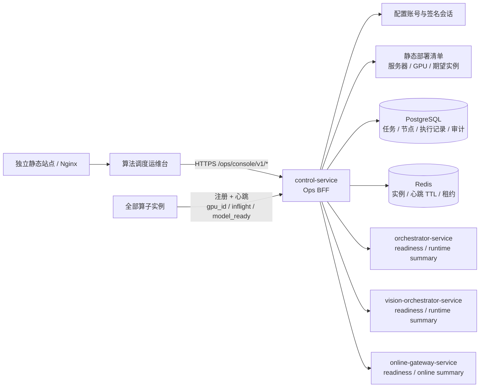

# 运维可视化平台详细设计文档 V1

> 文档版本：1.0  
> 编制日期：2026-08-11  
> 文档状态：设计基线，待实施  
> 适用系统：算法功能调度平台  
> 前端名称：算法调度运维台  
> 后端入口：`control-service`  
> 关联文档：`docs/算法功能调度平台总体设计-v2.md`

## 1. 文档目的

本文档给出“算法调度运维台”的完整前后端设计，并明确当前算法调度平台为了支撑该运维台需要补充的接口、配置、数据模型、上报字段、状态计算、权限、审计和验收要求。

本设计遵循以下已确认原则：

1. 运维前端只访问 `control-service`，不直接访问 Redis、PostgreSQL、Kafka、算法算子或其他平台服务。
2. 第一版服务于运维人员和算法工程师，核心目标是看清平台、任务、算子实例、GPU/CPU 部署和容量运行情况。
3. 第一版只允许对算子实例执行“排空”和“恢复接流”；不提供任务重试、取消、补跑和重新执行。
4. 第一版不建设告警通知中心，不发送短信、邮件、企业微信或钉钉通知；页面只展示当前状态和需要关注的事实。
5. 离线任务展示完整任务类型、DAG 节点和实际承载实例；在线图片和实时 ASR 只展示聚合指标，不展示逐请求内容。
6. 登录采用单一配置账号，不建设用户表、组织、角色和复杂 RBAC。
7. GPU 硬件和期望部署拓扑由 `control-service` 的静态部署清单提供；算子实例只需上报自身配置的 `gpu_id`，不要求上报 GPU UUID、GPU 型号或主机硬件信息。
8. 当前项目代码和既有 HTTP/WebSocket 业务契约保持兼容。本文中的接口扩展均采用新增接口或新增可选字段，不改变既有字段含义。

## 2. 目标与非目标

### 2.1 目标

运维人员应能回答以下问题：

- 四个平台服务分别是否存活、是否就绪；不可用时具体是哪一个检查项失败。
- 当前有哪些离线课程任务，处于哪个任务类型、哪个 DAG 节点、由哪个算子实例执行。
- 当前注册了哪些算子实例，各自是在线、排空、未就绪还是离线。
- 静态部署清单期望有哪些实例，哪些尚未部署，哪些实际实例不在计划中。
- 共有几台算法服务器、每台服务器有几张 GPU、每张 GPU 期望和实际部署了哪些算子实例。
- CPU/通用实例分别部署在哪里，每个实例的状态、容量、租约和心跳如何。
- 每个实例声明多少并发容量、有效租约多少、心跳上报 `inflight` 多少、当前还可调度多少。
- 在线图片接口和实时 ASR 的聚合请求量、成功率、延迟和活动会话如何。
- PostgreSQL、Redis、Kafka、Outbox、后台循环和共享存储是否正常。
- 谁在什么时间对哪个实例执行过排空或恢复，操作是否成功、原因是什么。

### 2.2 非目标

第一版不包含：

- Kubernetes、Service Mesh、自动扩缩容或容器编排控制。
- GPU 利用率、显存、温度、功耗等硬件遥测。页面中的“容量”只表示调度容量，不表示硬件利用率。
- 自动发现未运行任何算子的物理 GPU；物理 GPU 总量以静态部署清单为准。
- 任务重试、取消、补跑、修改优先级或手工推进状态。
- 在线图片、音频、识别文本、Base64、请求参数和响应内容的逐请求查询。
- 日志全文检索、链路追踪平台或告警通知平台。
- 多用户、角色、细粒度权限和外部统一身份认证。

## 3. 当前系统基线

### 3.1 当前已有能力

当前 `control-service` 已具备：

| 能力 | 现有接口或数据 | 当前可用程度 |
|---|---|---|
| 课程任务精确查询 | `GET /ops/course-jobs/{task_id}` | 可直接复用，但没有任务分页列表 |
| 算子注册 | `POST /api/operator-instances/register` | 已具备 |
| 算子心跳 | `POST /api/operator-instances/heartbeat` | 已具备 |
| 算子注销 | `POST /api/operator-instances/unregister` | 已具备 |
| 实例实时列表 | `GET /ops/operator-instances` | 已具备原始列表；`GET /ops/operator-instances/snapshot` 已提供逐实例有效租约数，但尚缺期望部署、历史事实和统一 BFF 聚合 |
| 实例排空 | `POST /ops/operator-instances/{instance_id}/drain` | 已具备 |
| 生命周期设置 | `POST /api/operator-instances/lifecycle` | 已具备内部通用能力，不应由前端直接调用 |
| 实例事件 | `GET /ops/operator-instances/{instance_id}/events` | 已具备单实例查询，缺少全局分页查询 |
| 容量租约 | `/internal/operator-instances/lease|renew|release` | 已具备调度热路径和逐实例只读容量快照，缺少租约上下文快照 |
| 队列摘要 | `GET /ops/queues` | 已具备状态、优先级、能力和数量；缺少最久等待时间 |
| 存储摘要 | `GET /ops/storage` | 已具备 |
| control 就绪 | `GET /ops/readiness` | 已具备 PostgreSQL、Redis 和 schema 检查 |
| Prometheus 文本指标 | `GET /metrics` | 已有指标类型骨架，部分指标尚未在运行路径真实更新 |

算子注册的现有声明包括：

```text
instance_id
operator_code
capabilities
service_url
model_version
api_version
declared_capacity
labels
```

心跳现有字段包括：

```text
instance_id
inflight
model_ready
```

Redis 是实时注册、心跳 TTL 和容量租约的权威来源；PostgreSQL 中的 `operator_instances` 和 `operator_instance_events` 是声明和生命周期审计快照，不参与每次租约的热路径。

### 3.2 当前主要缺口

1. `control-service` 没有平台服务聚合接口，不能一次返回四个服务分别的可用性。
2. 没有任务分页列表接口，只能按 `task_id` 精确查询。
3. 当前任务节点没有稳定记录每次实际选中的 `operator_instance_id` 和租约上下文，无法完整追溯“哪个实例执行了哪个节点”。
4. 当前 `GET /ops/operator-instances/snapshot` 已返回逐实例 `active_lease_count`，但尚缺租约上下文、历史执行事实和面向运维台的统一 BFF 聚合。前端不得从 `inflight` 推断 Redis 中的有效租约数。
5. 当前只有 `labels.gpu`，且它只表示实例上报的 GPU 编号；物理 GPU 总量、型号、所属服务器和期望实例需要静态清单。
6. 没有“期望部署实例”数据，因此不能严谨计算“未部署”或“实际/期望”分母。
7. `vision-orchestrator-service` 和 `online-gateway-service` 的就绪接口目前只表达基本进程就绪，尚不能完整证明后台循环和关键依赖可用。
8. 在线聚合指标没有可供运维台按 15 分钟、1 小时和 24 小时查询的摘要接口。
9. 没有运维登录接口和通用运维操作审计表。
10. 只有排空专用 Ops 接口，没有带校验和审计原因的恢复专用 Ops 接口。
11. 当前存储摘要会在请求路径递归计算目录大小，不适合被运维页面高频轮询，需要改为后台采样缓存。

## 4. 总体架构



`control-service` 作为 Ops BFF，承担：

- 登录、会话和 CSRF 校验。
- 聚合本地数据库、Redis、静态清单和其他平台服务的运维数据。
- 统一状态派生、时间格式、分页和部分失败表达。
- 对排空、恢复操作进行前置校验、执行和审计。
- 隐藏内部服务地址、Redis Key、数据库结构和租约实现细节。

前端不得：

- 直连 Redis、PostgreSQL 或 Kafka。
- 直接调用 `/internal/operator-instances/*`。
- 直接调用其他三个平台服务。
- 根据显示文本自行推导生命周期或容量状态。

推荐将静态前端文件与 `control-service` 进程分开托管，但由同一个 Nginx/反向代理提供**同源地址**：例如 `https://ops.example.local/` 返回静态页面，`https://ops.example.local/ops/console/v1/*` 代理到 control。这样 `SameSite=Strict` Cookie、CSRF 和浏览器 credentials 能按同源工作；control 不可达时已经加载的页面仍能明确显示“control-service 不可用”，其他服务状态只能标记为未知，浏览器不得绕过 BFF 直连。若部署方坚持跨源，必须配置唯一的前端 Origin、`Access-Control-Allow-Credentials: true`、精确方法/头部白名单和适配的 Cookie SameSite 策略，禁止 `*` Origin。若由 control 直接托管静态资源，则必须接受 control 整体不可达时运维台也无法打开，并由 Docker/部署探针承担外部存活观测。

## 5. 数据来源、权威性与时效

| 数据 | 权威来源 | 建议刷新 | 失败时行为 |
|---|---|---:|---|
| 期望服务器、GPU、实例 | `control-service` 静态部署清单 | 配置加载时 | 标记配置错误，实例页面不可宣称完整拓扑 |
| 实例声明、生命周期、心跳 | Redis registry | 5 秒 | 使用最后快照并标记过期；不可执行排空/恢复 |
| 有效租约 | Redis lease ZSET/hash | 5 秒 | 容量显示未知，不用 `inflight` 冒充租约 |
| 实例历史声明与事件 | PostgreSQL | 查询时 | 历史页返回 503；实时实例/拓扑仍返回 200 + `partial=true`，但无法区分的离线/未部署项改为未知 |
| 离线任务、节点和结果 | PostgreSQL | 列表 15 秒，运行详情 5 秒 | 页面明确“任务数据不可用” |
| 平台服务状态 | 各服务健康/就绪接口 | 15 秒，手工可刷新 | 单服务失败只影响该服务项，聚合接口仍返回 200 + `partial=true` |
| 在线聚合 | online gateway 分钟桶摘要 | 15 秒 | 显示统计不完整和最近成功时间，不展示伪造的 0 |
| Kafka lag、后台循环 | orchestrator/vision 运行摘要 | 15 秒 | 单项显示未知或不可用 |
| 文件系统容量 | control 本地挂载检查 | 30 秒 | 对应存储项不可用 |
| 目录逻辑占用 | control 后台采样缓存 | 5–10 分钟 | 返回最后成功样本并标记陈旧，不在页面请求内递归扫描 |

V1 使用以下明确阈值；阈值由 `control-service` 配置并随来源元数据返回：

| 来源 | `fresh_after_seconds` | `stale_retention_seconds` | `hard_expire_seconds` | 过期规则 |
|---|---:|---:|---:|---|
| Redis 实例/租约快照 | 10 | 60 | 60 | 超过 10 秒实时状态立即改为 `UNKNOWN`；60 秒后不再返回陈旧容量数值 |
| 平台服务探测 | 20 | 60 | 120 | 最近一次探测结果决定当前 `status`；探测结果不明确或超过 20 秒未得到新结果时为 `UNKNOWN`；超过 60 秒后清空旧的当前 liveness/readiness/checks 明细；最近一次明确结果仅通过 `last_known_status` 保留，超过 120 秒后置为 `null` |
| 在线分钟桶摘要 | 30 | 300 | 600 | 300 秒内可展示“缓存数据”；超过 600 秒统计值为 `null` |
| 文件系统容量 | 60 | 300 | 600 | 超时后容量值为 `null` |
| 目录逻辑占用 | 1200 | 7200 | 86400 | 先标陈旧，超过 24 小时逻辑占用为 `null` |
| PostgreSQL任务/审计查询 | 0 | 0 | 0 | V1 不提供陈旧查询回退，权威查询失败返回 503 |

Redis 快照一旦超过新鲜阈值，`runtime_status` 必须为 `UNKNOWN`，原状态仅能通过 `last_known_runtime_status`、`last_success_at` 和 `observed_at` 展示；`active_lease_count`、`reported_inflight`、`schedulable_used`、`raw_free_capacity` 和 `schedulable_available` 设为 `null`。静态清单仍可返回，因此实例/拓扑接口返回 200、`partial=true`；任务和审计以 PostgreSQL 为权威，查询失败直接返回 503；单个平台服务失败不拖垮其他服务项。

所有查询响应使用统一信封。聚合响应还必须逐一说明数据来源的新鲜度，不能在 Redis、PostgreSQL 或下游服务不可用时用数值 `0` 冒充真实结果：

```json
{
  "data": {},
  "meta": {
    "generated_at": "2026-08-11T16:42:08+08:00",
    "partial": false,
    "trace_id": "trace-001",
    "sources": [
      {
        "name": "redis_registry",
        "status": "FRESH",
        "observed_at": "2026-08-11T16:42:07+08:00",
        "last_attempt_at": "2026-08-11T16:42:07+08:00",
        "last_success_at": "2026-08-11T16:42:07+08:00",
        "age_seconds": 1,
        "fresh_after_seconds": 10,
        "hard_expire_seconds": 60,
        "stale": false,
        "stale_reason": null
      }
    ]
  }
}
```

来源状态统一为 `FRESH`、`STALE`、`UNAVAILABLE`、`NOT_CONFIGURED`。必须区分“得到明确的负面观测”与“未能完成观测”：连接被拒绝、可确认的 DNS 不存在、`/health` 非 2xx 都是新鲜的 `UNAVAILABLE` 事实，必须同时更新 `last_attempt_at` 和 `observed_at`，但不更新表示最后一次成功可用的 `last_success_at`。只有超时、取消、响应无法解析或未得到可分类结论时，才只更新 `last_attempt_at`，不更新 `observed_at/last_success_at`，并按新鲜度规则进入 `UNKNOWN`。`generated_at` 只是 BFF 生成响应的时间，不能代表来源数据新鲜。`partial=true` 表示仍有可用数据，但至少一个非关键来源失败或只能提供陈旧快照。对排空和恢复等写操作不得使用陈旧快照。后文响应示例为突出业务字段可只展示 `data` 内容，但实际接口仍须携带该 `meta`。

## 6. 配置设计

### 6.1 运维台基础与登录配置

在 `control_service/config.toml` 增加：

```toml
[ops_console]
enabled = true
username = "operator"
# 第一版使用配置账号，不建设用户表、密码修改和找回流程。
password = "change-me"
session_signing_key = "change-this-key"
session_ttl_seconds = 28800
cookie_secure = false
probe_health_timeout_seconds = 1.0
probe_readiness_timeout_seconds = 5.0
summary_cache_seconds = 5
registration_grace_seconds = 30
```

readiness 超时必须大于被探测服务自身的依赖检查超时。当前三个下游服务的依赖检查预算可达到 3 秒，因此 BFF 使用 5 秒 readiness 总超时，才能接收到下游明确返回的 503 和失败 `checks`；若 BFF 仍在 2 秒提前取消，只会稳定得到 `UNKNOWN`，无法区分真实 `DEGRADED`。liveness 只验证进程响应，使用独立的 1 秒预算。三个下游服务并发探测，所以一次聚合的最坏等待接近单个 readiness 超时，而不是三项超时相加。后续若下游内部预算变化，配置校验应要求 `probe_readiness_timeout_seconds` 至少比最大内部预算多 0.5 秒。

第一版按已确认范围直接从配置读取用户名和密码，不引入用户表、Argon2、LDAP、SSO 或 RBAC。比较时使用恒定时间比较；配置内容、登录请求和会话密钥不得写入日志。开发环境允许直接在 TOML 中配置；生产部署必须用 `OPS_CONSOLE_PASSWORD` 和 `OPS_CONSOLE_SESSION_SIGNING_KEY` 环境变量覆盖对应配置，并限制配置文件读取权限。应用在非开发环境发现仍使用示例值或签名密钥长度不足 32 字节时拒绝启用 Ops Console，但不阻止 control 的既有业务 API 启动。所有成功和失败的写操作均记录该固定账号；共享账号只能审计到账号名，不能区分具体自然人。

### 6.2 平台服务清单

```toml
[[ops_console.platform_services]]
service_code = "orchestrator-service"
display_name = "离线编排服务"
base_url = "http://orchestrator-service:18101"
health_path = "/health"
readiness_path = "/ops/readiness"
enabled = true

[[ops_console.platform_services]]
service_code = "vision-orchestrator-service"
display_name = "视觉编排服务"
base_url = "http://vision-orchestrator-service:8010"
health_path = "/health"
readiness_path = "/ops/readiness"
enabled = true

[[ops_console.platform_services]]
service_code = "online-gateway-service"
display_name = "在线网关服务"
base_url = "http://online-gateway-service:8001"
health_path = "/health"
readiness_path = "/ops/readiness"
enabled = true
```

`control-service` 自身不通过 HTTP 回调自己，直接调用本地 readiness checker。其他服务并发探测，避免一个超时拖延全部结果。

V1 不设置含义模糊的 `required` 开关。`enabled=true` 的服务都逐项探测并进入可用、降级、不可用、未知的汇总；`enabled=false` 的服务返回 `DISABLED`，不发起探测且不进入数量汇总。一次新鲜探测明确得到 `UNAVAILABLE` 是完整的故障事实，本身不代表响应数据残缺；只有启用服务的探测超时、来源陈旧或检查明细未能取得时，响应才设置 `meta.partial=true`。配置加载时要求 `service_code` 唯一，并要求所有启用项同时配置 `base_url`、`health_path` 和 `readiness_path`；禁用项允许保留这些字段，便于以后重新启用。

### 6.3 静态硬件与期望部署清单

静态清单使用稳定 `instance_id` 将期望实例绑定到服务器和 GPU。算子注册不必上报主机 ID、GPU 型号或 UUID。

```toml
[ops_inventory]
version = "2026-08-11-v1"

[[ops_inventory.hosts]]
host_id = "algo-node-01"
display_name = "算法服务器 01"

[[ops_inventory.hosts.gpus]]
gpu_id = "0"
model = "NVIDIA A800"

[[ops_inventory.hosts.gpus]]
gpu_id = "1"
model = "NVIDIA A800"

[[ops_inventory.hosts]]
host_id = "algo-node-02"
display_name = "算法服务器 02"

[[ops_inventory.hosts.gpus]]
gpu_id = "0"
model = "NVIDIA A800"

[[ops_inventory.hosts.gpus]]
gpu_id = "1"
model = "NVIDIA A800"

[[ops_inventory.instances]]
instance_id = "ocr-node01-gpu0"
operator_code = "ocr"
host_id = "algo-node-01"
device_type = "GPU"
gpu_id = "0"

[[ops_inventory.instances]]
instance_id = "text-node01-01"
operator_code = "text_analysis"
host_id = "algo-node-01"
device_type = "CPU"
```

配置加载时必须校验：

- `version` 非空。
- `host_id` 全局唯一。
- 同一主机内 `gpu_id` 唯一。
- `instance_id` 全局唯一。
- `operator_code` 属于八类已知算子。
- GPU 实例引用的 `host_id + gpu_id` 必须存在。
- CPU 实例不得配置 `gpu_id`。
- 同一 `instance_id` 不得同时配置为 GPU 和 CPU。

校验失败只禁用 Ops inventory 子系统：`GET /ops/console/v1/deployment-topology` 返回 503/`OPS_INVENTORY_INVALID`；overview 和实例列表仍可返回 Redis 当前实例，响应为 200、`partial=true`，其中 `expected/undeployed` 等清单计数为 `null`，`plan_status/placement_status` 为 `UNKNOWN`。`meta.sources` 将 `ops_inventory` 标记为 `NOT_CONFIGURED` 并给出不含敏感信息的校验摘要。不得因此阻止 `control-service` 启动，也不得影响 A 服务任务接口、算子注册/心跳和现有租约热路径。现有 `/ops/readiness` 继续只用 PostgreSQL、Redis 和 schema 等关键检查决定 HTTP 200/503，避免 Compose/Kubernetes 因 Ops 展示配置错误而重启核心 control。平台服务聚合器在本地 readiness 结果之外单独追加非关键 `ops_inventory` 检查；它失败时页面将 control 显示为 `DEGRADED`，但 control readiness 仍可为 200。

静态清单只描述硬件和期望部署，不参与实际租约选择；路由仍以 Redis 中的注册、心跳、生命周期、模型就绪和容量为准。

### 6.4 算子侧 GPU 配置与上报

各 GPU 算子根目录 `config.toml` 增加或统一：

```toml
[platform_registration]
gpu_id = "0"
```

多实例使用同一镜像和同一基础配置时，允许通过现有 `PLATFORM_GPU_ID` 环境变量覆盖。现有共享客户端还支持 `PLATFORM_INSTANCE_LABELS` JSON，因此必须定义合并而不是在 JSON 存在时整体跳过 GPU 配置。非空 `gpu` 值优先级为：

```text
PLATFORM_GPU_ID > PLATFORM_INSTANCE_LABELS["gpu"] > config.toml platform_registration.gpu_id > 不上报 GPU 标签
```

合并步骤是：先解析 `PLATFORM_INSTANCE_LABELS` 作为通用 label 基础映射，再按上述优先级得到最终 `gpu_id`并覆盖 `labels["gpu"]`；其他 JSON label 必须保留。空字符串不视为有效 GPU 值。各算子由自身配置加载层读取 `config.toml`，再向共享 `install_operator_runtime`/注册客户端增加可选 `registration_labels` 或 `configured_gpu_id` 参数；共享客户端不反向推测八个算子各自的配置格式。

这里的 `gpu_id` 是静态清单中的**宿主机展示编号**，不是容器内 CUDA 可见设备下标。示例：宿主机物理 GPU 2 单独映射进容器后，算法进程可能使用 `cuda:0`，但平台注册仍应显式配置并上报 `gpu_id="2"`。共享注册客户端不得读取 `CUDA_VISIBLE_DEVICES` 后自动猜测该编号。

注册请求仍使用现有 `labels`，不增加复杂字段：

```json
{
  "instance_id": "ocr-node01-gpu0",
  "operator_code": "ocr",
  "capabilities": ["ocr"],
  "service_url": "http://ocr-node01-gpu0:8866",
  "declared_capacity": 2,
  "labels": {"gpu": "0"}
}
```

`control-service` 根据 `instance_id` 查找静态清单，并校验实际 `labels.gpu` 是否与期望 `gpu_id` 一致。主机归属来自静态清单，不要求算子上报。

## 7. 状态与指标口径

### 7.1 计划、存在、位置与运行状态分离

前端不能用一个字段同时表达“清单要求什么、是否注册过、部署位置是否匹配、当前能否运行”。BFF 返回四个权威事实字段和两个只供展示的派生字段：

| 维度 | 枚举 | 判定 |
|---|---|---|
| `plan_status` | `EXPECTED` / `UNPLANNED` / `UNKNOWN` | `instance_id` 是否存在于启用的静态期望清单；清单无效或不可用时为未知 |
| `presence_status` | `NEVER_REGISTERED` / `REGISTERED_CURRENT` / `REGISTERED_HISTORICAL` / `UNKNOWN` | 是否从未注册、Redis 当前有声明、只有 PostgreSQL 历史，或因实例历史来源不可用而无法判定 |
| `placement_status` | `MATCHED` / `MISMATCH` / `NOT_APPLICABLE` / `UNKNOWN` | 清单内 GPU 实例的 `labels.gpu` 是否匹配期望值；CPU 为 `NOT_APPLICABLE`；计划外实例为 `UNKNOWN` |
| `runtime_status` | `ABSENT` / `REGISTERING` / `ONLINE` / `DRAINING` / `OFFLINE` / `NOT_READY` / `UNKNOWN` | 只表达当前运行事实；Redis 陈旧时为 `UNKNOWN` |
| `display_status` | `UNDEPLOYED` / `REGISTERING` / `ONLINE` / `DRAINING` / `DRAINED` / `OFFLINE` / `NOT_READY` / `UNKNOWN` | 页面主状态；只在运行状态基础上区分未部署和排空完成，不能作为后端权威事实回写 |
| `display_flags` | `UNPLANNED`、`GPU_ID_NOT_REPORTED`、`PLACEMENT_MISMATCH` 的数组，可为空 | 与主状态并列的计划/位置风险标记 |

`runtime_status` 按以下优先级派生：

1. Redis 来源超过新鲜阈值：`UNKNOWN`。
2. Redis 中无当前实例声明：`ABSENT`。
3. 当前 `registration_generation` 还没有同代首次心跳，且距 `registered_at` 不超过 `registration_grace_seconds=30`：`REGISTERING`。
4. 当前注册代超过宽限期仍没有首次心跳，或已有同代心跳但 TTL 已过期，或 lifecycle 为 `OFFLINE`：`OFFLINE`。
5. lifecycle 为 `DRAINING`：`DRAINING`。
6. 心跳有效但 `model_ready=false`：`NOT_READY`。
7. lifecycle 为 `ONLINE`、心跳有效且 `model_ready=true`：`ONLINE`。

`display_status` 再按组合事实派生：`EXPECTED + NEVER_REGISTERED + ABSENT` 显示 `UNDEPLOYED`；已注册历史但当前缺席或心跳过期显示 `OFFLINE`；`EXPECTED + UNKNOWN + ABSENT` 显示 `UNKNOWN`，不得猜成未部署；其余情况沿用运行状态。`plan_status=UNPLANNED` 时添加 `display_flags=["UNPLANNED"]`；由于没有期望主机/GPU 映射，计划外实例的 `placement_status` 必须是 `UNKNOWN`，不能仅凭非全局唯一的 `gpu_id` 宣称位置不匹配。清单中的期望 GPU 实例没有上报非空 `labels.gpu` 时，设置 `placement_status=UNKNOWN` 和 `display_flags=["GPU_ID_NOT_REPORTED"]`；上报了非空但不同的 `gpu_id` 时，才设置 `placement_status=MISMATCH` 和 `display_flags=["PLACEMENT_MISMATCH"]`。例如一个期望实例正在运行但 GPU 编号不匹配，仍是 `display_status=ONLINE`，同时带位置风险标记。所有风险标记都不得覆盖主状态。注册后首次心跳到达前的 `REGISTERING` 不参与租约选择。

当 lifecycle 为 `DRAINING` 时，页面再根据占用派生排空阶段：有效租约或 `inflight` 大于 0 显示 `DRAINING`；两者均为 0 显示 `DRAINED`（排空完成）。`DRAINED` 只是 `display_status`，不新增注册中心 lifecycle 枚举。

`FULL` 不是生命周期。实例在线但 `schedulable_available=0` 时，运行状态仍为 `ONLINE`，另显示容量状态 `FULL`。

### 7.2 “离线”和“未部署”

- **离线**：实例是已知的，并且至少注册过一次，但当前无有效心跳或已被设置为 `OFFLINE`。
- **未部署**：静态清单要求存在该实例，但实例从未注册，当前也不存在。

该区别依赖静态清单和 PostgreSQL 历史快照；只读取 Redis 无法可靠区分。

若 Redis 新鲜但 PostgreSQL 实例历史查询失败，当前仍在 Redis 中的实例可确定为 `REGISTERED_CURRENT`；所有 `E - R` 项只能返回 `presence_status=UNKNOWN, runtime_status=ABSENT, display_status=UNKNOWN`。实例和拓扑聚合接口返回 200、`meta.partial=true`，`meta.sources` 将 `postgresql_instance_history` 标记为 `UNAVAILABLE`；此时这些项不计入 `offline` 或 `undeployed`，统一计入 `unknown`。不得把 PostgreSQL 故障造成的“查不到历史”当成“从未注册”。

### 7.3 实例计数

概览不使用含义不明确的 `23/27`。先定义三个集合，所有计数都按稳定 `instance_id` 去重：

```text
E = 启用的静态期望清单中的 instance_id 集合
R = 当前 Redis registry 中仍有实例声明的 instance_id 集合；心跳过期但声明尚在的实例仍属于 R
H = PostgreSQL 实例历史中至少成功注册过一次的 instance_id 集合
K = E ∪ R，当前运维页面需要展示和统计的实例全集
```

上述分类公式以 PostgreSQL 实例历史可用为前提。历史来源不可用时不构造 `H`，页面全集仍为 `K = E ∪ R`，但 `E - R` 按上一节计入 `unknown`。`H` 只用于区分期望实例的离线/未部署，不把仅存在于历史、既不在清单也不在当前 Redis 的旧计划外实例加入当前实例全集；这类历史只在实例事件查询中出现。

字段计算公式如下：

```text
expected             = |E|
registered_current   = |R|
online               = |{i ∈ K | display_status(i) = ONLINE}|
draining             = |{i ∈ K | display_status(i) ∈ {DRAINING, DRAINED}}|
not_ready            = |{i ∈ K | display_status(i) = NOT_READY}|
offline              = |{i ∈ K | display_status(i) = OFFLINE}|
registering           = |{i ∈ K | display_status(i) = REGISTERING}|
unknown               = |{i ∈ K | display_status(i) = UNKNOWN}|
undeployed            = |{i ∈ E | i ∉ R 且 i ∉ H}| 
unplanned             = |R - E|
```

当 Redis 来源新鲜时，`i ∈ E ∩ H` 且 `i ∉ R` 的实例归入 `offline`，不是 `undeployed`；`i ∈ E` 且从未注册才归入 `undeployed`。当 Redis 来源陈旧而无法确认 `R` 时，依赖当前运行事实的状态归入 `unknown`，不得根据旧快照继续计入在线或容量。

页面分别展示：

```text
当前注册实例数
期望实例数
在线实例数
排空实例数
未就绪实例数
离线实例数
注册中实例数（非零时显示）
状态未知实例数（非零时显示）
未部署实例数
计划外实例数
```

`online`、`draining`、`not_ready`、`offline`、`registering`、`unknown`、`undeployed` 是 `K` 上互斥的主状态计数；`expected` 和 `registered_current` 是集合规模，会与主状态计数重叠；`unplanned` 是计划维度，会与在线、排空等主状态重叠。例如计划外在线实例同时计入 `online` 与 `unplanned`。因此页面不得暗示所有卡片可以相加为一个总数。

只有在标题明确为“当前注册 / 期望部署”时才允许使用分子分母；默认页面采用独立数字。

### 7.4 调度容量与租约

每个实例展示以下独立值：

```text
declared_capacity     算子声明的最大调度并发
active_lease_count    Redis 当前未过期租约数
reported_inflight     心跳上报的实际处理中数量
schedulable_used      active_lease_count
raw_free_capacity     max(declared_capacity - schedulable_used, 0)，仅表示未占用槽位
schedulable_available 实例可参与调度时等于 raw_free_capacity，否则为 0
```

平台是否还能分发只以 Redis 当前有效的 `active_lease_count` 为权威事实。`reported_inflight`
保留为算子实际接收请求数的心跳观测值，用于发现直连调用、心跳时差或漏租约；它与活跃租约的
差异必须单独展示和告警，但不得再参与 `schedulable_used`、`raw_free_capacity` 或准入判断。

“可参与调度”必须同时满足：Redis 数据新鲜、心跳 TTL 有效、lifecycle 为 `ONLINE`、`model_ready=true`。`DRAINING`、`DRAINED`、`NOT_READY`、`OFFLINE`、`REGISTERING` 和 Redis 状态未知的实例，即使 `raw_free_capacity` 大于 0，`schedulable_available` 也必须为 0。静态清单中的位置不匹配和计划外实例作为独立部署风险展示；第一版不在未获用户确认的情况下据此改变现有调度资格。

GPU 卡片上的容量为该 GPU 上已注册实例的上述值求和：

```text
GPU 声明容量 = Σ declared_capacity
GPU 有效租约 = Σ active_lease_count
GPU 心跳处理中 = Σ reported_inflight
GPU 调度占用 = Σ schedulable_used
GPU 未占用容量 = Σ raw_free_capacity
GPU 可调度容量 = Σ schedulable_available
```

页面默认突出“可调度容量”，不得把离线、排空或未就绪实例的未占用槽位算作可用。上述数值不能命名为 GPU 利用率、显存利用率或 GPU 负载。

### 7.5 平台服务状态

| 页面状态 | 判定 |
|---|---|
| `AVAILABLE` | `/health` 成功且 readiness 为 ready |
| `DEGRADED` | 进程存活，但至少一个 readiness 检查失败 |
| `UNAVAILABLE` | 明确连接拒绝、DNS 失败或 `/health` 非 2xx，当前不能提供服务 |
| `UNKNOWN` | 尚未探测、最近一次探测超时/结果不明确，或超过 `fresh_after_seconds=20` 仍没有新探测结果 |
| `DISABLED` | 清单明确 `enabled=false`；不参与可用/不可用汇总，也不发起探测 |

`status` 永远表达最近一次探测得到的**当前结论**，不得用旧的成功结果冒充当前可用。另返回 `last_known_status` 和 `last_known_observed_at`：最近一次明确的 `AVAILABLE`、`DEGRADED` 或 `UNAVAILABLE` 结论最多保留到 `hard_expire_seconds=120`；超过 120 秒后二者均为 `null`。`UNKNOWN + last_known_status=AVAILABLE` 的含义是“当前无法确认，最后一次明确状态曾经可用”，页面必须同时显示这两个事实，且数量汇总只按当前 `status` 计算。

页面必须显示具体服务名、当前状态、最后已知状态（如有）、检查时间、响应耗时和失败检查项。不能只显示“平台服务 4/4”。

## 8. 数据模型调整

### 8.1 Redis 实例与租约快照

现有实例 Hash 保持兼容，新增可选字段：

```text
registry_version       无符号递增整数；旧记录缺失时按 0 读取
registered_at          当前这一代注册完成时间
registration_generation  每次注册/重注册生成的 UUID
heartbeat_generation   最近一次心跳所属注册代；首次心跳前为空
```

`registry_version` 用于防止注册、重注册和运维 lifecycle 写入互相覆盖。为避免注销删除实例 Hash 后版本号回退造成 ABA，每个 `instance_id` 的版本计数器用独立 Redis key 保留，注销只删实例/心跳/租约，不删版本计数器。首次注册、每次注册/重注册、注销、显式 lifecycle 修改，以及心跳导致 `model_ready` 发生变化时递增；`declared_capacity` 只能通过重新注册改变，现有心跳合同不携带该字段；仅刷新 `last_heartbeat_at` 或普通 `inflight` 数值不递增。

注册脚本原子生成新 `registration_generation`、写 `registered_at`、清空 `heartbeat_generation` 并删除旧心跳 TTL；心跳脚本从当前实例 Hash 复制 `registration_generation` 到 `heartbeat_generation` 并刷新 TTL。BFF 只在两个 generation 相同时把 TTL 当成当前这代注册的心跳。为保持旧响应字段兼容，新状态派生不依赖注册请求写入的 `last_heartbeat_at`。

存量 Redis 记录采用先兼容、后回填的滚动升级，不要求一次停机清空注册中心：

1. 先部署能同时读取 legacy/new 两种记录的 control。缺少任一 generation 字段的记录标记 `generation_compat=LEGACY`：心跳 TTL 有效时仍按原 lifecycle、`model_ready` 和容量规则工作；TTL 不存在时为 `OFFLINE`。legacy 记录不进入 `REGISTERING`，避免升级瞬间把全部在线实例误判为注册中。
2. legacy 实例的下一次成功心跳由 Redis Lua 原子懒回填：生成一个 generation，同时写入 `registration_generation=heartbeat_generation`、补 `registered_at`、从独立计数器取得新 `registry_version`，但保留当前 lifecycle、容量和全部 labels。这样旧客户端无需增加心跳字段也能升级。
3. 新注册/重注册从发布日起直接写完整新字段；确认所有存量实例已经懒回填或重新注册后，才允许在后续版本移除 legacy 分支。升级期间调度 Lua 同时支持缺失 `registry_version` 按 0 读取，但任何首次 CAS/回填都必须先把独立计数器推进到大于 Hash 中已知版本。
4. 回填绝不能把现有 `DRAINING` 改为 `ONLINE`。启用维护意图表前，对“当前仍注册、心跳有效且持续 DRAINING 超过一个停机宽限窗口”的 legacy 记录生成待确认清单；只有部署清单或历史操作证据能确认是人工排空的实例才种入 `operator_maintenance_intents`，普通 stop 流程的短暂 DRAINING 不迁移为持久意图。无法确认的项保持实时 DRAINING 并要求部署负责人核对，不能自动恢复。
5. 发布顺序固定为：数据库迁移与兼容读取器 → 维护意图核对/回填 → 新 control 写入器和 Lua → 算子/编排客户端 → 移除 legacy 分支。任一步回滚都必须继续读旧字段，不能清空 Redis 作为升级手段。

排空/恢复通过 Redis Lua 脚本同时比较实例存在性、`expected_lifecycle` 和 `expected_registry_version`，成功写入 lifecycle 后原子递增版本。比较失败返回 CAS 冲突并携带当前 lifecycle/version：同步用户请求重新读取后仍不满足前置条件时返回 409；后台协调器可以基于新版本做有上限的重试，不能盲写覆盖。

租约 Hash 增加可选上下文字段：

```text
operator_code       取得租约时的算子代码快照
model_version       取得租约时的模型版本快照，可选
api_version         取得租约时的 API 版本快照，可选
operator_registry_version  取得租约时的 registry_version
requester_service
workload_kind       OFFLINE_NODE | ONLINE_IMAGE | ASR_SESSION
task_id             仅离线任务填写
task_type           PPT | ASR | TEACHER_BEHAVIOR | STUDENT_BEHAVIOR
node_id             仅离线任务填写
node_code           仅离线任务填写
node_work_item_id   PostgreSQL 工作项行的 bigint 主键，可选
work_item_key       任务内稳定的业务键字符串，例如 page-0018，可选
operator_task_id    算子返回的任务标识，可选
trace_id            跨服务关联标识
created_at
```

当前通用执行器的顺序是“先按 capability 取得租约，再领取具体节点”，因此租约申请时还不知道 `task_id/node_id`。不能把任务上下文改成申请租约的必填字段。

现有租约申请请求只增加申请时已经确定的可选字段，不改变已有调用方：

```json
{
  "capability": "ocr",
  "ttl_seconds": 60,
  "requester_service": "orchestrator-service",
  "workload_kind": "OFFLINE_NODE"
}
```

现有租约响应保留 `lease_id/instance_id/capability/service_url/expires_at`，只追加下列可选快照字段，旧调用方可忽略：

```json
{
  "lease_id": "6eb045ee-85e8-43ab-a6bc-07d6480fa48c",
  "instance_id": "ocr-node01-gpu0",
  "capability": "ocr",
  "service_url": "http://ocr-node01-gpu0:8866",
  "expires_at": "2026-08-11T16:43:08+08:00",
  "operator_code": "ocr",
  "model_version": "ocr-v6",
  "api_version": "v1",
  "operator_registry_version": 12
}
```

这些字段必须在 Redis 原子选择实例时从同一份实例 Hash 复制到租约 Hash 并返回，不得在返回租约后再二次查询当前实例，否则会在重新注册竞态中混入新版本。

领取节点后新增幂等绑定接口：

```text
POST /internal/operator-instances/lease/bind
```

```json
{
  "lease_id": "lease-001",
  "task_id": "course-0811-031",
  "task_type": "PPT",
  "node_id": 1024,
  "node_code": "PPT_OCR",
  "node_work_item_id": 2048,
  "work_item_key": "page-0018",
  "operator_task_id": null,
  "requester_service": "orchestrator-service",
  "trace_id": "trace-001"
}
```

`node_work_item_id` 是现有 `node_work_items.id` 的 `bigint` 外键；`work_item_key` 对应现有 `node_work_items.item_key`，是节点范围内稳定的字符串业务键，两者不得混用。调用对应已持久化工作项时必须同时传两者，并由 control 校验 `node_work_item_id` 属于该 `node_id`且 `item_key` 一致；纯节点级调用没有工作项时，两者同时为 `null`。

绑定只补充 owner context，不延长 TTL、不改变实例、不重新分配容量。重复绑定时，以 `lease_id + task_id + node_id + node_work_item_id + work_item_key` 的规范化结果判断幂等；任何已绑定身份字段被改成另一节点或工作项都返回 409。执行器在领取节点并创建 `task_node_runs`、确定具体调用后创建 `operator_invocations`，随后尝试绑定；绑定失败不得撤销已领取节点或破坏现有调度语义，而是记录可观测性缺口并继续以 PostgreSQL invocation 为权威。

在线路径只记录聚合类别和承载实例，不保存请求内容；运维 API 默认不返回在线请求的租约明细，只返回计数。

Redis registry 需要新增只读快照能力，在读取时先按 Redis 服务端时间清理过期 ZSET 成员，再返回有效租约数和有限的离线任务上下文。前端不得直接读取 Redis Key。

### 8.2 节点执行记录

新增前向迁移创建两层事实。`task_node_runs` 记录一次节点级执行尝试：

```text
id
task_node_id
attempt
worker_id
status                    CLAIMED | RUNNING | SUCCEEDED | FAILED | ABANDONED
started_at
finished_at
elapsed_ms
error_code
error_summary
created_at
updated_at
```

`operator_invocations` 记录该节点尝试中的每一次算子调用；OCR 分页、视觉工作项或分片任务可以在同一节点尝试下产生多条：

```text
id
invocation_id             UUID，全局唯一
task_node_run_id
run_seq                   节点尝试内递增序号
node_work_item_id         可选，分页/视觉工作项标识
work_item_key             可选，任务内稳定业务键，例如 page-0018
work_item_kind            可选，例如 PPT_PAGE / VISUAL_CHUNK
operator_instance_id
capability
operator_code              租约取得时的快照
model_version              租约取得时的快照，可选
api_version                租约取得时的快照，可选
operator_registry_version  租约取得时的快照
lease_id
operator_task_id          算子返回标识，可选
trace_id                  编排器生成并跨服务传播的关联标识
execution_status          ACQUIRED | RUNNING | SUCCEEDED | FAILED | ABANDONED
lease_release_status      NOT_REQUESTED | PENDING | RELEASED | EXPIRED | FAILED
lease_released_at         可选；租约实际释放或确认过期的时间
lease_release_error_code  可选；释放失败原因
started_at
finished_at
elapsed_ms
error_code
error_summary
created_at
updated_at
```

约束与写入时机：

- `(task_node_id, attempt)` 唯一。
- `(task_node_run_id, run_seq)` 唯一，`invocation_id` 唯一；同一有效 `lease_id` 最多关联一条 invocation。
- 纯平台节点可以只有 `task_node_runs`，没有 invocation。
- Worker 成功领取节点时写 `task_node_runs.status=CLAIMED`；开始本次执行时改为 `RUNNING`。取得租约并确定工作项后、调用算子前写入 `execution_status=ACQUIRED` 的 invocation；同步 HTTP 调用真正开始后改为 `RUNNING`，取得可验证终态后才写 `SUCCEEDED/FAILED`。
- 释放租约时只更新 `lease_release_status` 和 `lease_released_at`，不得用 `RELEASED/EXPIRED` 覆盖原先成功或失败的执行结论。先在 PostgreSQL 提交 invocation/run 终态，再请求释放；释放失败保留执行终态并将释放状态记为 `FAILED`，由协调器重试。
- `operator_code/model_version/api_version/operator_registry_version` 必须从租约响应快照写入；历史查询不得再关联当前 `operator_instances` 覆盖当时的执行版本。
- 节点完成时聚合其全部 invocation 更新 `task_node_runs`，但 `task_nodes` 仍是节点当前状态权威。
- 两张表都不保存请求媒体、Base64、音频、图片或完整算子响应。

异步 PPT 切片必须使用不同于同步调用的收敛规则：

1. `PptSliceAdapter.submit` 收到 `RUNNING` 受理响应时，只把 invocation 从 `ACQUIRED` 改为 `RUNNING` 并持久化 `operator_task_id`；**受理成功不是执行成功**，不得完成 `task_node_runs`，也不得释放容量租约。
2. 现有 `PptCapacityLeaseKeeper` 在等待终态期间持续续租。只有 `PptSliceTerminalHandler` 已校验终态 callback/manifest，并在 PostgreSQL 中持久化节点结果、invocation 终态和 run 终态后，才调用 `release_after_terminal_persistence`；失败终态也遵循“先持久化、后释放”。这保持已批准的 PPT 内部共享路径契约。
3. 重复 callback 或 manifest reconcile 通过 `operator_task_id + task_node_run_id` 幂等处理，不能产生第二条 invocation，也不能重复释放后覆盖首次终态。

新增 `operator_invocation_reconciler` 收敛进程崩溃遗留事实：

- 周期扫描 `CLAIMED/RUNNING` run 和 `ACQUIRED/RUNNING` invocation，候选条件使用可配置 `updated_at` 静默阈值；每次同时读取当前 `task_nodes`、Redis 有效租约和 Worker/节点领取事实，不仅凭时间判死。
- 对异步 PPT，启动恢复先调用已有 manifest reconcile；原租约仍有效时重新建立同一 `lease_id` 的续租守护。原租约已经过期时记 `lease_release_status=EXPIRED`，继续等待/核对原 `operator_task_id` 的终态，但不得重新申请一个可能落到其他实例的新租约冒充原调用；页面将其显示为 `CAPACITY_PROTECTION_LOST` 异常。
- 对同步调用，若节点已有可验证终态，则按持久化结果收敛 run/invocation；若 Worker 已失去领取权且租约不存在或已过期，又没有可验证算子终态，则把 invocation 和本次 run 标记为 `ABANDONED`，`error_code=WORKER_OR_LEASE_LOST`。`ABANDONED` 表示本次编排尝试的结论未知，不等价于算子明确失败。
- 协调器不得直接覆盖 `task_nodes` 的权威状态；是否重领/重试仍走现有节点状态机和领取机制，新尝试使用递增 `attempt` 和新的 invocation。活跃租约没有绑定记录时报告 `UNBOUND_LEASE`，等待 TTL 或后续绑定收敛。
- 所有协调更新使用条件更新，要求原状态仍为非终态；callback、正常 Worker 和协调器并发时只能有一方完成终态迁移。

任务详情从 invocation 展示“当前/最近承载实例”和每个工作项的执行尝试。任务列表不能假设只有一个实例，返回 `current_operator_instances` 摘要：`count`、最多前三个 `instance_ids` 和 `truncated`；完整列表只在任务详情查询。

### 8.3 运维操作审计

新增 `ops_audit_events`：

```text
id
action_id            UUID，服务端生成
request_id           UUID，浏览器生成，用于写操作幂等
request_fingerprint  规范化操作内容的 SHA-256
occurred_at
updated_at
completed_at          可选，操作进入最终结果的时间
actor
action              LOGIN | LOGOUT | DRAIN | RESUME
target_type         CONSOLE | OPERATOR_INSTANCE
target_id
reason
result              PENDING | SUCCESS | FAILURE | NOOP | PARTIAL
previous_state
resulting_state
trace_id
source_ip
detail jsonb
response_snapshot jsonb
```

对非空 `request_id` 建部分唯一索引 `UNIQUE(actor, request_id) WHERE request_id IS NOT NULL`。`request_fingerprint` 对规范化后的 `{action,target_id,trimmed_reason,expected_lifecycle}` 计算：指纹相同则返回第一次保存的状态和 `response_snapshot`；指纹不同返回 409。首次操作仍为 `PENDING` 时重复请求返回 202，不能声称已经有最终结果。登录/退出不要求浏览器生成 `request_id`，使用服务端 `action_id` 即可。登录失败只保存用户名摘要、来源 IP、时间和失败类型，不保存提交的密码。

`ops_audit_events` 在 V1 中是一行一个 `action_id` 的**操作审计状态记录**：Saga 开始时插入一行 `result=PENDING`，后续协调进展和最终结果更新同一行的 `result`、`resulting_state`、`detail`、`response_snapshot`、`updated_at` 和 `completed_at`，不得为同一操作再插入“最终审计行”。因此唯一约束与 PENDING→最终的状态迁移不冲突。真正的实例生命周期事实仍以追加方式写入现有 `operator_instance_events`；只有 Redis lifecycle 实际发生变化时才追加对应实例事件。

### 8.4 人工维护意图

排空不能只保存在 Redis 的瞬时 lifecycle 中。否则算子重启并重新注册时，注册请求的默认 `ONLINE` 会覆盖人工排空，实例会在维护尚未结束时重新获得租约。

新增独立表 `operator_maintenance_intents`，不把这些字段塞入现有 Redis 实例 Hash 或其他实例历史表：

```text
instance_id                  主键
applied_state                NORMAL | DRAINING，已成功应用到 Redis 的状态
target_state                 NORMAL | DRAINING，本次操作目标
operation_status             PENDING | APPLIED | FAILED
operation_phase              INTENT_PERSISTED | REDIS_APPLIED | FINALIZED | RECONCILIATION_REQUIRED
operation_request_id         当前操作的 request_id
operation_action_id          当前操作的 action_id，外键关联 ops_audit_events.action_id
expected_registry_version    用户操作开始时读取的 Redis 版本
redis_applied_version        目标 lifecycle 成功 CAS 后的 Redis 版本，可选
maintenance_reason           当前操作原因
maintenance_actor            当前操作账号
maintenance_updated_at       最近修改时间
retry_count                  后台协调已尝试次数
next_retry_at                下次协调时间，可选
last_observed_lifecycle      协调器最近读取的 Redis lifecycle，可选
last_observed_registry_version  协调器最近读取的 Redis 版本，可选
last_error_code              最近一次协调失败原因
version                      乐观锁版本
```

该表是跨 PostgreSQL 和 Redis 操作的 Saga 状态，不假设二者可以参与同一个事务。处理规则：

1. 首个数据库事务对该 `instance_id` 加行锁或 advisory lock，读取实时 Redis lifecycle/version，插入 `PENDING` 审计行，并写入 `operation_status=PENDING, operation_phase=INTENT_PERSISTED`。数据库事务提交后行锁已释放，因此不能假设它会覆盖后续 Redis 协调阶段。同一实例存在 PENDING 时，相同 `request_id` 和指纹返回原 `action_id` 与当前状态；不同请求返回 409/`MAINTENANCE_OPERATION_IN_PROGRESS`，不得开始第二个 Saga。
2. 排空写入 `target_state=DRAINING`；恢复在心跳有效、`model_ready=true` 且位置匹配后写入 `target_state=NORMAL`，但在确认 Redis 已恢复之前 `applied_state` 仍为 `DRAINING`。两者都使用 `expected_lifecycle + expected_registry_version` 原子 CAS，成功后先将阶段记为 `REDIS_APPLIED` 并保存 `redis_applied_version`。
3. Redis 成功后的最终 PostgreSQL 事务必须用 `instance_id + operation_action_id + version` 作条件更新，将 `applied_state` 收敛到目标、`operation_status=APPLIED`、阶段记为 `FINALIZED`，并把同一审计行更新为最终成功。条件更新影响 0 行时不能盲写，转入协调器处理。
4. PostgreSQL 在写入 PENDING 前不可用时不开始操作，返回 503。PENDING 已持久化但 Redis 或最终回写暂时失败时返回 202，响应携带 `action_id/operation_phase/retry_count/next_retry_at`，由后台 `maintenance_intent_reconciler` 重试，不能假装成功。
5. 协调器每次必须先实时读 Redis lifecycle/version 并保存本次观测：若 Redis 已等于目标，则完成 PostgreSQL 最终提交；若 Redis 仍等于可证明的已应用状态，则基于当前版本重试目标 CAS；若实例已重注册或状态/版本无法归因，进入 `RECONCILIATION_REQUIRED`，不用 PostgreSQL 中的旧 `applied_state` 猜测 Redis 事实。
6. 重试到上限时不得直接把 `target_state` 回滚成旧 `applied_state`。只有实时 Redis 明确仍等于已应用状态，且版本证据证明目标 CAS 未发生时，才可做条件补偿并标记 `FAILED`；若 Redis 已等于目标则必须完成提交；若 Redis 不可用或状态有歧义，保留原 target，记为 `FAILED + RECONCILIATION_REQUIRED`、阻止新排空/恢复，并以 `DRAINING` 作为不发新租约的安全有效状态。
7. 注册/重新注册必须先合并 Saga：未完成的排空目标按 `DRAINING` 处理；未完成的恢复在应用成功前仍按 `applied_state=DRAINING` 处理；任何 `RECONCILIATION_REQUIRED` 也按 `DRAINING` 处理。只有明确 `applied_state=NORMAL` 且没有 PENDING/待对账排空时，实例才可进入 `ONLINE`。
8. 现有 PostgreSQL `operator_instances.desired_state` 定义为“最近一次合并人工意图后的有效 lifecycle 镜像”，不是人工维护意图的权威来源。注册路径在 PostgreSQL 事务内先读 `operator_maintenance_intents`，再以合并后的有效 lifecycle upsert `operator_instances.desired_state`，最后将同一有效值写入 Redis；不得用注册请求的默认 `ONLINE` 先覆盖该字段。
9. 普通算子注销、进程退出、心跳过期和运行时临时排空不得创建或清除人工维护意图。页面同时展示 `applied_state/target_state/operation_status/operation_phase/runtime_status`。只有专用恢复领域服务可以发起人工 `target_state=NORMAL`。

恢复最终完成后的 `NORMAL + NORMAL + APPLIED + FINALIZED` 行是中性 tombstone，不再构成有效人工维护意图：注册合并时等同于“无意图”，实例接口的 `maintenance` 返回 `null`；历史操作仍由 `ops_audit_events` 保留。该 tombstone 可按审计保留策略异步清理，但清理不得删除操作审计或影响相同 `request_id` 的幂等响应。

`FAILED + RECONCILIATION_REQUIRED` 不是永久死锁。协调器在快速重试耗尽后改为低频对账，并通过现有 `GET /ops/console/v1/operations/{action_id}` 返回最近 Redis 观测、失败原因和 `resolution_hint`：

- Redis 恢复且实时状态/版本能证明目标已应用时，自动完成 PostgreSQL 和审计最终提交。
- 目标为 `DRAINING` 且实例出现新注册代时，协调器可基于当前代版本重新 CAS 到安全 `DRAINING`，成功后完成该操作。
- 目标为 `NORMAL` 但注册代或版本归因已经丢失时，协调器不得自动恢复接流。实例维持有效 `DRAINING`；页面将现有“恢复接流”按钮显示为“重新确认恢复”。运维人员使用同一个 resume 接口提交新的 `request_id` 和原因后，领域服务在行锁内把旧操作审计标记为 `FAILURE/superseded_by`，以当前实时版本开始一个新 Saga。只有 Redis 可读、心跳有效、模型就绪且位置匹配时才允许这一显式接管。
- Redis 长期不可用时继续安全排空，不提供绕过版本校验的强制 ONLINE 接口。恢复只能等待依赖恢复后走上述现有 resume 流程。

因此普通并发操作在 `RECONCILIATION_REQUIRED` 期间仍被拒绝，但满足校验的“重新确认恢复”是解除该状态的唯一人工入口，不需要另建越权的强制修复接口。

## 9. 接口总体规范

### 9.1 路径与兼容性

新增前端专用接口统一位于：

```text
/ops/console/v1/*
```

保留现有 `/api/*`、`/internal/*` 和 `/ops/*` 接口，不改变既有路径和响应字段。所有能改变 lifecycle 的入口都必须先合并人工维护意图，但必须区分“运维人工意图”与“进程运行时临时状态”：

- 旧 `POST /ops/operator-instances/{instance_id}/drain` 保持成功响应的现有 `OperatorInstance` 合同，内部使用系统 actor、服务端 `request_id` 和固定兼容原因委托排空 Saga。兼容适配器同步等待到 Redis 目标状态明确：若已确认 lifecycle 为 `DRAINING`，即使 PostgreSQL 最终审计仍在后台收敛，也从 Redis 重新读取并返回原有 200 响应结构，可用 `X-Ops-Action-Id` 响应头关联审计；若能证明 Redis 尚未应用，则条件取消本次目标、把审计收敛为失败并按现有错误信封返回 503，后台不得稍后再应用；若 Redis 结果有歧义则返回 503 + `Retry-After`，协调器先进入安全排空对账，绝不能用 200 返回仍为 ONLINE 的实例，也不能把新 202 Saga 响应体塞给旧调用方。新前端只使用 `/ops/console/v1/.../drain` 的 200/202 合同。
- 通用 `POST /api/operator-instances/lifecycle` 是 `PROCESS_RUNTIME` 来源。现有注册客户端在正常 `stop()` 时会先调它写 `DRAINING`、再注销，因此该路径的 `DRAINING/OFFLINE` 只更新当前运行状态和 `operator_instances.desired_state` 镜像，不创建、修改或清除 `operator_maintenance_intents`，也不记作人工 DRAIN 审计。
- 通用 lifecycle 路径收到 `ONLINE` 时仍必须合并人工意图：存在已应用/PENDING/待对账排空时，不得覆盖有效 `DRAINING`，调用方收到当前合并后 lifecycle。进程临时 `DRAINING` 之后重新注册，如果没有人工意图，可按新一代注册恢复正常 `ONLINE`。
- 注册/重新注册先合并维护 Saga，再写 Redis；不得无条件使用注册默认 `ONLINE`。
- 反向代理只对外暴露 A 服务接口、健康探针和 `/ops/console/v1/*`。`/internal/*`、注册、心跳和通用 lifecycle 只允许平台内部网络访问。
- `/health` 与各服务 `/ops/readiness` 保持免登录，避免破坏 Compose/Kubernetes 探针。

前端专用接口返回真实 HTTP 状态：

| HTTP 状态 | 含义 |
|---:|---|
| 200 | 查询或幂等操作成功 |
| 202 | 维护 Saga 已接受但仍在协调，客户端按 `action_id` 查询状态 |
| 204 | 退出成功，无响应体 |
| 400 | 查询参数不合法 |
| 401 | 未登录或会话过期 |
| 403 | CSRF 校验失败 |
| 404 | 目标任务或实例不存在 |
| 409 | 当前实例状态不允许操作、期望状态与实时状态不一致，或同一 `request_id` 的请求内容冲突 |
| 422 | 缺少排空/恢复原因等业务校验失败 |
| 503 | 写操作所需的 Redis/PostgreSQL 不可用 |

### 9.2 登录接口

```text
POST /ops/console/v1/session/login
GET  /ops/console/v1/session
POST /ops/console/v1/session/logout
```

登录请求：

```json
{"username": "operator", "password": "******"}
```

登录成功后设置签名、`HttpOnly`、`SameSite=Strict` 会话 Cookie，并返回 CSRF token。会话到期或 `control-service` 签名密钥变化后要求重新登录。

### 9.3 接口清单

| 接口 | 用途 | 主要来源 |
|---|---|---|
| `GET /ops/console/v1/overview` | 运行概览 | PG + Redis + 平台服务缓存 + 在线摘要 |
| `GET /ops/console/v1/platform-services` | 四个平台服务逐项状态 | 各服务 health/readiness |
| `GET /ops/console/v1/course-jobs` | 离线任务分页列表 | PostgreSQL |
| `GET /ops/console/v1/course-jobs/{task_id}` | 完整任务类型、DAG、执行记录 | PostgreSQL |
| `GET /ops/console/v1/queues` | 队列与最久等待 | PostgreSQL |
| `GET /ops/console/v1/deployment-topology` | 主机、GPU、期望与实际实例 | 静态清单 + Redis + PG 快照 |
| `GET /ops/console/v1/operator-instances` | 实例分页列表 | 静态清单 + Redis + PG 快照 |
| `GET /ops/console/v1/operator-instances/{instance_id}` | 实例详情、离线当前工作负载与在线聚合 | Redis + PG |
| `POST /ops/console/v1/operator-instances/{instance_id}/drain` | 排空实例 | Redis + PG 审计 |
| `POST /ops/console/v1/operator-instances/{instance_id}/resume` | 恢复接流 | Redis + PG 审计 |
| `GET /ops/console/v1/operations/{action_id}` | 查询排空/恢复 Saga 状态 | PG 维护意图 + 审计 |
| `GET /ops/console/v1/online-summary` | 在线图片和 ASR 聚合 | online gateway 摘要 |
| `GET /ops/console/v1/storage` | 两类共享存储 | control 本地挂载 |
| `GET /ops/console/v1/audit/operations` | 登录和人工操作记录 | `ops_audit_events` |
| `GET /ops/console/v1/audit/instance-events` | 实例生命周期事件 | `operator_instance_events` |

内部调度接口另新增 `POST /internal/operator-instances/lease/bind`，不向浏览器开放。

## 10. 关键接口详细设计

### 10.1 运行概览

```text
GET /ops/console/v1/overview?online_window=15m
```

响应 `data` 至少包含：

```json
{
  "platform_services": {
    "configured": 4,
    "enabled": 4,
    "available": 2,
    "degraded": 1,
    "unavailable": 1,
    "unknown": 0,
    "disabled": 0,
    "items": [
      {"service_code": "control-service", "enabled": true, "status": "AVAILABLE"},
      {"service_code": "orchestrator-service", "enabled": true, "status": "AVAILABLE"},
      {"service_code": "vision-orchestrator-service", "enabled": true, "status": "DEGRADED"},
      {"service_code": "online-gateway-service", "enabled": true, "status": "UNAVAILABLE"}
    ]
  },
  "instances": {
    "registered_current": 27,
    "expected": 28,
    "online": 22,
    "draining": 3,
    "not_ready": 1,
    "offline": 1,
    "registering": 0,
    "unknown": 0,
    "undeployed": 1,
    "unplanned": 0
  },
  "capacity": {
    "declared": 78,
    "active_leases": 35,
    "reported_inflight": 34,
    "schedulable_used": 35,
    "raw_free": 43,
    "schedulable_available": 32,
    "by_operator": [
      {"operator_code": "vbas", "declared": 16, "active_leases": 6, "reported_inflight": 4, "schedulable_used": 6, "schedulable_available": 6},
      {"operator_code": "ocr", "declared": 8, "active_leases": 3, "reported_inflight": 3, "schedulable_used": 3, "schedulable_available": 2},
      {"operator_code": "asr_offline", "declared": 8, "active_leases": 6, "reported_inflight": 6, "schedulable_used": 6, "schedulable_available": 2},
      {"operator_code": "asr_online", "declared": 16, "active_leases": 8, "reported_inflight": 9, "schedulable_used": 8, "schedulable_available": 6},
      {"operator_code": "facerec", "declared": 8, "active_leases": 4, "reported_inflight": 4, "schedulable_used": 4, "schedulable_available": 4},
      {"operator_code": "screen_det", "declared": 6, "active_leases": 3, "reported_inflight": 3, "schedulable_used": 3, "schedulable_available": 3},
      {"operator_code": "ppt_slice", "declared": 8, "active_leases": 4, "reported_inflight": 4, "schedulable_used": 4, "schedulable_available": 2},
      {"operator_code": "text_analysis", "declared": 8, "active_leases": 1, "reported_inflight": 1, "schedulable_used": 1, "schedulable_available": 7}
    ],
    "by_capability": [
      {"capability": "teacher_behavior", "supporting_instance_count": 4, "schedulable_instance_count": 3, "supporting_declared_capacity": 16, "active_leases_for_capability": 3, "shared_pool_schedulable_used": 6, "schedulable_available": 6, "shared_capacity": true}
    ]
  },
  "tasks": {
    "non_terminal_nodes": 33,
    "waiting_operator": 6,
    "running": 12,
    "outbox_pending": 3
  },
  "online": {
    "image_concurrency": 13,
    "asr_active_sessions": 8
  }
}
```

`by_operator` 按实例的唯一 `operator_code` 分组，八类相加应与全局容量一致，是原型“算子/能力容量”八行的直接数据源。`by_capability` 按注册声明中的 `capabilities[]` 分组，返回 `supporting_instance_count`、其中当前可调度的 `schedulable_instance_count`、`supporting_declared_capacity`、`active_leases_for_capability`、`shared_pool_schedulable_used`、`schedulable_available` 和 `shared_capacity`。其中租约可按租约自身的 `capability` 精确计数，`shared_pool_schedulable_used` 只统计相关实例共享池的活跃租约；心跳 `reported_inflight` 不能拆到 capability，也不得参与共享池占用，只能在实例或算子分组中作为差异观测值展示。一个实例可能同时声明多个 capability，例如 `text_analysis` 的 `course_overviews/extract_keywords` 和 `vbas` 的 `student_behavior/teacher_behavior`，所以同一实例可以出现在多个 capability 分组；这些分组表达“该 capability 可选择的共享容量池”，**不得横向相加**，也不得用它们反算全局容量。全局和 `by_operator` 聚合对每个 `instance_id` 只计一次。示例只展开一个 capability，实际响应必须返回当前注册中出现的全部 capability。

不得返回只有 `23/27` 而无字段含义的指标。

### 10.2 平台服务状态

```text
GET /ops/console/v1/platform-services?force=false
```

每项返回：

```json
{
  "service_code": "orchestrator-service",
  "display_name": "离线编排服务",
  "enabled": true,
  "status": "DEGRADED",
  "last_known_status": "DEGRADED",
  "last_known_observed_at": "2026-08-11T16:42:08+08:00",
  "liveness": {"ok": true, "http_status": 200, "latency_ms": 8},
  "readiness": {"ready": false, "http_status": 503, "latency_ms": 13},
  "checks": [
    {"name": "postgresql", "ready": true, "detail": "连接正常"},
    {"name": "kafka", "ready": false, "detail": "Broker 连接超时"},
    {"name": "node_executor", "ready": true, "detail": "后台循环运行中"}
  ],
  "observed_at": "2026-08-11T16:42:08+08:00",
  "last_attempt_at": "2026-08-11T16:42:08+08:00",
  "last_success_at": "2026-08-11T16:42:08+08:00",
  "age_seconds": 0,
  "fresh_after_seconds": 20,
  "stale_retention_seconds": 60,
  "hard_expire_seconds": 120,
  "stale": false,
  "stale_reason": null
}
```

探测超时、结果不明确或距离 `observed_at` 超过 20 秒时，当前 `status` 改为 `UNKNOWN`，同时保留最近明确的 `last_known_status/last_known_observed_at`。超过 `stale_retention_seconds=60` 后，当前 `liveness` 和 `readiness` 置为 `null`、`checks` 置为空数组，避免把旧检查明细当成当前事实；超过 `hard_expire_seconds=120` 后，`last_known_status` 和 `last_known_observed_at` 也置为 `null`。`enabled=false` 时固定返回 `status=DISABLED`，不探测也不制造陈旧结果。

需要调整其他服务：

- `orchestrator-service` 复用现有 `/ops/readiness`，补充需要展示的循环最近成功时间，并将现有对 control `/health` 的依赖检查改为调用 control `/ops/readiness` 或等价的内部注册中心 readiness；否则 Redis 租约不可用时仍会被误报为就绪。
- `vision-orchestrator-service` 新增完整 `/ops/readiness`，检查 PostgreSQL、Kafka、control 以及消费/执行循环。
- `online-gateway-service` 新增完整 `/ops/readiness`，检查 control、租约客户端初始化和必要运行资源。
- 各服务 readiness 返回统一的 `status + checks` 结构；保留已有 `/ready` 兼容接口。

### 10.3 离线任务列表

```text
GET /ops/console/v1/course-jobs
    ?task_id_prefix=course-0811
    &status=NON_TERMINAL
    &task_type=PPT
    &priority=URGENT
    &page=1
    &page_size=50
```

列表项包含：

```text
task_id
requested_task_types          四类中实际请求的类型数组
task_types                    每类的 task_type/status/priority/reason 摘要数组
overall_status                仅供运维列表显示的派生状态
has_failed_task_type          是否已有任一任务类型失败
effective_priority            仅供排序/显示的派生优先级
current_nodes                 count + 最多三个 task_type/node_code/status/required_capability + truncated
current_operator_instances   count + 最多三个 instance_ids + truncated
waiting_reasons              按 task_type/node_code 分组的数组
created_at
started_at
updated_at
finished_at
elapsed_ms
```

一个 `task_id` 可同时有 PPT、ASR、教师行为、学生行为多条独立 `course_task_types`，且可有多个节点并行，因此 `task_types` 和 `current_nodes` 才是权威明细，不返回含义不清的单个 `current_node_code/priority`。`overall_status` 使用以下固定规则：

1. 所有已请求类型均为 `COMPLETED` 时为 `COMPLETED`。
2. 所有类型都已进入终态 `COMPLETED/FAILED/CANCELLED`，且至少一类 `FAILED` 时为 `FAILED`；没有失败但至少一类取消时为 `CANCELLED`。
3. 仍有非终态时，按 `RUNNING > QUEUED > WAITING_OPERATOR > WAITING` 选择：任一类 `RUNNING` 则为 `RUNNING`；否则任一类 `QUEUED` 则为 `QUEUED`；否则任一类 `WAITING_OPERATOR` 则为 `WAITING_OPERATOR`；余下 `PENDING/WAITING_PREREQUISITE` 统一为 `WAITING`。
4. 某一类已失败但其他类仍在运行时，`overall_status` 仍反映正在进行的状态，同时 `has_failed_task_type=true`，页面必须并列显示“已有类型失败”，不得隐藏。

`effective_priority=URGENT` 的条件是至少一个已请求任务类型为 URGENT；否则为 NORMAL。它不覆盖 `task_types[].priority`。`status=NON_TERMINAL` 是伪状态筛选，匹配任一已请求类型处于 `PENDING/WAITING_PREREQUISITE/WAITING_OPERATOR/QUEUED/RUNNING` 的 `task_id`；其他 `status` 值匹配派生 `overall_status`。另提供 `has_failure=true|false` 筛选，用于找到“部分失败但其他类型仍在运行”的任务。`task_type` 和 `priority` 筛选均按“任一已请求类型匹配”处理。

`current_nodes` 的 `count` 是全部已请求类型中处于 `PENDING/WAITING_PREREQUISITE/WAITING_OPERATOR/QUEUED/RUNNING` 的节点数；`items` 只返回前三项，并按 `RUNNING > QUEUED > WAITING_OPERATOR > PENDING > WAITING_PREREQUISITE`、任务类型优先级 `URGENT > NORMAL`、`updated_at ASC`、`task_type ASC`、`node_id ASC` 稳定排序，让运行中和等待最久的节点优先可见。`truncated = count > items.length`。终态和 `UNREQUESTED` 节点不进入 `current_nodes`，但仍在任务详情的完整 DAG 中返回。

任务级时间按以下规则聚合，不能从任意一条任务类型随意取值：

- `created_at`：全部已请求 `course_task_types.requested_at` 的最小值；返回字段仍命名为 `created_at`，表示该 `task_id` 最早的任务类型提交时间。
- `started_at`：全部已请求类型/节点首个非空开始时间的最小值；尚未开始为 `null`。
- `updated_at`：任务类型、节点、run 和 invocation 最近更新时间的最大值，用于列表排序。
- `finished_at`：只有所有已请求类型都终态时，取各类型终态时间的最大值；仍有非终态时为 `null`。
- `elapsed_ms`：未开始为 `null`；非终态用响应 `meta.generated_at - started_at`；全部终态用 `finished_at - started_at`。数据库和 BFF 均使用 UTC 时间计算，响应按 ISO 8601 带时区返回。

概览 `tasks.non_terminal_nodes` 和 `tasks.waiting_operator` 的单位都是**节点数**；`tasks.running` 的单位是 `overall_status=RUNNING` 的去重 `task_id` 数；`tasks.outbox_pending` 的单位是未发布 Outbox 事件行数。响应实现和前端标签必须保留这些单位，不能混用任务、任务类型和节点。

默认按 `updated_at DESC, task_id ASC` 稳定排序。`page_size` 范围 1–100。

任务详情在现有四类任务和节点基础上增加：

- 节点直接前置依赖。
- 当前执行记录。
- 最近承载实例，以及调用当时的算子、模型、API 和注册版本快照。
- 有效租约剩余时间，仅离线运行节点显示。
- 工作项统计，例如 OCR 已完成/总数。
- 结果路径和数量；不在页面展开大体积结构化结果。

### 10.4 队列与 Outbox 摘要

```text
GET /ops/console/v1/queues
```

在现有 `/ops/queues` 的分组计数基础上返回：

```json
{
  "queues": [
    {
      "status": "WAITING_OPERATOR",
      "priority": "URGENT",
      "capability": "vbas",
      "count": 2,
      "oldest_waiting_at": "2026-08-11T16:38:53+08:00",
      "oldest_wait_age_seconds": 195
    }
  ],
  "outbox": {
    "pending": 3,
    "oldest_pending_created_at": "2026-08-11T16:41:30+08:00",
    "oldest_pending_age_seconds": 38,
    "oldest_available_at": "2026-08-11T16:41:30+08:00"
  }
}
```

节点等待起点使用 `COALESCE(task_nodes.ready_at, task_nodes.created_at)`；Outbox “最老”按未发布行的 `created_at` 计算，`available_at` 另行返回以区分业务延时发布。没有等待节点或未发布事件时，时间和 age 为 `null`，不用 0 时间代替。

### 10.5 部署拓扑

```text
GET /ops/console/v1/deployment-topology
```

响应结构：

```json
{
  "inventory_version": "2026-08-11-v1",
  "hosts": [
    {
      "host_id": "algo-node-01",
      "display_name": "算法服务器 01",
      "gpus": [
        {
          "gpu_id": "0",
          "model": "NVIDIA A800",
          "expected_instances": 6,
          "registered_instances": 6,
          "capacity": {
            "declared": 16,
            "active_leases": 12,
            "reported_inflight": 11,
            "schedulable_used": 12,
            "raw_free": 4,
            "schedulable_available": 4
          },
          "instances": [
            {
              "instance_id": "ocr-node01-gpu0",
              "operator_code": "ocr",
              "capabilities": ["ocr"],
              "plan_status": "EXPECTED",
              "presence_status": "REGISTERED_CURRENT",
              "placement_status": "MATCHED",
              "runtime_status": "ONLINE",
              "display_status": "ONLINE",
              "display_flags": [],
              "active_leases": 1,
              "reported_inflight": 1,
              "declared_capacity": 2
            }
          ]
        }
      ],
      "cpu_instances": []
    }
  ],
  "unplanned_instances": []
}
```

CPU/通用实例必须逐实例返回和逐行展示，不提供只有“2 个实例”的汇总条。

### 10.6 实例列表与详情

实例分页列表 `GET /ops/console/v1/operator-instances` 的查询参数：

```text
operator_code
runtime_status
plan_status
presence_status
placement_status
display_status
display_flags
host_id
gpu_id
page
page_size
```

实例详情 `GET /ops/console/v1/operator-instances/{instance_id}` 只接受：

```text
workload_limit              离线当前工作负载的最大明细数，默认 20，范围 1..100
```

每行至少包含：

```text
instance_id
operator_code
capabilities
expected_host_id
device_type
expected_gpu_id
reported_gpu_id
plan_status
presence_status
placement_status
runtime_status
display_status
display_flags
maintenance
model_ready
declared_capacity
active_lease_count
reported_inflight
schedulable_used
raw_free_capacity
schedulable_available
model_version
api_version
last_heartbeat_at
heartbeat_age_seconds
allowed_actions
```

`display_flags` 为数组；查询参数中的 `display_flags` 可重复传入或使用逗号分隔，多个值按“任一匹配”过滤。`maintenance` 使用与 8.4 相同的 Saga 字段：

```json
{
  "applied_state": "DRAINING",
  "target_state": "NORMAL",
  "operation_status": "PENDING",
  "operation_phase": "INTENT_PERSISTED",
  "operation_request_id": "4dd5fe76-87e6-49ca-a08d-12d8ed0f4ee2",
  "action_id": "a6f74ee4-62b8-4b7c-a9e1-4ec7833fdb12",
  "expected_registry_version": 12,
  "redis_applied_version": null,
  "reason": "GPU 维护完成",
  "actor": "operator",
  "updated_at": "2026-08-11T16:42:08+08:00",
  "retry_count": 1,
  "next_retry_at": "2026-08-11T16:42:13+08:00",
  "last_observed_lifecycle": "DRAINING",
  "last_observed_registry_version": 12,
  "last_error_code": null
}
```

没有人工维护意图时，`maintenance` 为 `null`，不用空字符串或伪造的 `NORMAL/APPLIED` 记录代替。

`allowed_actions` 由后端计算，例如：

```json
{
  "drain": {"allowed": true, "reason": null},
  "resume": {"allowed": false, "reason": "实例当前为 ONLINE，仅排空后可恢复"}
}
```

前端不得仅凭显示状态自行开放按钮。

当维护意图为 `FAILED + RECONCILIATION_REQUIRED` 且符合 8.4 的显式接管条件时，后端可返回 `resume.allowed=true, resume.mode="RECONFIRM_CURRENT_GENERATION"`；其他对账中状态仍为 `allowed=false` 并返回具体原因。前端只改变确认文案，不调用新的强制接口。

实例分页行另返回轻量 `workload_summary`：

```json
{
  "offline_active": 3,
  "online_active": 0,
  "unbound_active_leases": 0,
  "unattributed_reported_inflight": 0
}
```

实例详情返回完整 `current_workloads`，用于反向回答“这个实例正在执行哪些任务”：

```json
{
  "current_workloads": {
    "offline": {
      "count": 3,
      "items": [
        {
          "context_status": "ATTRIBUTED",
          "workload_kind": "OFFLINE_NODE",
          "task_id": "course-0811-031",
          "task_type": "PPT",
          "node_id": 1024,
          "node_code": "PPT_OCR",
          "node_work_item_id": 2048,
          "work_item_key": "page-0018",
          "invocation_id": "d5620e7b-59ce-42e7-944d-384b30fbb836",
          "execution_status": "RUNNING",
          "lease_id": "lease-001",
          "lease_expires_at": "2026-08-11T16:47:08+08:00",
          "started_at": "2026-08-11T16:33:16+08:00",
          "elapsed_ms": 834000,
          "trace_id": "trace-001"
        }
      ],
      "truncated": false
    },
    "online": {
      "active_count": 0,
      "groups": [],
      "individual_details_exposed": false
    },
    "unbound_active_leases": 0,
    "unattributed_reported_inflight": 0,
    "anomalies": []
  }
}
```

“当前”必须以 Redis 服务端时间清理后仍有效的租约为第一判据，并与 PostgreSQL 中同一 `lease_id` 的非终态 invocation 交叉补充开始时间和工作项信息：

1. 有效租约已绑定 `workload_kind=OFFLINE_NODE`，且能关联 `ACQUIRED/RUNNING` invocation 时，返回 `context_status=ATTRIBUTED` 的离线明细。
2. 有效离线租约尚未绑定或找不到 invocation 时仍计入当前占用，但返回 `context_status=UNBOUND`，任务、节点和工作项字段为 `null`，同时增加 `unbound_active_leases`；不得猜测 task_id。
3. PostgreSQL 中非终态 invocation 已没有对应有效租约时，不算作“当前有租约的工作负载”，放入 `anomalies`，类型为 `ORPHANED_INVOCATION`，等待 8.2 的协调器收敛。
4. `unattributed_reported_inflight=max(reported_inflight - active_lease_count, 0)` 只表示心跳与活跃租约之间的观测差额，不能参与调度准入，也不能展开成虚构任务；该值可能因直连调用、漏租约或心跳时差短暂非零。
5. 在线图片和实时 ASR 只按 `workload_kind + capability` 返回 `active_count` 聚合，例如 `{"workload_kind":"ASR_SESSION","capability":"asr_online","active_count":2}`；不返回在线 `lease_id`、请求 ID、单会话时间或内容。
6. `offline.items` 默认最多 20 条，可用 `workload_limit=1..100` 调整；先按 `started_at ASC, lease_id ASC` 排序，返回完整 `count` 和 `truncated`。响应使用 BFF 的 `generated_at` 计算 `elapsed_ms`，保证同一响应内一致。

若 Redis 租约来源不可用，`current_workloads=null` 且接口返回 200、`meta.partial=true`；不得退化为只读取 PostgreSQL 并把历史 `RUNNING` 当成当前执行。若目标实例仅能从 PostgreSQL 历史发现而 PostgreSQL 又不可用，则实例详情返回 503；当前 Redis 或静态清单仍能发现的实例可以返回部分数据。

### 10.7 排空与恢复

```text
POST /ops/console/v1/operator-instances/{instance_id}/drain
POST /ops/console/v1/operator-instances/{instance_id}/resume
```

请求：

```json
{
  "reason": "GPU 计划维护",
  "expected_lifecycle": "ONLINE",
  "request_id": "4dd5fe76-87e6-49ca-a08d-12d8ed0f4ee2"
}
```

恢复请求使用同一结构，`expected_lifecycle` 为 `DRAINING`。`reason` 必填，去除首尾空格后长度为 2–200 字符；`request_id` 必须是 UUID。浏览器为每次用户确认生成一个新 ID，并在网络超时重试时复用该 ID。

排空语义：

1. 重新读取实时实例。
2. 验证实例存在且处于允许排空状态。
3. 按 8.4 写入 PostgreSQL PENDING 维护目标和审计。
4. 使用版本 CAS 将 Redis lifecycle 设置为 `DRAINING`；应用成功后立即拒绝新租约。
5. 已有租约和实时 ASR 会话继续直至结束。
6. 写回 `applied_state=DRAINING`、追加实例事件，并把原 PENDING 审计行更新为最终结果；返回当前有效租约、`inflight` 和新状态。

控制台排空只改变 control 注册中心的 desired lifecycle，不额外调用算子自身 `/ops/drain`。当前算子本地 runtime 的 drain 没有对称 resume；如果同时调用，会出现 Redis 已恢复 ONLINE 但算子本地仍拒绝请求的不一致。

恢复语义：

1. 实例必须仍在 Redis 中。
2. 心跳必须有效。
3. `model_ready` 必须为 true。
4. 期望部署不匹配时默认拒绝恢复，除非先修复清单或部署配置。
5. 按 8.4 写入 `target_state=NORMAL, operation_status=PENDING`，`applied_state` 暂时仍为 `DRAINING`。
6. 使用版本 CAS 将 Redis lifecycle 设置为 `ONLINE`，成功后再写回 `applied_state=NORMAL`，追加实例事件，并把原 PENDING 审计行更新为最终结果。

若提交的 `expected_lifecycle` 与实时状态不一致，返回 409 并返回当前状态，防止使用陈旧页面误操作。同步完成返回 200；Saga 已落库但尚未完成 Redis 协调时返回 202：

```json
{
  "action_id": "a6f74ee4-62b8-4b7c-a9e1-4ec7833fdb12",
  "operation_status": "PENDING",
  "operation_phase": "INTENT_PERSISTED",
  "applied_state": "DRAINING",
  "target_state": "NORMAL",
  "retry_count": 1,
  "next_retry_at": "2026-08-11T16:42:13+08:00",
  "poll_url": "/ops/console/v1/operations/a6f74ee4-62b8-4b7c-a9e1-4ec7833fdb12"
}
```

相同 `request_id` 和指纹的重复提交返回已保存的当前状态/最终响应；使用新 `request_id` 重复排空或重复恢复可作为幂等成功返回，但必须注明 `changed=false` 和 `result=NOOP`。

`GET /ops/console/v1/operations/{action_id}` 返回同一组 Saga 字段、审计 `result`、最近 Redis 观测、`last_error_code`、`resolution_hint`、`can_reconfirm_resume` 和最终 `response_snapshot`。`can_reconfirm_resume=true` 只表示可以通过现有 resume 接口重新提交确认，不能被前端解释为已恢复。

### 10.8 在线聚合

```text
GET /ops/console/v1/online-summary?window=15m
```

支持窗口：`15m`、`1h`、`24h`。返回：

```text
图片请求总数
成功、业务失败、技术失败数量与比例
P50/P95 延迟
按能力聚合的当前并发
按实例聚合的流量占比
实时 ASR 当前活动会话总数和按实例分布
统计窗口起止时间
数据是否因进程重启而不完整
```

`online-gateway-service` 增加进程内有界分钟桶收集器和内部摘要接口：

```text
GET /internal/ops/online-summary?window_seconds=900
```

分钟桶最多保留 24 小时加 5 分钟余量。服务重启后历史从零重新积累，响应返回 `complete_window=false`、`collection_started_at` 和新的 `boot_id`，前端不得把缺失历史显示为真实 0。

禁止收集和返回：

- Base64 图片或图片哈希。
- 音频片段和识别文本。
- 请求参数、人员信息或业务响应内容。
- 可反查单次在线请求的明细标识。

### 10.9 审计查询

```text
GET /ops/console/v1/audit/operations?action=DRAIN&actor=operator&page=1&page_size=50
GET /ops/console/v1/audit/instance-events?instance_id=ocr-node01-gpu0&page=1&page_size=50
```

操作记录和实例事件分开查询、分开显示。第一类回答“谁做了什么”，第二类回答“实例发生了什么”。

### 10.10 共享存储

```text
GET /ops/console/v1/storage
```

文件系统容量和目录逻辑占用必须分开返回：

```json
{
  "mounts": [
    {
      "path": "/data/course",
      "filesystem": {
        "total_bytes": 1099511627776,
        "used_bytes": 673450872832,
        "free_bytes": 426060754944,
        "measured_at": "2026-08-11T16:42:00+08:00"
      },
      "directory": {
        "logical_bytes": 618475290624,
        "measured_at": "2026-08-11T16:35:00+08:00",
        "stale": false
      }
    }
  ]
}
```

`shutil.disk_usage` 等文件系统统计可在查询时短周期获取；目录逻辑占用不得在每次页面刷新时递归遍历。`control-service` 每 600 秒启动一次独立、可终止的采样子进程，子进程递归计算目录逻辑字节；300 秒仍未结束则终止该子进程并记录失败。扫描使用单飞互斥，上一进程未真正退出前不得启动下一次，不能用“线程等待超时”冒充扫描已取消。

单副本可将最新样本保存在内存；多副本必须使用 Redis 分布式锁和共享缓存，缓存键携带 `measured_at`、结果、失败原因和采样进程世代。样本 1200 秒后标记陈旧，24 小时后值为 `null`；control 重启且尚无样本时 `logical_bytes=null`。旧 `GET /ops/storage` 在保持原响应字段兼容的前提下也必须复用该缓存，不能继续在请求线程递归扫描。新旧接口都只读取最近一次成功样本；采样失败时返回 `stale=true`、`stale_reason` 和原始 `measured_at`，从未成功采样时不能显示 0。

## 11. 六个前端模块设计

### 11.1 运行概览

- 平台服务逐项显示：服务名、可用/降级/不可用、失败检查项。
- 已注册实例、期望实例、在线、排空、未就绪、离线、未部署分别显示。
- 当前执行节点显示 `task_id`、任务类型、节点、承载实例和运行时长。
- 需要关注项只展示事实，不产生告警通知。
- 能力容量显示“调度占用 / 声明容量”，并在提示中说明调度占用的计算口径。
- 队列显示能力、URGENT/NORMAL 数量和最久等待时间。

### 11.2 离线任务

- 支持 task_id 前缀、状态、任务类型和优先级筛选。
- 列表分页，默认展示最近更新任务。
- 详情展示四类任务是否请求、任务状态、原因、DAG 和节点进度。
- 运行节点展示实际承载实例和离线租约剩余时间。
- 不提供重试、取消、补跑或状态编辑按钮。

### 11.3 算子实例

包含三个视角：

1. **按 GPU**：按服务器和 GPU 展示静态硬件、期望实例、实际实例、状态和容量。
2. **按算子**：展示算子在各服务器/GPU 上的覆盖矩阵，明确在线、排空、未就绪、离线和未部署。
3. **实例列表**：展示所有期望和实际实例，支持筛选并执行排空/恢复。

GPU 卡片每个算子实例一行。CPU/通用实例也必须一行一个实例，字段与实例列表一致。

### 11.4 在线运行

- 只展示聚合请求量、成功率、失败分类、P50/P95 延迟和并发。
- 实时 ASR 展示当前会话总数及按实例分布。
- 显示统计窗口是否完整。
- 不提供在线请求详情入口。

### 11.5 平台组件

- 四个平台服务分别展示 liveness、readiness、耗时和失败检查。
- 展示 PostgreSQL、Redis、Kafka 和 schema 状态。
- 展示 Outbox、Consumer lag 和后台循环最近成功时间。
- 展示 `/data/course` 和 `/data/result` 的文件系统容量与目录占用。
- 页面中的“重新检查”触发 `force=true`，绕过短缓存。

### 11.6 操作记录

- “运维操作”页签：登录、退出、排空、恢复及成功/失败结果。
- “实例事件”页签：注册、重注册、心跳摘要、心跳过期、生命周期改变和注销。
- 支持实例、操作人、动作和时间范围筛选。
- 不提供修改或删除审计记录的功能。

## 12. 登录、安全与操作保护

1. 生产环境必须使用 HTTPS，Cookie 设置 `Secure`。
2. 第一版直接读取配置用户名和密码，使用恒定时间比较；不得把密码返回前端、写日志或写审计。开发环境可写 TOML，生产环境必须以环境变量覆盖密码和会话签名密钥。
3. 所有 `/ops/console/v1/*` 除登录外均要求有效会话。
4. 排空和恢复要求 CSRF token、操作原因和实时状态复核。
5. 登录接口按来源 IP 做简单内存限速，例如 5 分钟最多 10 次失败；服务重启后限速状态可丢失。
6. 响应不得返回内部密码、DSN、Redis URL、Kafka凭据、Cookie 签名密钥和完整异常栈。
7. `reason` 去除首尾空格，长度 2–200 字符；审计保留原始有效原因。
8. 服务探测返回的异常只保留可读摘要，不返回凭据或连接串。

## 13. 缓存、并发与部分失败

- 平台服务和概览聚合使用 5 秒短缓存，避免多个浏览器重复探测下游。
- 同一缓存键只允许一个刷新任务，其他请求读取旧值并标记 `refreshing=true`。
- 平台服务并发探测；liveness 超时 1 秒，readiness 超时 5 秒，并满足 6.1 中“外层预算大于下游内部预算”的校验。
- 查询接口允许部分失败；写接口开始前重新确认 Redis 和 PostgreSQL。只有 PENDING 维护目标和审计先成功提交后才修改 Redis；之后的跨系统失败进入 202 PENDING，由协调器重试。
- 排空与恢复都使用 8.4 的维护 Saga、单实例串行锁和 Redis 版本 CAS；不得在 API 路由中各自拼接不一致的双写顺序。
- 前端自动刷新不会覆盖正在编辑的排空原因，也不会在用户确认弹窗打开时自动执行操作。
- 实例计数和状态不得从 Prometheus `algorithm_operator_instances` Gauge 反推；当前 Gauge 在 label 状态变化后可能保留旧 label。实例页面始终以 Redis 实时状态、静态清单和 PostgreSQL 历史快照合并结果为准。

## 14. 需要调整的项目范围

本文只描述后续实施范围，不表示本次已修改这些代码。

| 项目 | 需要调整 |
|---|---|
| `control_service` | Ops 配置、登录会话、聚合 BFF、静态清单解析、状态派生、分页查询、排空/恢复 Saga、维护协调器、审计接口、服务探测、存储采样缓存 |
| `algorithm-scheduling-platform/packages/platform_common` | Redis 租约只读快照、可选租约上下文、任务执行记录 Repository、Ops 审计 Repository |
| `algorithm-scheduling-platform/migrations` | 新增 `task_node_runs`、`operator_invocations`、`ops_audit_events`、`operator_maintenance_intents` 及索引和中文注释 |
| `orchestrator_service` | 申请租约后绑定离线任务上下文；写入节点执行记录；运行摘要补充循环最近成功时间 |
| `vision_orchestrator_service` | 完整 readiness、租约上下文、视觉执行记录和运行摘要 |
| `online_gateway_service` | 完整 readiness、分钟桶在线聚合、内部摘要接口 |
| 八个算子 | 从各自 `config.toml` 读取可选 `gpu_id`，以环境变量优先，并通过现有 `labels.gpu` 注册 |
| 前端 | 六个模块、简单登录、自动刷新、排空/恢复确认和错误/陈旧状态呈现 |
| 各服务配置与文档 | 同步各服务根目录 `config.toml` 中文注释、`README.md`、启动示例和环境变量说明；路径、端口和既有 `app.main:app` 入口保持不变 |
| `algorithm-scheduling-platform/deploy` | Compose 增加 Ops 密码/会话签名密钥注入、静态 inventory 挂载和新 readiness healthcheck；不得把生产密钥写入仓库 |
| Schema readiness | 新迁移加入 schema 版本/必需表检查清单，确保数据库未迁移时服务明确不就绪；Ops inventory 仍是非关键检查 |
| 跨服务测试与 Harness | 增加真实 PostgreSQL、Redis、Kafka、四服务 readiness、注册升级、租约绑定、PPT 异步续租和维护 Saga 故障注入证据 |

实施时按工作区规则同步受影响的 README、Compose、配置注释和验证证据。`AGENTS.md` 只在服务边界、入口、配置位置或强制验证要求发生耐久变化时更新，不把普通变更日志写入其中。

## 15. 推荐实施顺序

### 阶段 1：数据口径与静态清单

1. 冻结本设计中的状态枚举和容量公式。
2. 在 `control-service` 加载并校验静态硬件/实例清单。
3. 统一算子 `gpu_id` 配置读取和注册标签。
4. 增加部署拓扑聚合的纯函数和测试，不先接前端。
5. 同步配置中文注释、环境变量模板、README 和 Compose inventory 挂载说明。

### 阶段 2：实时实例、租约和操作

1. 按 8.1 的顺序发布 Redis legacy/new 兼容读取、generation 懒回填和有效租约快照，不清空存量 Redis。
2. 给租约申请增加已知的可选类别字段，并在领取节点后通过 `/internal/operator-instances/lease/bind` 幂等绑定任务上下文。
3. 增加持久化人工维护意图，确保重新注册不覆盖排空状态。
4. 增加实例聚合列表、详情、排空和恢复 BFF 接口。
5. 增加登录、CSRF、`request_id` 幂等和运维操作审计。
6. 完成维护意图迁移核对、`RECONCILIATION_REQUIRED` 低频对账和重新确认恢复流程。

### 阶段 3：任务和平台组件

1. 新增 `task_node_runs`、`operator_invocations`、schema readiness 清单和任务分页查询。
2. 编排服务记录实际承载实例，并实现 invocation 崩溃协调器及异步 PPT“终态持久化后再释放”规则。
3. 统一四服务 readiness，补充 control 聚合探测。
4. 增加队列最久等待、Kafka lag 和后台循环摘要。

### 阶段 4：在线聚合与前端

1. 在线网关增加分钟桶收集器和摘要接口。
2. 完成六个前端模块。
3. 接入自动刷新、部分失败和数据陈旧提示。
4. 完成真实 PostgreSQL、Redis、Kafka 和多实例部署验收。
5. 更新 Compose healthcheck/密钥注入、各服务 README，并保存跨服务测试与 Harness 证据。

## 16. 测试与验收

### 16.1 配置与状态单元测试

- 重复 `host_id`、`gpu_id`、`instance_id` 必须使 inventory 加载失败并给出明确配置错误，但核心 control 仍能启动和处理既有业务接口。
- GPU 实例引用不存在 GPU 时 topology 返回 `OPS_INVENTORY_INVALID`。
- CPU 实例携带 `gpu_id` 时 inventory 校验失败。
- 环境变量 GPU 编号必须覆盖配置文件。
- 覆盖计划、存在、位置和运行四个维度的组合，至少包括 `UNDEPLOYED`、历史实例 `OFFLINE`、`UNPLANNED`、缺少 GPU 标签的 `GPU_ID_NOT_REPORTED`、`PLACEMENT_MISMATCH`、`NOT_READY`、`DRAINING`、`ONLINE` 和 Redis 陈旧 `UNKNOWN`。
- 容量公式覆盖租约大于、等于、小于 `inflight` 和超容量异常值。
- PostgreSQL 实例历史不可用时，`E - R` 必须成为 `presence_status/display_status=UNKNOWN`，响应为 200 + `partial=true`，且离线/未部署不产生伪计数。
- 多 capability 实例在 `by_operator` 和全局容量中只计一次，在 `by_capability` 中可重复出现且明确 `shared_capacity=true`；所有八类 `by_operator` 之和必须等于全局示例 `78/35/36/31` 口径。

### 16.2 Redis 与租约集成测试

- 注册后首次心跳前不成为 `ONLINE` 候选。
- legacy Redis Hash 在升级期间继续可调度；首次心跳原子回填 generation/version 且不改变 lifecycle，旧人工 `DRAINING` 的核对迁移不会被自动恢复。
- 心跳 TTL 到期后页面显示离线且不再获得新租约。
- 过期租约不计入快照。
- 租约在节点领取后能幂等绑定任务上下文；绑定失败不释放已领取节点或改变调度结果。
- 排空后拒绝新租约，存量租约仍可续约和释放。
- 被人工排空的实例重新注册后仍保持 `DRAINING`，不会因注册默认值恢复接流。
- 恢复仅在心跳有效且模型就绪时成功。
- 同一实例并发排空/恢复通过行锁和 Redis CAS 串行化；陈旧版本返回 409 或进入协调重试，不出现目标状态交错。
- PENDING 排空在重新注册时按 `DRAINING`，PENDING 恢复在应用成功前仍按 `DRAINING`。
- 维护协调器可在 control 重启后继续处理 PENDING，并最终写为 APPLIED 或可解释的 FAILED。
- `FAILED + RECONCILIATION_REQUIRED` 会继续低频对账；歧义恢复只能通过当前版本上的“重新确认恢复”解除，不能强制 ONLINE。
- 离线租约上下文能关联任务和节点；在线租约不泄露请求内容。
- Worker 在 invocation `ACQUIRED/RUNNING` 时崩溃，协调器会依据节点、领取权和有效租约收敛为可验证终态或 `ABANDONED`，不会永久显示伪运行。
- PPT 受理响应后 invocation 保持 `RUNNING` 并续租；只有终态 callback/manifest 已持久化后才写终态并释放，重启后可恢复同一 lease 的续租或明确报告 `CAPACITY_PROTECTION_LOST`。

### 16.3 平台服务测试

- 四服务全可用时逐项返回 `AVAILABLE`。
- 单个服务进程存活但 Kafka 失败时返回 `DEGRADED`。
- 单个服务探测超时时标记该服务 `UNKNOWN`，聚合响应 `partial=true`；明确连接拒绝时标记 `UNAVAILABLE`。
- 下游在 3 秒内部预算内返回 readiness 503 时，BFF 的 5 秒外层预算必须保留其 `DEGRADED` 和失败 checks，而不是提前转成 `UNKNOWN`。
- `force=true` 跳过缓存；普通请求命中短缓存。

### 16.4 API 与安全测试

- 未登录查询返回 401。
- 错误密码不泄露用户名是否存在。
- 写操作缺少 CSRF 返回 403。
- 排空/恢复缺少原因返回 422。
- 陈旧 lifecycle 返回 409。
- 相同 `request_id` 和相同请求内容重复提交只执行一次并返回首次结果；同 ID 不同内容返回 409。
- 旧 drain 接口委托维护 Saga；通用 lifecycle 和重新注册不能绕过人工 DRAINING。
- 旧 drain 同步确认 Redis 已排空时仍返回原 `OperatorInstance`；未应用、已应用但审计待收敛、以及状态歧义三条兼容分支均有契约测试，不向旧调用方返回新 202 结构。
- 登录、退出、排空和恢复成功/失败均有审计记录。
- 既有业务、注册和租约接口契约测试保持通过。

### 16.5 前端验收

- 六个导航页面和实例/审计子页签可键盘操作。
- 概览不再出现无说明的 `23/27`。
- 平台服务能明确看到具体哪个可用、降级或不可用。
- 每张 GPU 上每个期望算子实例均逐行展示。
- CPU/通用实例一行一个实例。
- 离线、未部署、未就绪、排空和计划外视觉上可区分，且不只依赖颜色。
- 容量明确标注“有效租约、心跳处理中、声明容量、未占用容量、可调度容量”，且排空、未就绪、离线实例的可调度容量为 0。
- 320px 至桌面宽度无内容重叠；大表格只在自身区域横向滚动。
- 排空确认弹窗说明存量任务继续运行；恢复失败显示后端原因。

### 16.6 真实环境验收场景

1. 配置两台服务器、四张 GPU 和完整期望实例清单。
2. 启动大部分实例，故意不启动一个实例，验证显示“未部署”。
3. 启动后停止另一个已注册实例，等待 TTL，验证显示“离线”。
4. 让一个实例 `model_ready=false`，验证显示“未就绪”。
5. 对一个有存量租约的实例执行排空，验证不再分配新租约且存量继续完成。
6. 恢复该实例，验证心跳和模型就绪校验、状态和审计。
7. 停止一个平台服务或断开其 Kafka 依赖，验证具体服务和检查项。
8. 提交一条离线任务，验证从任务到节点、实例、租约和执行记录的关联。
9. 发起在线图片与实时 ASR 流量，验证只出现聚合数据。

## 17. 风险与约束

| 风险 | 影响 | 控制措施 |
|---|---|---|
| `instance_id` 不稳定 | 静态清单无法与实际实例匹配 | 部署前冻结命名；禁止滚动部署中新旧进程共用同一 ID |
| 多服务器都有 GPU 0 | 只看 `gpu_id` 会冲突 | 由静态清单通过 `instance_id` 绑定主机，不用 GPU 编号做全局主键 |
| 静态清单过期 | 错报未部署或计划外 | 配置携带 version；页面显示清单版本；部署变更必须同步更新 |
| 租约与 `inflight` 短暂不一致 | 容量判断误导 | 展示两者并使用 `max` 计算调度占用 |
| 服务重启导致在线窗口不完整 | 统计被误认为 0 | 返回 `complete_window=false` 和采集开始时间 |
| 登录配置泄露 | 运维写操作被滥用 | 限制配置文件权限、生产环境强制用环境变量覆盖密码与会话签名密钥、HTTPS、HttpOnly Cookie 和审计 |
| readiness 只检查进程 | 页面显示假就绪 | 统一依赖和后台循环检查，区分 liveness 与 readiness |
| 实例重新注册覆盖人工排空 | 维护中的实例重新获得租约 | 持久化维护 Saga 的 applied/target 状态，注册时合并人工意图而不是无条件写 `ONLINE` |
| 页面刷新触发目录递归扫描 | control 延迟升高并争用共享存储 | 后台 5–10 分钟采样、互斥执行并返回样本时间和陈旧标记 |

## 18. 最终设计结论

第一版运维台的数据模型必须把以下三层事实分开：

1. **期望部署事实**：来自 `control-service` 静态清单，回答“应该有什么”。
2. **实时运行事实**：来自 Redis 注册、心跳和租约，回答“现在有什么、能不能接任务”。
3. **业务执行事实**：来自 PostgreSQL 任务、节点和执行记录，回答“正在执行什么、由谁执行”。

算子注册保持简单，只额外保证 `gpu_id` 能从算子有效配置进入现有 `labels.gpu`。服务器、GPU 型号和期望实例由静态清单管理。`control-service` 负责合并三层数据并提供稳定的 `/ops/console/v1/*` 接口，前端只负责展示后端已经计算好的状态、容量和允许操作。
