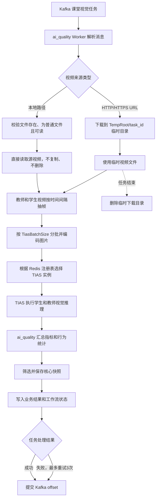

# AI课堂视觉分析数据链路

ai_quality 从 Kafka 获取课堂视觉任务。教师、学生和课件视频字段支持两种来源：本地文件路径或 HTTP/HTTPS URL。

## 本地路径模式

- 绝对路径直接使用，例如 `/data/ai-quality-eval/video-workspace/35160/teacher.mp4`。
- 相对路径基于 `LocalVideoBaseRoot` 解析。
- 宿主机视频目录必须以相同路径只读挂载到 ai_quality Worker 容器。
- Worker 只读取源视频，任务结束后不会删除本地源文件。

## URL模式

- 仅接受完整的 HTTP或 HTTPS URL。
- Worker先将教师和学生视频下载到 `TempRoot/task_id`，再执行抽帧和分析。
- 无论任务成功或失败，任务临时目录都会在处理结束后清理。

## 共同处理与存储

- `slides_video_path` 当前只校验来源是否可用，不参与抽帧和视觉指标计算。
- 抽取的普通帧仅在内存中处理，不逐帧保存。
- TIAS接收编码后的帧并返回检测结果，不持久保存业务图片。
- ai_quality只保存满足策略的核心快照。西交大部署路径为 `/data/ai-quality-eval/image/cv/{task_id}/{image_id}.png`，数据库保存相对路径 `cv/{task_id}/{image_id}.png`。
- 任务成功后提交 Kafka offset；处理失败时最多重试3次，最终仍提交 offset，失败任务需要上游重新投递。
